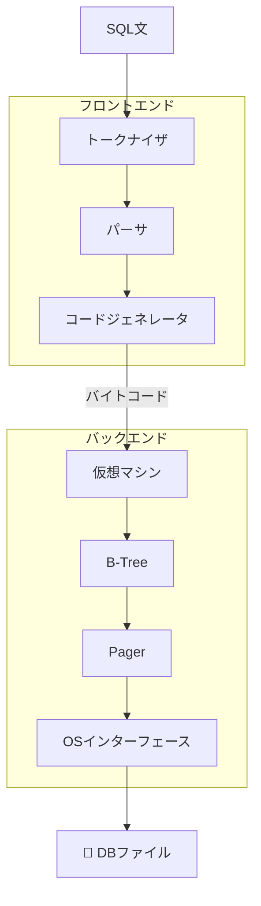

# Let's Build a Simple Database

SQLiteクローンをC言語でゼロから作りながら、データベースの内部構造を学ぶチュートリアル。

> 原文: [cstack/db_tutorial](https://cstack.github.io/db_tutorial/)

## なぜこのチュートリアルを学ぶのか？

普段使っているデータベースの中身は**ブラックボックス**だ。このチュートリアルでは、SQLiteをモデルに以下の疑問に答えていく：

- データはメモリとディスクにどう保存される？
- INSERT/SELECTはどう実行される？
- B-Treeとは何か？なぜDBに最適か？
- ノードが溢れたらどう分割する？

> 「自分で作れないものは、理解していない」 — リチャード・ファインマン

## SQLiteアーキテクチャ全体像

## 学習ロードマップ

### 🔰 フェーズ1: 基礎（Part 1-5）
REPL → SQLパーサ → インメモリDB → テスト → ディスク永続化

| Part | タイトル | 内容 |
|------|---------|------|
| [1](./_parts/part1.md) | REPLの構築 | 対話型シェルとSQLiteアーキテクチャの理解 |
| [2](./_parts/part2.md) | SQLコンパイラと仮想マシン | SQLの解釈と実行の仕組み |
| [3](./_parts/part3.md) | インメモリDB | insert/selectの最小実装 |
| [4](./_parts/part4.md) | テストとバグ | テスト駆動開発とバグ修正 |
| [5](./_parts/part5.md) | ディスクへの永続化 | Pagerによるメモリ↔ディスクの管理 |

### 🌲 フェーズ2: B-Tree（Part 6-9）
カーソル抽象化 → B-Tree理論 → リーフノード実装 → 二分探索

| Part | タイトル | 内容 |
|------|---------|------|
| [6](./_parts/part6.md) | カーソルの抽象化 | テーブル走査の汎用化 |
| [7](./_parts/part7.md) | B-Tree入門 | B-Treeの理論と特性 |
| [8](./_parts/part8.md) | リーフノードのフォーマット | ノードの物理レイアウト設計 |
| [9](./_parts/part9.md) | 二分探索と重複キー | ソート済みデータの高速検索 |

### 🔧 フェーズ3: ツリーの成長（Part 10-14）
ノード分割 → 再帰検索 → 複数階層スキャン → 親ノード更新 → 内部ノード分割

| Part | タイトル | 内容 |
|------|---------|------|
| [10](./_parts/part10.md) | リーフノードの分割 | ノード溢れ時の処理 |
| [11](./_parts/part11.md) | B-Treeの再帰的検索 | 複数階層ツリーの検索 |
| [12](./_parts/part12.md) | 複数階層のスキャン | SELECT文の全行走査 |
| [13](./_parts/part13.md) | 親ノードの更新 | 分割後のツリー整合性維持 |
| [14](./_parts/part14.md) | 内部ノードの分割 | B-Tree実装の完成 |

### 📚 まとめ

| Part | タイトル |
|------|---------|
| [15](./_parts/part15.md) | まとめと今後の学習 |