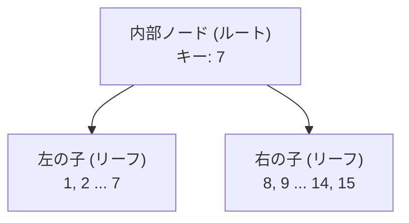

> 🎯 **このパートを学ぶ理由**: B-Tree成長の核心。ノードが溢れた時に2つに分割し、親ノードを作るアルゴリズム。「ツリーが下から上に成長する」というB-Treeの特徴を体験する。
> **前提知識**: Part 8-9（リーフノード + 二分探索）

1つしかノードがないB-Treeはツリーらしくない。これを解決するために、リーフノードを2つに分割するコードが必要だ。そしてその後、2つのリーフノードの親となる内部ノードを作成する必要がある。

この記事の目標は、こうなっている状態から：


こうする：



まず、リーフノードがいっぱいの場合のエラー処理を削除する：

```diff
 void leaf_node_insert(Cursor* cursor, uint32_t key, Row* value) {
   void* node = get_page(cursor->table->pager, cursor->page_num);

   uint32_t num_cells = *leaf_node_num_cells(node);
   if (num_cells >= LEAF_NODE_MAX_CELLS) {
     // ノードがいっぱい
-    printf("Need to implement splitting a leaf node.\n");
-    exit(EXIT_FAILURE);
+    leaf_node_split_and_insert(cursor, key, value);
+    return;
   }
```

```diff
ExecuteResult execute_insert(Statement* statement, Table* table) {
   void* node = get_page(table->pager, table->root_page_num);
   uint32_t num_cells = (*leaf_node_num_cells(node));
-  if (num_cells >= LEAF_NODE_MAX_CELLS) {
-    return EXECUTE_TABLE_FULL;
-  }

   Row* row_to_insert = &(statement->row_to_insert);
   uint32_t key_to_insert = row_to_insert->id;
```

## 分割アルゴリズム

簡単な部分は終わった。[SQLite Database System: Design and Implementation](https://play.google.com/store/books/details/Sibsankar_Haldar_SQLite_Database_System_Design_and?id=9Z6IQQnX1JEC&hl=en)から、必要な処理の説明を引用する：

> リーフノードに空きがない場合、既存のエントリと新しいエントリ（挿入しようとしているもの）を2つの等しい半分に分ける：下半分と上半分。（上半分のキーは下半分のキーよりも厳密に大きい。）新しいリーフノードを確保し、上半分を新しいノードに移す。

旧ノードへのハンドルを取得し、新しいノードを作成する：

```diff
+void leaf_node_split_and_insert(Cursor* cursor, uint32_t key, Row* value) {
+  /*
+  新しいノードを作成し、半分のセルを移す。
+  新しい値を2つのノードのどちらかに挿入する。
+  親を更新するか、新しい親を作成する。
+  */
+
+  void* old_node = get_page(cursor->table->pager, cursor->page_num);
+  uint32_t new_page_num = get_unused_page_num(cursor->table->pager);
+  void* new_node = get_page(cursor->table->pager, new_page_num);
+  initialize_leaf_node(new_node);
```

次に、各セルを新しい位置にコピーする：

```diff
+  /*
+  既存のすべてのキーと新しいキーを
+  旧ノード（左）と新ノード（右）に均等に分配する。
+  右から順に、各キーを正しい位置に移動する。
+  */
+  for (int32_t i = LEAF_NODE_MAX_CELLS; i >= 0; i--) {
+    void* destination_node;
+    if (i >= LEAF_NODE_LEFT_SPLIT_COUNT) {
+      destination_node = new_node;
+    } else {
+      destination_node = old_node;
+    }
+    uint32_t index_within_node = i % LEAF_NODE_LEFT_SPLIT_COUNT;
+    void* destination = leaf_node_cell(destination_node, index_within_node);
+
+    if (i == cursor->cell_num) {
+      serialize_row(value, destination);
+    } else if (i > cursor->cell_num) {
+      memcpy(destination, leaf_node_cell(old_node, i - 1), LEAF_NODE_CELL_SIZE);
+    } else {
+      memcpy(destination, leaf_node_cell(old_node, i), LEAF_NODE_CELL_SIZE);
+    }
+  }
```

各ノードのヘッダのセル数を更新する：

```diff
+  /* 両方のリーフノードのセル数を更新 */
+  *(leaf_node_num_cells(old_node)) = LEAF_NODE_LEFT_SPLIT_COUNT;
+  *(leaf_node_num_cells(new_node)) = LEAF_NODE_RIGHT_SPLIT_COUNT;
```

次に、ノードの親を更新する必要がある。元のノードがルートの場合、親は存在しない。その場合は、新しいルートノードを作成して親とする。もう一方の分岐は今のところスタブにしておく：

```diff
+  if (is_node_root(old_node)) {
+    return create_new_root(cursor->table, new_page_num);
+  } else {
+    printf("Need to implement updating parent after split\n");
+    exit(EXIT_FAILURE);
+  }
+}
```

## 新しいページの確保

いくつかの新しい関数と定数を定義する。新しいリーフノードを作成した時、`get_unused_page_num()`で決まったページに配置した：

```diff
+/*
+空きページの再利用を始めるまでは、新しいページは常に
+データベースファイルの末尾に追加される
+*/
+uint32_t get_unused_page_num(Pager* pager) { return pager->num_pages; }
```

今のところ、Nページのデータベースでは、ページ番号0からN-1が使用済みと仮定する。したがって、新しいページには常にページ番号Nを割り当てられる。将来、削除を実装すると空になるページが出てくるため、それらの空きページを再利用する方が効率的だ。

## リーフノードのサイズ

ツリーのバランスを保つために、セルを2つの新しいノードに均等に分配する。リーフノードがN個のセルを保持できるなら、分割時にはN+1個のセル（元のN個と新しい1個）を2つのノードに分配する必要がある。N+1が奇数の場合は、左ノードに1つ多くセルを割り当てることにする。

```diff
+const uint32_t LEAF_NODE_RIGHT_SPLIT_COUNT = (LEAF_NODE_MAX_CELLS + 1) / 2;
+const uint32_t LEAF_NODE_LEFT_SPLIT_COUNT =
+    (LEAF_NODE_MAX_CELLS + 1) - LEAF_NODE_RIGHT_SPLIT_COUNT;
```

## 新しいルートの作成

[SQLite Database System](https://play.google.com/store/books/details/Sibsankar_Haldar_SQLite_Database_System_Design_and?id=9Z6IQQnX1JEC&hl=en)は、新しいルートノードの作成プロセスを次のように説明している：

> Nをルートノードとする。まず、LとRという2つのノードを確保する。Nの下半分をLに、上半分をRに移す。これでNは空になる。N に〈L, K, R〉を追加する。ここでKはLの最大キーだ。ページNはルートのままとなる。ツリーの深さは1つ増えるが、B+木の性質を損なうことなく高さバランスが保たれる。

この時点で、既に右の子を確保し上半分をそこに移している。この関数は右の子を入力として受け取り、左の子を格納するための新しいページを確保する。

```diff
+void create_new_root(Table* table, uint32_t right_child_page_num) {
+  /*
+  ルートの分割を処理する。
+  旧ルートを新しいページにコピーし、左の子にする。
+  右の子のアドレスは引数として渡される。
+  ルートページを新しいルートノードとして再初期化する。
+  新しいルートノードは2つの子を指す。
+  */
+
+  void* root = get_page(table->pager, table->root_page_num);
+  void* right_child = get_page(table->pager, right_child_page_num);
+  uint32_t left_child_page_num = get_unused_page_num(table->pager);
+  void* left_child = get_page(table->pager, left_child_page_num);
```

旧ルートを左の子にコピーして、ルートページを再利用できるようにする：

```diff
+  /* 左の子は旧ルートからデータをコピー */
+  memcpy(left_child, root, PAGE_SIZE);
+  set_node_root(left_child, false);
```

最後に、ルートページを2つの子を持つ新しい内部ノードとして初期化する。

```diff
+  /* ルートノードは1つのキーと2つの子を持つ新しい内部ノード */
+  initialize_internal_node(root);
+  set_node_root(root, true);
+  *internal_node_num_keys(root) = 1;
+  *internal_node_child(root, 0) = left_child_page_num;
+  uint32_t left_child_max_key = get_node_max_key(left_child);
+  *internal_node_key(root, 0) = left_child_max_key;
+  *internal_node_right_child(root) = right_child_page_num;
+}
```

## 内部ノードのフォーマット

内部ノードを初めて作成するので、そのレイアウトを定義する必要がある。共通ヘッダから始まり、次にキーの数、そして最も右の子のページ番号が続く。内部ノードは常にキーの数より1つ多い子ポインタを持つ。その余分な子ポインタはヘッダに格納される。

```diff
+/*
+ * 内部ノードヘッダレイアウト
+ */
+const uint32_t INTERNAL_NODE_NUM_KEYS_SIZE = sizeof(uint32_t);
+const uint32_t INTERNAL_NODE_NUM_KEYS_OFFSET = COMMON_NODE_HEADER_SIZE;
+const uint32_t INTERNAL_NODE_RIGHT_CHILD_SIZE = sizeof(uint32_t);
+const uint32_t INTERNAL_NODE_RIGHT_CHILD_OFFSET =
+    INTERNAL_NODE_NUM_KEYS_OFFSET + INTERNAL_NODE_NUM_KEYS_SIZE;
+const uint32_t INTERNAL_NODE_HEADER_SIZE = COMMON_NODE_HEADER_SIZE +
+                                           INTERNAL_NODE_NUM_KEYS_SIZE +
+                                           INTERNAL_NODE_RIGHT_CHILD_SIZE;
```

ボディはセルの配列で、各セルは子ポインタとキーを含む。各キーはその左にある子に含まれる最大キーであるべきだ。

```diff
+/*
+ * 内部ノードボディレイアウト
+ */
+const uint32_t INTERNAL_NODE_KEY_SIZE = sizeof(uint32_t);
+const uint32_t INTERNAL_NODE_CHILD_SIZE = sizeof(uint32_t);
+const uint32_t INTERNAL_NODE_CELL_SIZE =
+    INTERNAL_NODE_CHILD_SIZE + INTERNAL_NODE_KEY_SIZE;
```

これらの定数に基づくと、内部ノードのレイアウトは以下のようになる：



分岐係数が非常に大きいことに注目。各子ポインタ/キーペアが非常に小さいため、各内部ノードに510個のキーと511個の子ポインタを格納できる。つまり、特定のキーを見つけるのにツリーを多くの階層たどる必要がない！

| 内部ノードの階層数 | リーフノードの最大数      | 全リーフノードのサイズ |
|-------------------|--------------------------|----------------------|
| 0                 | 511^0 = 1                | 4 KB                 |
| 1                 | 511^1 = 512              | 約2 MB               |
| 2                 | 511^2 = 261,121          | 約1 GB               |
| 3                 | 511^3 = 133,432,831      | 約550 GB             |

実際には、ヘッダ、キー、未使用スペースのオーバーヘッドがあるため、リーフノードあたり4 KBまるまるデータは保存できない。しかし、ディスクからわずか4ページをロードするだけで約500 GBのデータを検索できる。これがB-Treeがデータベースにとって有用なデータ構造である理由だ。

内部ノードの読み書きメソッドは以下のとおり：

```diff
+uint32_t* internal_node_num_keys(void* node) {
+  return node + INTERNAL_NODE_NUM_KEYS_OFFSET;
+}
+
+uint32_t* internal_node_right_child(void* node) {
+  return node + INTERNAL_NODE_RIGHT_CHILD_OFFSET;
+}
+
+uint32_t* internal_node_cell(void* node, uint32_t cell_num) {
+  return node + INTERNAL_NODE_HEADER_SIZE + cell_num * INTERNAL_NODE_CELL_SIZE;
+}
+
+uint32_t* internal_node_child(void* node, uint32_t child_num) {
+  uint32_t num_keys = *internal_node_num_keys(node);
+  if (child_num > num_keys) {
+    printf("Tried to access child_num %d > num_keys %d\n", child_num, num_keys);
+    exit(EXIT_FAILURE);
+  } else if (child_num == num_keys) {
+    return internal_node_right_child(node);
+  } else {
+    return internal_node_cell(node, child_num);
+  }
+}
+
+uint32_t* internal_node_key(void* node, uint32_t key_num) {
+  return internal_node_cell(node, key_num) + INTERNAL_NODE_CHILD_SIZE;
+}
```

内部ノードの場合、最大キーは常に最も右のキーだ。リーフノードの場合は、最大インデックスのキーになる：

```diff
+uint32_t get_node_max_key(void* node) {
+  switch (get_node_type(node)) {
+    case NODE_INTERNAL:
+      return *internal_node_key(node, *internal_node_num_keys(node) - 1);
+    case NODE_LEAF:
+      return *leaf_node_key(node, *leaf_node_num_cells(node) - 1);
+  }
+}
```

## ルートの追跡

共通ノードヘッダの`is_root`フィールドを使う。リーフノードの分割方法を決めるために使用する：

```c
  if (is_node_root(old_node)) {
    return create_new_root(cursor->table, new_page_num);
  } else {
    printf("Need to implement updating parent after split\n");
    exit(EXIT_FAILURE);
  }
}
```

ゲッターとセッターは以下のとおり：

```diff
+bool is_node_root(void* node) {
+  uint8_t value = *((uint8_t*)(node + IS_ROOT_OFFSET));
+  return (bool)value;
+}
+
+void set_node_root(void* node, bool is_root) {
+  uint8_t value = is_root;
+  *((uint8_t*)(node + IS_ROOT_OFFSET)) = value;
+}
```


両方のタイプのノードの初期化時に、デフォルトで`is_root`をfalseに設定する：

```diff
 void initialize_leaf_node(void* node) {
   set_node_type(node, NODE_LEAF);
+  set_node_root(node, false);
   *leaf_node_num_cells(node) = 0;
 }

+void initialize_internal_node(void* node) {
+  set_node_type(node, NODE_INTERNAL);
+  set_node_root(node, false);
+  *internal_node_num_keys(node) = 0;
+}
```

テーブルの最初のノードを作成する時に`is_root`をtrueに設定する：

```diff
     // 新しいデータベースファイル。ページ0をリーフノードとして初期化。
     void* root_node = get_page(pager, 0);
     initialize_leaf_node(root_node);
+    set_node_root(root_node, true);
   }

   return table;
```

## ツリーの表示

データベースの状態を可視化するために、`.btree`メタコマンドを複数階層のツリーを表示できるよう更新する。

現在の`print_leaf_node()`関数を置き換える

```diff
-void print_leaf_node(void* node) {
-  uint32_t num_cells = *leaf_node_num_cells(node);
-  printf("leaf (size %d)\n", num_cells);
-  for (uint32_t i = 0; i < num_cells; i++) {
-    uint32_t key = *leaf_node_key(node, i);
-    printf("  - %d : %d\n", i, key);
-  }
-}
```

任意のノードを受け取り、そのノードと子を表示する新しい再帰関数に置き換える。再帰呼び出しごとに増加するインデントレベルをパラメータとして取る。インデント用のヘルパー関数も追加する。

```diff
+void indent(uint32_t level) {
+  for (uint32_t i = 0; i < level; i++) {
+    printf("  ");
+  }
+}
+
+void print_tree(Pager* pager, uint32_t page_num, uint32_t indentation_level) {
+  void* node = get_page(pager, page_num);
+  uint32_t num_keys, child;
+
+  switch (get_node_type(node)) {
+    case (NODE_LEAF):
+      num_keys = *leaf_node_num_cells(node);
+      indent(indentation_level);
+      printf("- leaf (size %d)\n", num_keys);
+      for (uint32_t i = 0; i < num_keys; i++) {
+        indent(indentation_level + 1);
+        printf("- %d\n", *leaf_node_key(node, i));
+      }
+      break;
+    case (NODE_INTERNAL):
+      num_keys = *internal_node_num_keys(node);
+      indent(indentation_level);
+      printf("- internal (size %d)\n", num_keys);
+      for (uint32_t i = 0; i < num_keys; i++) {
+        child = *internal_node_child(node, i);
+        print_tree(pager, child, indentation_level + 1);
+
+        indent(indentation_level + 1);
+        printf("- key %d\n", *internal_node_key(node, i));
+      }
+      child = *internal_node_right_child(node);
+      print_tree(pager, child, indentation_level + 1);
+      break;
+  }
+}
```

表示関数の呼び出しを更新し、インデントレベル0を渡す。

```diff
   } else if (strcmp(input_buffer->buffer, ".btree") == 0) {
     printf("Tree:\n");
-    print_leaf_node(get_page(table->pager, 0));
+    print_tree(table->pager, 0, 0);
     return META_COMMAND_SUCCESS;
```

新しい表示機能のテストケース：

```diff
+  it 'allows printing out the structure of a 3-leaf-node btree' do
+    script = (1..14).map do |i|
+      "insert #{i} user#{i} person#{i}@example.com"
+    end
+    script << ".btree"
+    script << "insert 15 user15 person15@example.com"
+    script << ".exit"
+    result = run_script(script)
+
+    expect(result[14...(result.length)]).to match_array([
+      "db > Tree:",
+      "- internal (size 1)",
+      "  - leaf (size 7)",
+      "    - 1",
+      "    - 2",
+      "    - 3",
+      "    - 4",
+      "    - 5",
+      "    - 6",
+      "    - 7",
+      "  - key 7",
+      "  - leaf (size 7)",
+      "    - 8",
+      "    - 9",
+      "    - 10",
+      "    - 11",
+      "    - 12",
+      "    - 13",
+      "    - 14",
+      "db > Need to implement searching an internal node",
+    ])
+  end
```

新しいフォーマットは少し簡略化されているので、既存の`.btree`テストも更新が必要：

```diff
       "db > Executed.",
       "db > Executed.",
       "db > Tree:",
-      "leaf (size 3)",
-      "  - 0 : 1",
-      "  - 1 : 2",
-      "  - 2 : 3",
+      "- leaf (size 3)",
+      "  - 1",
+      "  - 2",
+      "  - 3",
       "db > "
     ])
   end
```

新しいテストの`.btree`出力を単独で見ると：

```
Tree:
- internal (size 1)
  - leaf (size 7)
    - 1
    - 2
    - 3
    - 4
    - 5
    - 6
    - 7
  - key 7
  - leaf (size 7)
    - 8
    - 9
    - 10
    - 11
    - 12
    - 13
    - 14
```

最も浅いインデントレベルにルートノード（内部ノード）が見える。`size 1`はキーが1つあることを示す。1段インデントすると、リーフノード、キー、もう1つのリーフノードが見える。ルートノードのキー（7）は最初のリーフノードの最大キーだ。7より大きいキーはすべて2番目のリーフノードにある。

## 大きな問題

注意深く追いかけてきたなら、大事なことを見落としていることに気づくかもしれない。もう1行追加で挿入しようとすると何が起こるか見てみよう：

```
db > insert 15 user15 person15@example.com
Need to implement searching an internal node
```

おっと！あのTODOメッセージを書いたのは誰だ :P

次回はB-tree壮大な物語の続きとして、複数階層のツリーでの検索を実装する。

---

<div align="center">

[← 前へ: Part 9 - 二分探索](./part9.md) | [次へ: Part 11 - B-Treeの再帰的検索 →](./part11.md)

</div>
