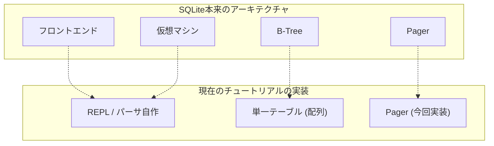

> 🎯 **このパートを学ぶ理由**: メモリからディスクへの永続化。Pager（ページキャッシュ）の抽象化はOSのページングと同じ考え方であり、以降のB-Tree実装の基盤になる。
> **前提知識**: Part 3-4（インメモリDB + テスト）

> 「この世で粘り強さに勝るものはない」 -- [カルビン・クーリッジ](https://en.wikiquote.org/wiki/Calvin_Coolidge)

データベースにレコードを挿入して読み出せるようになったが、プログラムを実行している間だけの話だ。プログラムを終了して再起動すると、データはすべて消えてしまう。実現したい動作の仕様はこうだ：

```ruby
it 'keeps data after closing connection' do
  result1 = run_script([
    "insert 1 user1 person1@example.com",
    ".exit",
  ])
  expect(result1).to match_array([
    "db > Executed.",
    "db > ",
  ])
  result2 = run_script([
    "select",
    ".exit",
  ])
  expect(result2).to match_array([
    "db > (1, user1, person1@example.com)",
    "Executed.",
    "db > ",
  ])
end
```

sqliteと同様に、データベース全体をファイルに保存することでレコードを永続化する。

行をページサイズのメモリブロックにシリアライズする仕組みはすでに準備できている。永続化のためには、そのメモリブロックをファイルに書き出し、次回プログラムの起動時にメモリに読み戻すだけで良い。

これを簡単にするため、ページャという抽象化を導入する。ページャにページ番号`x`を要求すると、メモリブロックを返してくれる。まずキャッシュを確認し、キャッシュミスの場合はデータベースファイルからメモリにデータをコピーする（ファイルを読み込む）。



ページャはページキャッシュとファイルにアクセスする。Tableオブジェクトはページャを通じてページを要求する：

```diff
+typedef struct {
+  int file_descriptor;
+  uint32_t file_length;
+  void* pages[TABLE_MAX_PAGES];
+} Pager;
+
 typedef struct {
-  void* pages[TABLE_MAX_PAGES];
+  Pager* pager;
   uint32_t num_rows;
 } Table;
```

`new_table()`を`db_open()`にリネームする。データベースへの接続を開くという意味合いを持つようになったからだ。接続を開くとは具体的に以下を行う：

- データベースファイルを開く
- ページャのデータ構造を初期化する
- テーブルのデータ構造を初期化する

```diff
-Table* new_table() {
+Table* db_open(const char* filename) {
+  Pager* pager = pager_open(filename);
+  uint32_t num_rows = pager->file_length / ROW_SIZE;
+
   Table* table = malloc(sizeof(Table));
-  table->num_rows = 0;
+  table->pager = pager;
+  table->num_rows = num_rows;

   return table;
 }
```

`db_open()`は`pager_open()`を呼び出す。`pager_open()`はデータベースファイルを開き、そのサイズを記録する。ページキャッシュはすべて`NULL`で初期化する。

```diff
+Pager* pager_open(const char* filename) {
+  int fd = open(filename,
+                O_RDWR |      // 読み書きモード
+                    O_CREAT,  // ファイルが存在しない場合は作成
+                S_IWUSR |     // ユーザー書き込み権限
+                    S_IRUSR   // ユーザー読み取り権限
+                );
+
+  if (fd == -1) {
+    printf("Unable to open file\n");
+    exit(EXIT_FAILURE);
+  }
+
+  off_t file_length = lseek(fd, 0, SEEK_END);
+
+  Pager* pager = malloc(sizeof(Pager));
+  pager->file_descriptor = fd;
+  pager->file_length = file_length;
+
+  for (uint32_t i = 0; i < TABLE_MAX_PAGES; i++) {
+    pager->pages[i] = NULL;
+  }
+
+  return pager;
+}
```

新しい抽象化に合わせて、ページ取得のロジックを独自のメソッドに移す：

```diff
 void* row_slot(Table* table, uint32_t row_num) {
   uint32_t page_num = row_num / ROWS_PER_PAGE;
-  void* page = table->pages[page_num];
-  if (page == NULL) {
-    // Allocate memory only when we try to access page
-    page = table->pages[page_num] = malloc(PAGE_SIZE);
-  }
+  void* page = get_page(table->pager, page_num);
   uint32_t row_offset = row_num % ROWS_PER_PAGE;
   uint32_t byte_offset = row_offset * ROW_SIZE;
   return page + byte_offset;
 }
```

`get_page()`メソッドにはキャッシュミスの処理ロジックが含まれる。ページはデータベースファイル内に順番に保存されている想定だ：ページ0はオフセット0、ページ1はオフセット4096、ページ2はオフセット8192、といった具合に。要求されたページがファイルの範囲外にある場合は空のはずなので、メモリを確保して返す。後でキャッシュをディスクにフラッシュする際にファイルに追加される。


```diff
+void* get_page(Pager* pager, uint32_t page_num) {
+  if (page_num > TABLE_MAX_PAGES) {
+    printf("Tried to fetch page number out of bounds. %d > %d\n", page_num,
+           TABLE_MAX_PAGES);
+    exit(EXIT_FAILURE);
+  }
+
+  if (pager->pages[page_num] == NULL) {
+    // キャッシュミス。メモリを確保してファイルから読み込む。
+    void* page = malloc(PAGE_SIZE);
+    uint32_t num_pages = pager->file_length / PAGE_SIZE;
+
+    // ファイル末尾に不完全なページが保存されている可能性がある
+    if (pager->file_length % PAGE_SIZE) {
+      num_pages += 1;
+    }
+
+    if (page_num <= num_pages) {
+      lseek(pager->file_descriptor, page_num * PAGE_SIZE, SEEK_SET);
+      ssize_t bytes_read = read(pager->file_descriptor, page, PAGE_SIZE);
+      if (bytes_read == -1) {
+        printf("Error reading file: %d\n", errno);
+        exit(EXIT_FAILURE);
+      }
+    }
+
+    pager->pages[page_num] = page;
+  }
+
+  return pager->pages[page_num];
+}
```

今のところ、キャッシュのディスクへのフラッシュはユーザーがデータベース接続を閉じるまで待つ。ユーザーが終了すると、新しいメソッド`db_close()`を呼び出す。このメソッドは以下を行う：

- ページキャッシュをディスクにフラッシュする
- データベースファイルを閉じる
- PagerとTableのデータ構造のメモリを解放する

```diff
+void db_close(Table* table) {
+  Pager* pager = table->pager;
+  uint32_t num_full_pages = table->num_rows / ROWS_PER_PAGE;
+
+  for (uint32_t i = 0; i < num_full_pages; i++) {
+    if (pager->pages[i] == NULL) {
+      continue;
+    }
+    pager_flush(pager, i, PAGE_SIZE);
+    free(pager->pages[i]);
+    pager->pages[i] = NULL;
+  }
+
+  // ファイル末尾に書き込むべき不完全なページがある場合がある
+  // B-treeに切り替えた後は不要になる
+  uint32_t num_additional_rows = table->num_rows % ROWS_PER_PAGE;
+  if (num_additional_rows > 0) {
+    uint32_t page_num = num_full_pages;
+    if (pager->pages[page_num] != NULL) {
+      pager_flush(pager, page_num, num_additional_rows * ROW_SIZE);
+      free(pager->pages[page_num]);
+      pager->pages[page_num] = NULL;
+    }
+  }
+
+  int result = close(pager->file_descriptor);
+  if (result == -1) {
+    printf("Error closing db file.\n");
+    exit(EXIT_FAILURE);
+  }
+  for (uint32_t i = 0; i < TABLE_MAX_PAGES; i++) {
+    void* page = pager->pages[i];
+    if (page) {
+      free(page);
+      pager->pages[i] = NULL;
+    }
+  }
+  free(pager);
+  free(table);
+}
+
-MetaCommandResult do_meta_command(InputBuffer* input_buffer) {
+MetaCommandResult do_meta_command(InputBuffer* input_buffer, Table* table) {
   if (strcmp(input_buffer->buffer, ".exit") == 0) {
+    db_close(table);
     exit(EXIT_SUCCESS);
   } else {
     return META_COMMAND_UNRECOGNIZED_COMMAND;
```

現在の設計では、ファイルの長さでデータベースの行数を表現しているため、ファイル末尾に不完全なページを書き込む必要がある。そのため`pager_flush()`はページ番号とサイズの両方を受け取る。最良の設計とは言えないが、B-treeの実装を始めるとすぐに解消される。

```diff
+void pager_flush(Pager* pager, uint32_t page_num, uint32_t size) {
+  if (pager->pages[page_num] == NULL) {
+    printf("Tried to flush null page\n");
+    exit(EXIT_FAILURE);
+  }
+
+  off_t offset = lseek(pager->file_descriptor, page_num * PAGE_SIZE, SEEK_SET);
+
+  if (offset == -1) {
+    printf("Error seeking: %d\n", errno);
+    exit(EXIT_FAILURE);
+  }
+
+  ssize_t bytes_written =
+      write(pager->file_descriptor, pager->pages[page_num], size);
+
+  if (bytes_written == -1) {
+    printf("Error writing: %d\n", errno);
+    exit(EXIT_FAILURE);
+  }
+}
```

最後に、ファイル名をコマンドライン引数として受け取れるようにする。`do_meta_command`にも引数を追加するのを忘れずに：

```diff
 int main(int argc, char* argv[]) {
-  Table* table = new_table();
+  if (argc < 2) {
+    printf("Must supply a database filename.\n");
+    exit(EXIT_FAILURE);
+  }
+
+  char* filename = argv[1];
+  Table* table = db_open(filename);
+
   InputBuffer* input_buffer = new_input_buffer();
   while (true) {
     print_prompt();
     read_input(input_buffer);

     if (input_buffer->buffer[0] == '.') {
-      switch (do_meta_command(input_buffer)) {
+      switch (do_meta_command(input_buffer, table)) {
```
これらの変更で、データベースを閉じて再度開いてもレコードが残るようになった！

```
~ ./db mydb.db
db > insert 1 cstack foo@bar.com
Executed.
db > insert 2 voltorb volty@example.com
Executed.
db > .exit
~
~ ./db mydb.db
db > select
(1, cstack, foo@bar.com)
(2, voltorb, volty@example.com)
Executed.
db > .exit
~
```

お楽しみとして、`mydb.db`を覗いてデータがどのように保存されているか見てみよう。vimをヘックスエディタとして使い、ファイルのメモリレイアウトを確認する：

```
vim mydb.db
:%!xxd
```


最初の4バイトは最初の行のid（`uint32_t`なので4バイト）。リトルエンディアンのバイトオーダーで保存されているので、最下位バイトが先頭（01）に来て、上位バイト（00 00 00）が続く。`memcpy()`を使って`Row`構造体からページキャッシュにバイトをコピーしたので、構造体はメモリ上でリトルエンディアンのバイトオーダーで配置されていることになる。これはプログラムをコンパイルしたマシンの特性だ。もしこのマシンでデータベースファイルを作成し、ビッグエンディアンのマシンで読み込みたい場合は、`serialize_row()`と`deserialize_row()`メソッドを変更して常に同じバイトオーダーで読み書きする必要がある。

次の33バイトはユーザー名をnull終端文字列として保存している。ASCIIの16進数で「cstack」は`63 73 74 61 63 6b`で、その後にnull文字（`00`）が続く。33バイトの残りは未使用だ。

次の256バイトも同様にメールアドレスを保存している。null終端文字の後にランダムなゴミデータが見える。これはおそらく`Row`構造体の初期化されていないメモリが原因だ。256バイト全体をファイルにコピーしているので、文字列の末尾以降のバイトも含まれる。構造体のメモリを確保した時点でそこにあったものがそのまま残っている。ただし、null終端文字を使用しているため、動作に影響はない。

**注意**：すべてのバイトを初期化したい場合は、`serialize_row`の`username`と`email`フィールドのコピーで`memcpy`の代わりに`strncpy`を使えば十分だ：

```diff
 void serialize_row(Row* source, void* destination) {
     memcpy(destination + ID_OFFSET, &(source->id), ID_SIZE);
-    memcpy(destination + USERNAME_OFFSET, &(source->username), USERNAME_SIZE);
-    memcpy(destination + EMAIL_OFFSET, &(source->email), EMAIL_SIZE);
+    strncpy(destination + USERNAME_OFFSET, source->username, USERNAME_SIZE);
+    strncpy(destination + EMAIL_OFFSET, source->email, EMAIL_SIZE);
 }
```

## まとめ

よし！永続化ができた。まだ完璧ではない。例えば`.exit`を入力せずにプログラムを終了すると変更が失われる。また、ディスクから読み込んでから変更されていないページも含めて、すべてのページをディスクに書き戻している。これらの問題は後で対処できる。

次回はカーソルを導入し、B-treeの実装をやりやすくする。

それではまた！

## 完全な差分
```diff
+#include <errno.h>
+#include <fcntl.h>
 #include <stdbool.h>
 #include <stdio.h>
 #include <stdlib.h>
 #include <string.h>
 #include <stdint.h>
+#include <unistd.h>

 struct InputBuffer_t {
   char* buffer;
@@ -62,9 +65,16 @@ const uint32_t PAGE_SIZE = 4096;
 const uint32_t ROWS_PER_PAGE = PAGE_SIZE / ROW_SIZE;
 const uint32_t TABLE_MAX_ROWS = ROWS_PER_PAGE * TABLE_MAX_PAGES;

+typedef struct {
+  int file_descriptor;
+  uint32_t file_length;
+  void* pages[TABLE_MAX_PAGES];
+} Pager;
+
 typedef struct {
   uint32_t num_rows;
-  void* pages[TABLE_MAX_PAGES];
+  Pager* pager;
 } Table;

@@ -84,32 +94,81 @@ void deserialize_row(void *source, Row* destination) {
   memcpy(&(destination->email), source + EMAIL_OFFSET, EMAIL_SIZE);
 }

+void* get_page(Pager* pager, uint32_t page_num) {
+  if (page_num > TABLE_MAX_PAGES) {
+     printf("Tried to fetch page number out of bounds. %d > %d\n", page_num,
+     	TABLE_MAX_PAGES);
+     exit(EXIT_FAILURE);
+  }
+
+  if (pager->pages[page_num] == NULL) {
+     // キャッシュミス。メモリを確保してファイルから読み込む。
+     void* page = malloc(PAGE_SIZE);
+     uint32_t num_pages = pager->file_length / PAGE_SIZE;
+
+     // ファイル末尾に不完全なページが保存されている可能性がある
+     if (pager->file_length % PAGE_SIZE) {
+         num_pages += 1;
+     }
+
+     if (page_num <= num_pages) {
+         lseek(pager->file_descriptor, page_num * PAGE_SIZE, SEEK_SET);
+         ssize_t bytes_read = read(pager->file_descriptor, page, PAGE_SIZE);
+         if (bytes_read == -1) {
+     	printf("Error reading file: %d\n", errno);
+     	exit(EXIT_FAILURE);
+         }
+     }
+
+     pager->pages[page_num] = page;
+  }
+
+  return pager->pages[page_num];
+}
+
 void* row_slot(Table* table, uint32_t row_num) {
   uint32_t page_num = row_num / ROWS_PER_PAGE;
-  void *page = table->pages[page_num];
-  if (page == NULL) {
-     // ページにアクセスしようとした時にのみメモリを確保
-     page = table->pages[page_num] = malloc(PAGE_SIZE);
-  }
+  void *page = get_page(table->pager, page_num);
   uint32_t row_offset = row_num % ROWS_PER_PAGE;
   uint32_t byte_offset = row_offset * ROW_SIZE;
   return page + byte_offset;
 }

-Table* new_table() {
-  Table* table = malloc(sizeof(Table));
-  table->num_rows = 0;
+Pager* pager_open(const char* filename) {
+  int fd = open(filename,
+     	  O_RDWR | 	// 読み書きモード
+     	      O_CREAT,	// ファイルが存在しない場合は作成
+     	  S_IWUSR |	// ユーザー書き込み権限
+     	      S_IRUSR	// ユーザー読み取り権限
+     	  );
+
+  if (fd == -1) {
+     printf("Unable to open file\n");
+     exit(EXIT_FAILURE);
+  }
+
+  off_t file_length = lseek(fd, 0, SEEK_END);
+
+  Pager* pager = malloc(sizeof(Pager));
+  pager->file_descriptor = fd;
+  pager->file_length = file_length;
+
   for (uint32_t i = 0; i < TABLE_MAX_PAGES; i++) {
-     table->pages[i] = NULL;
+     pager->pages[i] = NULL;
   }
-  return table;
+
+  return pager;
 }

-void free_table(Table* table) {
-  for (int i = 0; table->pages[i]; i++) {
-     free(table->pages[i]);
-  }
-  free(table);
+Table* db_open(const char* filename) {
+  Pager* pager = pager_open(filename);
+  uint32_t num_rows = pager->file_length / ROW_SIZE;
+
+  Table* table = malloc(sizeof(Table));
+  table->pager = pager;
+  table->num_rows = num_rows;
+
+  return table;
 }

 InputBuffer* new_input_buffer() {
@@ -142,10 +201,76 @@ void close_input_buffer(InputBuffer* input_buffer) {
   free(input_buffer);
 }

+void pager_flush(Pager* pager, uint32_t page_num, uint32_t size) {
+  if (pager->pages[page_num] == NULL) {
+     printf("Tried to flush null page\n");
+     exit(EXIT_FAILURE);
+  }
+
+  off_t offset = lseek(pager->file_descriptor, page_num * PAGE_SIZE,
+     		 SEEK_SET);
+
+  if (offset == -1) {
+     printf("Error seeking: %d\n", errno);
+     exit(EXIT_FAILURE);
+  }
+
+  ssize_t bytes_written = write(
+     pager->file_descriptor, pager->pages[page_num], size
+     );
+
+  if (bytes_written == -1) {
+     printf("Error writing: %d\n", errno);
+     exit(EXIT_FAILURE);
+  }
+}
+
+void db_close(Table* table) {
+  Pager* pager = table->pager;
+  uint32_t num_full_pages = table->num_rows / ROWS_PER_PAGE;
+
+  for (uint32_t i = 0; i < num_full_pages; i++) {
+     if (pager->pages[i] == NULL) {
+         continue;
+     }
+     pager_flush(pager, i, PAGE_SIZE);
+     free(pager->pages[i]);
+     pager->pages[i] = NULL;
+  }
+
+  // ファイル末尾に書き込むべき不完全なページがある場合がある
+  // B-treeに切り替えた後は不要になる
+  uint32_t num_additional_rows = table->num_rows % ROWS_PER_PAGE;
+  if (num_additional_rows > 0) {
+     uint32_t page_num = num_full_pages;
+     if (pager->pages[page_num] != NULL) {
+         pager_flush(pager, page_num, num_additional_rows * ROW_SIZE);
+         free(pager->pages[page_num]);
+         pager->pages[page_num] = NULL;
+     }
+  }
+
+  int result = close(pager->file_descriptor);
+  if (result == -1) {
+     printf("Error closing db file.\n");
+     exit(EXIT_FAILURE);
+  }
+  for (uint32_t i = 0; i < TABLE_MAX_PAGES; i++) {
+     void* page = pager->pages[i];
+     if (page) {
+         free(page);
+         pager->pages[i] = NULL;
+     }
+  }
+
+  free(pager);
+  free(table);
+}
+
 MetaCommandResult do_meta_command(InputBuffer* input_buffer, Table *table) {
   if (strcmp(input_buffer->buffer, ".exit") == 0) {
     close_input_buffer(input_buffer);
-    free_table(table);
+    db_close(table);
     exit(EXIT_SUCCESS);
   } else {
     return META_COMMAND_UNRECOGNIZED_COMMAND;
@@ -182,6 +308,7 @@ PrepareResult prepare_insert(InputBuffer* input_buffer, Statement* statement) {
     return PREPARE_SUCCESS;

 }
+
 PrepareResult prepare_statement(InputBuffer* input_buffer,
                                 Statement* statement) {
   if (strncmp(input_buffer->buffer, "insert", 6) == 0) {
@@ -227,7 +354,14 @@ ExecuteResult execute_statement(Statement* statement, Table *table) {
 }

 int main(int argc, char* argv[]) {
-  Table* table = new_table();
+  if (argc < 2) {
+      printf("Must supply a database filename.\n");
+      exit(EXIT_FAILURE);
+  }
+
+  char* filename = argv[1];
+  Table* table = db_open(filename);
+
   InputBuffer* input_buffer = new_input_buffer();
   while (true) {
     print_prompt();
```

テストの差分：
```diff
 describe 'database' do
+  before do
+    `rm -rf test.db`
+  end
+
   def run_script(commands)
     raw_output = nil
-    IO.popen("./db", "r+") do |pipe|
+    IO.popen("./db test.db", "r+") do |pipe|
       commands.each do |command|
         pipe.puts command
       end
@@ -28,6 +32,27 @@ describe 'database' do
     ])
   end

+  it 'keeps data after closing connection' do
+    result1 = run_script([
+      "insert 1 user1 person1@example.com",
+      ".exit",
+    ])
+    expect(result1).to match_array([
+      "db > Executed.",
+      "db > ",
+    ])
+
+    result2 = run_script([
+      "select",
+      ".exit",
+    ])
+    expect(result2).to match_array([
+      "db > (1, user1, person1@example.com)",
+      "Executed.",
+      "db > ",
+    ])
+  end
+
   it 'prints error message when table is full' do
     script = (1..1401).map do |i|
       "insert #{i} user#{i} person#{i}@example.com"
```

---

<div align="center">

[← 前へ: Part 4 - テストとバグ](./part4.md) | [次へ: Part 6 - カーソルの抽象化 →](./part6.md)

</div>
