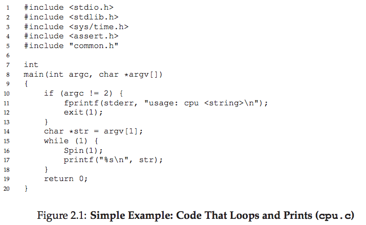
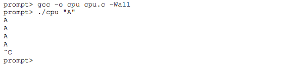
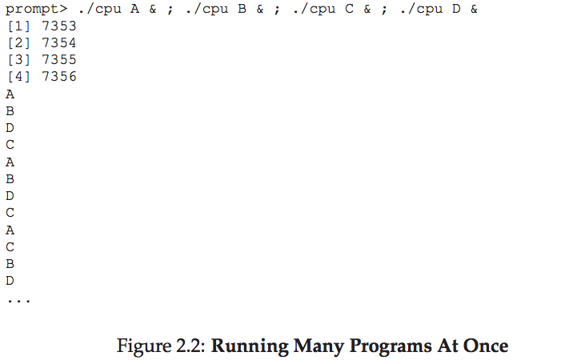
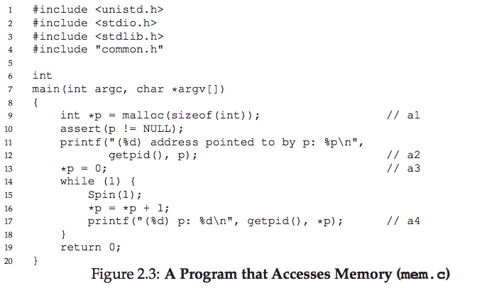
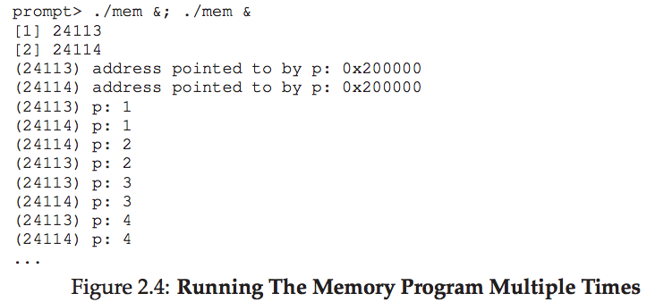
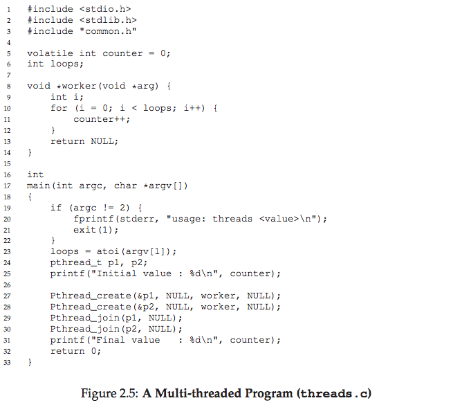
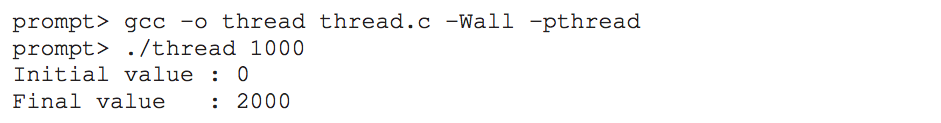
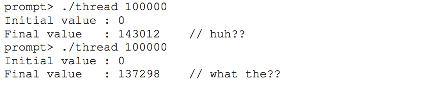
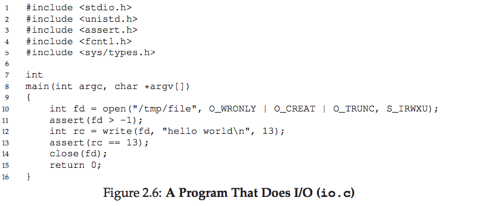

# 2. オペレーティングシステムの概要

## プログラムが実行されるとき何が起きるか？

実行中のプログラムがやっていることは、実はとてもシンプルです。

1. メモリから**命令をフェッチ**（取得）する
2. その命令を**デコード**（解読）する
3. 命令を**実行**する（足し算、メモリアクセス、条件判定、関数呼び出しなど）
4. 次の命令に進む

これを繰り返しているだけです。これが**フォン・ノイマン・モデル**の基本です。

---

## OSの役割

OSは、プログラムの実行を簡単にし、複数のプログラムを同時に動かし、メモリやデバイスへのアクセスを管理するソフトウェアです。

OSが使う主な手法が**仮想化**です。物理的なリソース（CPU、メモリ、ディスクなど）を、より使いやすい仮想的な形に変換します。そのためOSは「仮想マシン」と呼ばれることもあります。

OSはユーザーに対して**システムコール**というAPIを提供し、プログラムの実行、メモリの割り当て、ファイルへのアクセスなどを可能にします。

---

## 2.1 CPUの仮想化

上のプログラムは、コマンドライン引数の文字を1秒ごとに繰り返し表示する簡単なものです。

これを**同時に4つ**実行すると、次のようになります。

プロセッサは1つしかないのに、4つのプログラムが同時に動いているように見えます。OSがハードウェアの助けを借りて「たくさんの仮想CPUがある」という**錯覚**を作り出しているのです。これが**CPUの仮想化**です。

---

## 2.2 メモリの仮想化

メモリは単なる**バイトの配列**です。読み書きにはアドレスを指定します。

上のプログラムは、メモリを確保し、そこに格納された値を繰り返し更新・表示します。

このプログラムを**2つ同時に実行**すると、面白いことが起こります。

どちらのプログラムも**同じアドレス**（0x200000）にメモリを確保しているのに、互いに干渉せず独立して動いています。

これはOSが**メモリを仮想化**しているからです。各プロセスは自分専用の**仮想アドレス空間**を持ち、OSがそれを物理メモリにマッピングしています。

---

## 2.3 並行性（Concurrency）

並行性とは、同じプログラム内で複数の処理を同時に行うときに生じる問題群のことです。

上のプログラムでは、2つのスレッドが共有カウンタをインクリメントします。ループ回数が1000のときは期待通り2000になります。

しかし、ループ回数を100,000にすると…

200,000にならず、毎回違う値になります。これは、カウンタのインクリメントが「値の読み込み→加算→書き戻し」の3命令で構成されており、これらが**原子的（アトミック）に実行されない**ためです。

---

## 2.4 永続性（Persistence）

メインメモリ（DRAM）は**揮発性**です。電源が切れるとデータは消えます。データを永続的に保存するには、HDD・SSDなどのストレージが必要です。

ディスクを管理するOSのソフトウェアを**ファイルシステム**と呼びます。

ファイルにデータを書き込むとき、プログラムは3つのシステムコールを使います。

| システムコール | 役割 |
|---|---|
| `open()` | ファイルを開く（作成する） |
| `write()` | データを書き込む |
| `close()` | ファイルを閉じる |

ファイルシステムは裏側で多くの仕事をしています。

- ディスク上のどこにデータを置くか決める
- メタデータ（管理情報）を更新する
- 性能のために書き込みを**バッファリング**（まとめ書き）する
- クラッシュ対策として**ジャーナリング**や**コピーオンライト**を使う

CPUやメモリの仮想化とは違い、ファイルシステムはプロセスごとに仮想ディスクを作りません。**ファイルは複数のプロセス間で共有される**のが普通です。

---

## 2.5 設計目標

OSの主な設計目標は以下の通りです。

1. **抽象化**: 複雑な処理を隠し、使いやすいインターフェースを提供する
2. **高性能**: OS自体のオーバーヘッド（余分な時間・メモリ使用）を最小限にする
3. **保護（隔離）**: アプリケーション同士、およびアプリケーションとOSを互いから守る
4. **信頼性**: OSがクラッシュすると全アプリが止まるため、高い信頼性が求められる
5. その他：エネルギー効率、セキュリティ、モビリティなど

---

## 2.6 OSの歴史

| 時代 | 特徴 |
|---|---|
| **初期** | OSは単なるライブラリ。バッチ処理で一度に1つのジョブを実行 |
| **保護の導入** | システムコールの発明。ユーザーモードとカーネルモードの分離 |
| **マルチプログラミング** | 複数のジョブをメモリに載せて切り替え実行。UNIXの誕生 |
| **PC時代** | DOS、初期Mac OSなどでは保護機能が後退。のちにUNIXの知見を取り込んで発展 |
| **現代** | Linux（Android）、macOS（UNIX基盤）、Windowsなど。過去の良いアイデアが浸透 |

---

## 2.7 まとめ

本書では、OSの3つの柱を学びます。

- **仮想化**: CPU、メモリを仮想化して複数プログラムの同時実行を実現
- **並行性**: マルチスレッドプログラムで起きる厄介な問題への対処
- **永続性**: ファイルシステムによるデータの永続的な保存

---

[← 前へ: 01. はじめに](./01.md) | [次へ: 03. 仮想化に関する対話 →](./03.md)

