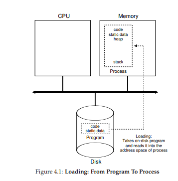
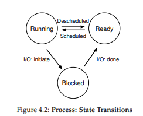
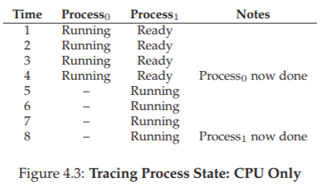
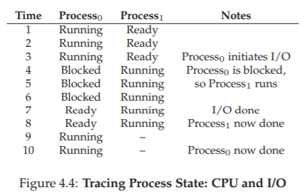
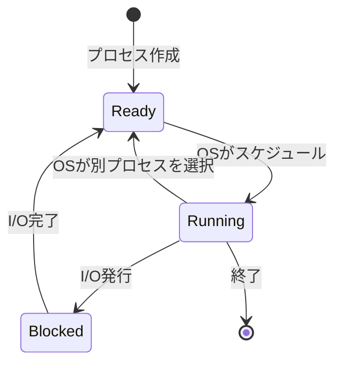
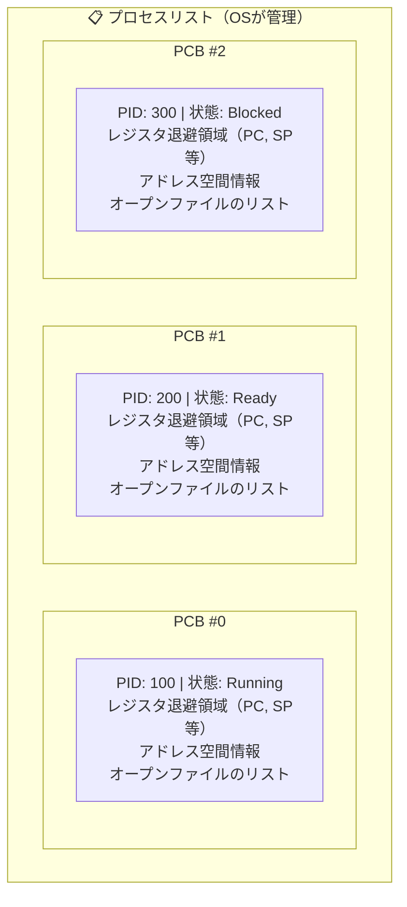
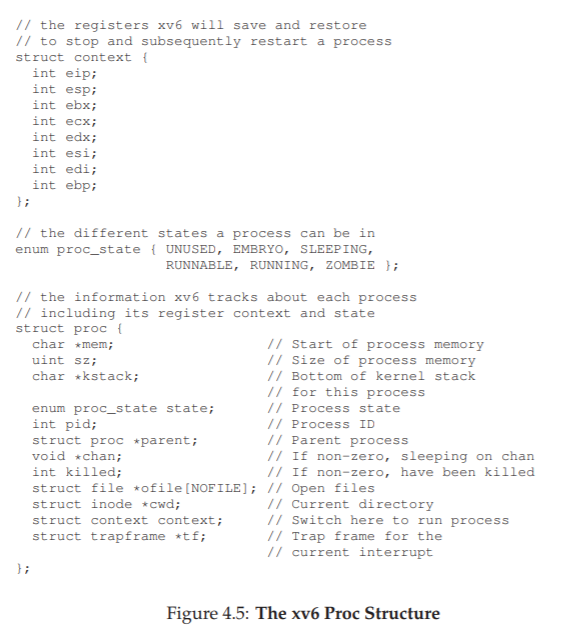

# 4. プロセス ― OSの基本的な抽象

## プロセスとは？

**プロセス = 実行中のプログラム**です。

プログラム自体はディスク上にある単なる命令の列にすぎません。それをメモリに読み込んで実行させるのがOSの役割であり、実行中の状態を「プロセス」と呼びます。

私たちは普段、ブラウザ、メール、音楽プレーヤーなどを同時に使っています。OSは**CPUの仮想化**によって、少数の物理CPUをたくさんの仮想CPUに見せかけ、この同時実行を実現しています。

---

## CPUの仮想化の仕組み

OSはプロセスを次々に切り替えて実行します（**タイムシェアリング**）。この切り替えの仕組みを**メカニズム**、「どのプロセスを次に実行するか」という判断を**ポリシー**と呼びます。

> **ポイント**: メカニズムとポリシーを分離するのは、OS設計の重要な原則です。仕組み（How）と判断基準（What/When）を切り離すと、片方だけを変更しやすくなります。

---

## 4.1 プロセスの構成要素

プロセスは、以下の**マシン状態（Machine State）**で構成されます。マシン状態とは、「ある瞬間にプログラムが使っているすべてのもの」のスナップショットです。料理に例えると、「調理中のキッチンの様子」——まな板の食材（メモリ）、レシピの何行目か（プログラムカウンタ）、使用中の鍋（レジスタ）、開いた冷蔵庫（ファイル）の全体像です。

| 構成要素 | 説明 |
|---|---|
| **アドレス空間** | プロセスがアクセスできるメモリ領域。命令やデータが格納される |
| **レジスタ** | CPU上の高速な記憶領域。プログラムカウンタ（PC）、スタックポインタなど |
| **I/O情報** | 開いているファイルのリストなど |

---

## 4.2 プロセスAPI

OSは以下のようなプロセス操作インターフェースを提供します。

| API | 説明 |
|---|---|
| **Create** | 新しいプロセスを作成する |
| **Destroy** | プロセスを強制終了する |
| **Wait** | プロセスの終了を待つ |
| **Suspend / Resume** | プロセスを一時停止・再開する |
| **Status** | プロセスの状態情報を取得する |

---

## 4.3 プロセスの作成手順

プログラムがプロセスになるまでの流れ:

1. **コードと静的データをメモリにロード**: ディスクからプログラムのバイナリを読み込み、アドレス空間に配置する
   - 初期のOSは一括ロード、現代のOSは**遅延ロード**（必要になったときに読み込む）
2. **スタックの割り当て**: ローカル変数、関数の引数、戻りアドレス用。`main()`の`argc`と`argv`もここにセットされる
3. **ヒープの割り当て**: `malloc()` / `free()` で動的に確保・解放されるメモリ領域
4. **I/Oの初期化**: 標準入力・標準出力・標準エラーの3つのファイルディスクリプタを開く
5. **`main()`にジャンプ**: エントリポイントからプログラムの実行を開始する

---

## 4.4 プロセスの状態

プロセスは主に3つの状態を取ります。

| 状態 | 意味 |
|---|---|
| **Running（実行中）** | CPUで命令を実行している |
| **Ready（準備完了）** | 実行できる状態だが、OSがまだ選んでいない |
| **Blocked（ブロック）** | I/Oなどの完了を待っている。完了したらReadyに戻る |

### 状態遷移の例

**例1: I/Oなし（CPU処理のみ）**

Process0とProcess1が交互にCPUを使います。

**例2: I/Oあり**

Process0がI/Oを発行するとブロック状態になり、その間にProcess1が実行されます。I/O完了後、Process0はReady状態に戻ります。

> 💡 **Runningは「今まCPUを使っている」**、**Readyは「いつでも走れるが順番待ち」**、**Blockedは「I/O待ちで動けない」**。Blockedから直接Runningには戻れず、必ずReadyを経由する点がポイント。

---

## 4.5 データ構造

OSはプロセスを管理するために内部的なデータ構造を持っています。

- **プロセスリスト**: 全プロセスの状態を追跡する
- **レジスタコンテキスト**: プロセスが中断されたとき、レジスタの値を保存する場所。実行再開時にこれを復元する（**コンテキストスイッチ**）
- **PCB（Process Control Block）**: 各プロセスの情報を格納する構造体

> 💡 **プロセスリスト**は「会社の社員台帳」、**PCB**は「個人の人事カード」のようなもの。台帳（リスト）には全社員（プロセス）が登録されており、カード（PCB）を見ればその社員の現在の役職（状態）や、デスクの場所（レジスタ値）などが分かる。

プロセスの状態には、Running / Ready / Blocked 以外に、**初期状態**（作成中）や**ゾンビ状態**（終了したがまだ親にクリーンアップされていない）もあります。

> 💡 **ゾンビ状態**は、子プロセスが終了したが親が`wait()`でその終了を確認していない状態。親が回収するまで、PCBだけがプロセスリストに残り続ける。

---

## 4.6 まとめ

- プロセスは**実行中のプログラム**というOSの基本抽象
- **メカニズム**（How: コンテキストスイッチなど）と**ポリシー**（What: スケジューリングなど）の組み合わせでCPUを仮想化する

---

[← 前へ: 03. 仮想化に関する対話](./03.md) | [次へ: 05. プロセスAPI →](./05.md)

