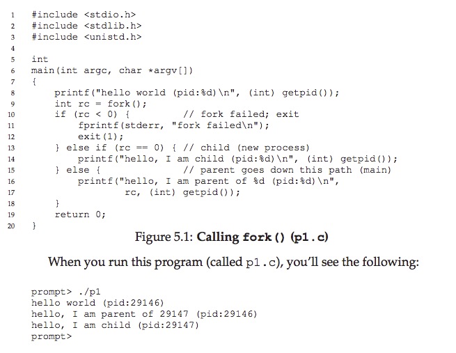
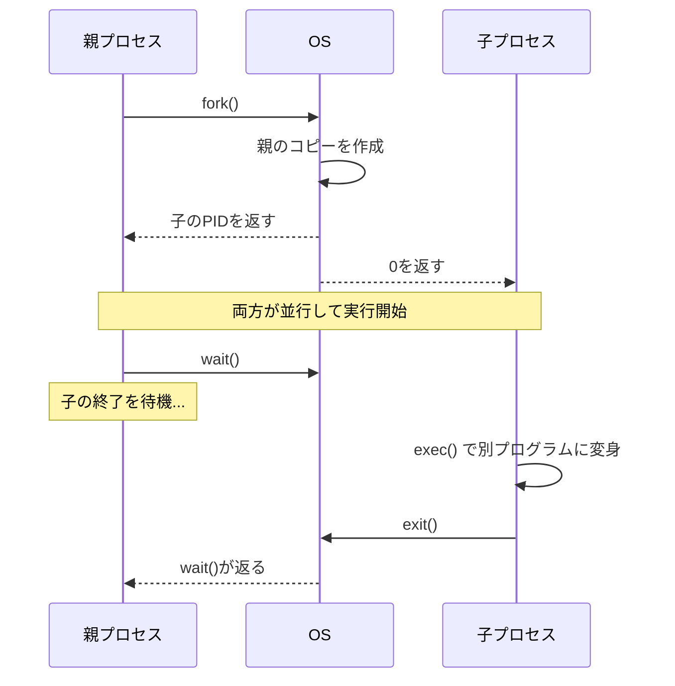
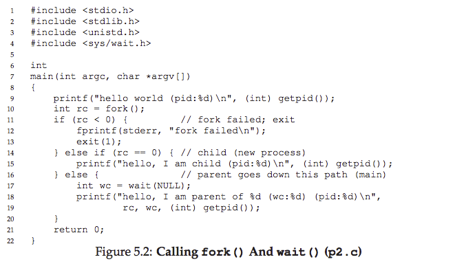
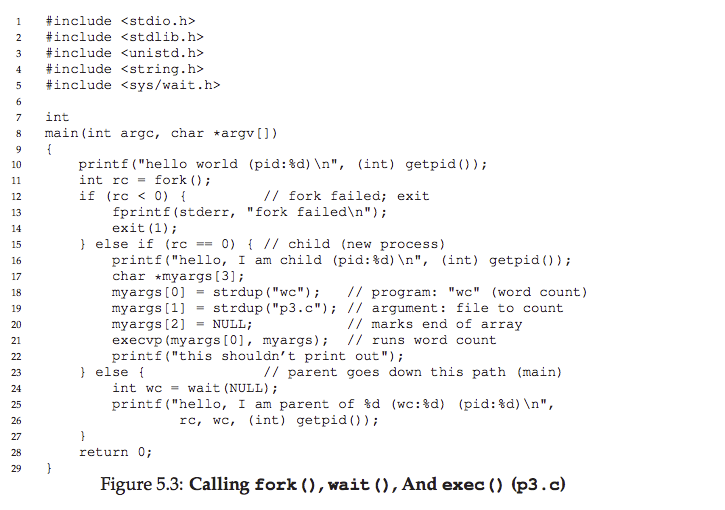
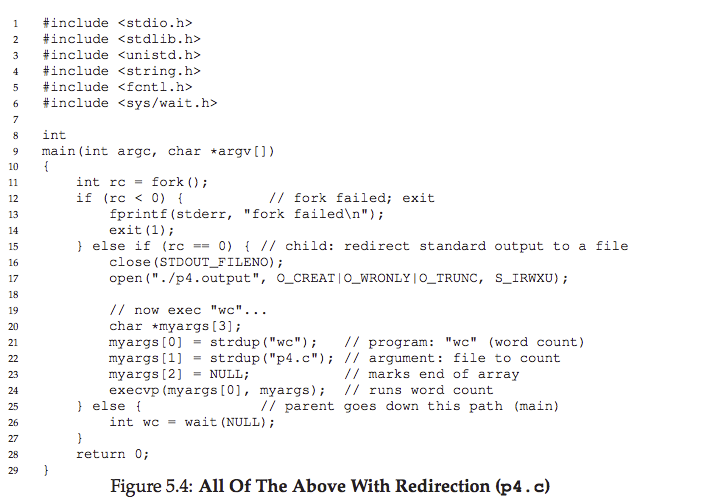

# 5. プロセスAPI

UNIXでは、プロセスの作成に `fork()`、`exec()`、`wait()` という3つのシステムコールを使います。

---

## 5.1 `fork()` ― プロセスの複製

`fork()` は、呼び出したプロセスの**ほぼ完全なコピー**を新しいプロセスとして作成します。



### 動作の流れ

1. 親プロセスが `fork()` を呼ぶ
2. OSが親プロセスのコピー（子プロセス）を作成する
3. 子プロセスは `main()` の先頭からではなく、**`fork()` の直後から**実行を開始する



### 親と子の見分け方

`fork()` の**戻り値**が異なります。

| 呼び出し元 | 戻り値 |
|---|---|
| **親プロセス** | 子プロセスのPID（正の数） |
| **子プロセス** | 0 |

子プロセスは自分専用のアドレス空間・レジスタを持つため、親と子は独立して動きます。

### 注意：実行順序は不定



CPUスケジューラの判断次第で、親と子のどちらが先に実行されるかは分かりません。この**非決定性**は並行プログラミングの重要なテーマです。

---

## 5.2 `wait()` ― 子プロセスの終了を待つ

親プロセスが子プロセスの終了を待ちたいときに使います。


`wait()` を使うと、子プロセスが先に終了することが**保証**されます。子が先に実行されなかった場合でも、親が `wait()` で止まって子の完了を待つためです。

---

## 5.3 `exec()` ― 別のプログラムを実行する

`exec()` は、現在のプロセスを**まったく別のプログラムに変身**させます。新しいプロセスは作られません。



### 動作の流れ

1. 実行ファイル名と引数を指定して `exec()` を呼ぶ
2. 現在のコード・データがすべて新しいプログラムで上書きされる
3. スタック・ヒープも再初期化される
4. 新しいプログラムの `main()` から実行開始

`exec()` が成功すると、**元のプログラムには二度と戻りません**。

---

## 5.4 なぜ `fork()` と `exec()` を分離するのか？

この設計が**UNIXシェルの基盤**です。

シェルの動作：
1. プロンプトを表示
2. ユーザーがコマンドを入力
3. `fork()` で子プロセスを作成
4. **`fork()` と `exec()` の間でリダイレクト等の設定ができる**
5. 子プロセスで `exec()` を呼んでコマンドを実行
6. `wait()` で完了を待つ

### リダイレクトの例

```
prompt> wc p3.c > newfile.txt
```

シェルは `fork()` 後、`exec()` 前に以下を行います。
1. 標準出力（stdout）を閉じる
2. ファイル `newfile.txt` を開く（空いているファイルディスクリプタ番号0から順に割り当てられるので、stdoutの番号に割り当てられる）
3. `exec()` で `wc` を実行 → 出力がファイルに書き込まれる



**パイプ**（`|`）も同じ仕組みで、`pipe()` システムコールを使って一方のプロセスの出力をもう一方の入力に接続します。

```
grep -o foo file | wc -l
```

---

## 5.5 その他のプロセスAPI

| API / コマンド | 説明 |
|---|---|
| `kill()` | プロセスにシグナルを送信（停止、終了など） |
| `ps` | 実行中のプロセス一覧を表示 |
| `top` | プロセスのCPU・メモリ使用状況をリアルタイム表示 |

---

## 5.6 まとめ

- `fork()`: 現在のプロセスを複製する
- `exec()`: 現在のプロセスを別のプログラムに置き換える
- `wait()`: 子プロセスの終了を待つ
- この3つの組み合わせが、UNIXのプロセス管理の基盤

---

## 演習問題

1. `fork()` 前に変数 `x = 100` をセット。子プロセスでの `x` の値は？ 両方で `x` を変更するとどうなる？
2. `open()` でファイルを開いてから `fork()`。親子ともにファイルディスクリプタにアクセスできる？ 同時に書き込むと？
3. 子が "hello"、親が "goodbye" を表示。`wait()` を使わずに子を必ず先に表示させることは可能？
4. `exec()` の全バリエーション（`execl`, `execle`, `execlp`, `execv`, `execvp`, `execvP`）を試してみよう。なぜこんなに多い？
5. `wait()` は何を返す？ 子プロセスで `wait()` を呼ぶとどうなる？
6. `wait()` の代わりに `waitpid()` を使うと？ いつ便利？
7. 子プロセスで標準出力を閉じてから `printf()` するとどうなる？
8. `pipe()` で2つの子プロセスの出力と入力をつなげるプログラムを書こう。

---

<div align="center">

[← 前へ: 04. プロセス](./04.md) | [次へ: 06. 制限付き直接実行 →](./06.md)

</div>
