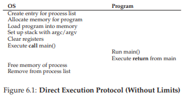
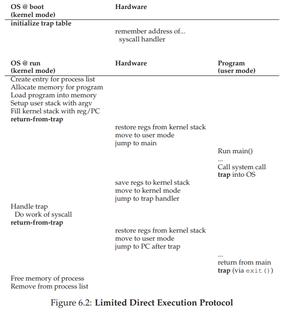
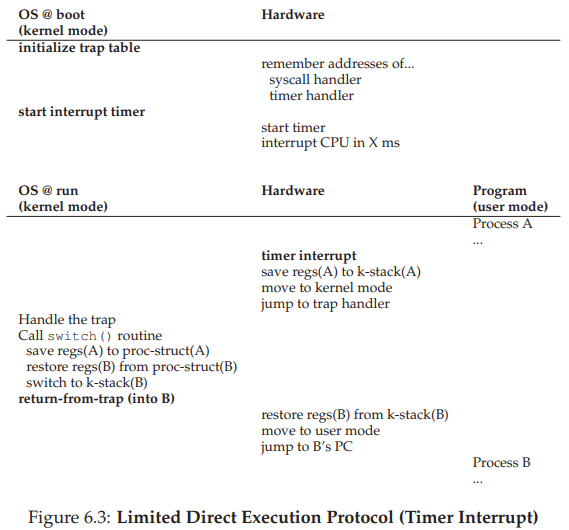
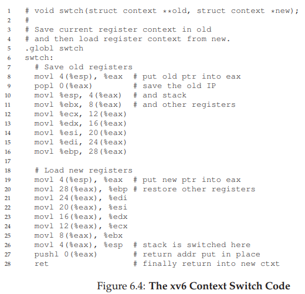

# 6. 制限付き直接実行（Limited Direct Execution）

前章まででプロセスの概念とAPIを学んだ。では、OSは実際にどうやってプログラムを高速に実行しつつ、同時にコントロールを失わないようにしているのだろうか？ CPUを仮想化するには、複数のプロセスでCPUを時分割（タイムスライス）して共有する必要がある。しかし、この仕組みを実現するには2つの課題がある。

1. **パフォーマンス**: オーバーヘッドを最小限に抑えながら仮想化を実現するには？
2. **制御**: プロセスにCPUの制御を奪われないようにするには？

OSは**制御を失わずに高いパフォーマンスを得る**必要がある。これがCPU仮想化の中心的な課題だ。

## 6.1 基本手法：直接実行

最も単純なアイデアは、プログラムをCPU上で直接実行することだ。OSは以下の手順でプロセスを開始する。

1. プロセスリストにエントリを作成
2. メモリを割り当て、プログラムコードをロード
3. エントリポイント（`main()`など）を見つけてジャンプ

シンプルだが、2つの問題がある。

- プログラムが「やってはいけないこと」を実行するのをどう防ぐか？
- 実行中のプロセスを止めて別のプロセスに切り替えるには？

## 6.2 問題1：制限付き操作

直接実行はハードウェア上でネイティブに動作するため高速だ。しかし、ディスクI/Oの発行やシステムリソースへのアクセスなど、制限すべき操作をどう扱うか？

### ユーザモードとカーネルモード

この問題を解決するために、プロセッサには2つの動作モードがある。

- **ユーザモード**: アプリケーションが動作するモード。できることが制限されている（例：I/O要求を直接発行できない）
- **カーネルモード**: OSが動作するモード。I/O要求の発行を含む、すべての特権操作が可能

### システムコールの仕組み

ユーザプログラムが特権操作を行いたい場合、**システムコール**を使う。その流れは次の通り。

1. プログラムが**トラップ命令**を実行
2. CPUがカーネルモードに切り替わり、カーネル内のトラップハンドラにジャンプ
3. カーネルが要求された操作を実行
4. **return-from-trap命令**でユーザモードに戻る

トラップ実行時、ハードウェアは呼び出し元のレジスタ（プログラムカウンタ、フラグなど）をカーネルスタックに保存する。return-from-trapでこれらを復元し、ユーザプログラムの実行を再開する。

### トラップテーブル

トラップ時にカーネル内のどのコードを実行するかは、起動時にOSが設定する**トラップテーブル**で決まる。

- OSはブート時に、各種イベント（システムコール、ハードディスク割り込み、キーボード割り込みなど）に対応するハンドラの場所をハードウェアに通知する
- ハードウェアはこの情報を記憶し、イベント発生時に適切なハンドラにジャンプする

ユーザコードはジャンプ先のアドレスを直接指定できず、**システムコール番号**を通じて間接的にサービスを要求する。これが保護の仕組みとして機能する。

### LDEプロトコルの流れ

1. **ブート時**: カーネルがトラップテーブルを初期化し、CPUにその場所を記憶させる
2. **プロセス実行時**: カーネルがプロセスの準備（メモリ割り当てなど）を行い、return-from-trapでユーザモードに切り替えて実行開始
3. **システムコール時**: プロセスがトラップ → OSが処理 → return-from-trapで戻る
4. **終了時**: プロセスが`main()`から戻り、`exit()`でOSに制御を返す

## 6.3 問題2：プロセス間の切り替え

プロセスがCPU上で動作しているとき、OSは動作していない。OSが動作していなければ、何もできない。では、どうやってCPUの制御を取り戻すのか？

### 協調的アプローチ

古いシステム（旧Mac OSなど）では、プロセスが自発的にCPUを手放すことを前提としていた。プロセスはシステムコールを通じて頻繁にOSに制御を渡す。

**問題点**: プロセスが無限ループに陥ると、OSは制御を取り戻せない。唯一の手段はマシンの再起動。

### 非協調的アプローチ：タイマ割り込み

現代のOSでは、**タイマ割り込み**を使う。タイマデバイスが一定間隔で割り込みを発生させ、実行中のプロセスを停止してOSの割り込みハンドラを実行する。

- ブート時にOSがタイマを起動（特権操作）
- タイマが定期的に割り込みを発生
- 割り込み発生時、ハードウェアが実行中プロセスのレジスタをカーネルスタックに保存
- OSの割り込みハンドラが実行される

これにより、プロセスが協力的でなくても、OSは確実にCPUの制御を取り戻せる。

### コンテキストスイッチ

OSが制御を取り戻した後、現在のプロセスを継続するか、別のプロセスに切り替えるかを**スケジューラ**が決定する。切り替える場合、OSは**コンテキストスイッチ**を実行する。

1. 現在のプロセスのレジスタ値をそのプロセスのプロセス構造体に保存
2. 次に実行するプロセスのレジスタ値をプロセス構造体から復元
3. カーネルスタックを切り替え
4. return-from-trapで新しいプロセスの実行を再開

**レジスタの保存/復元には2種類ある。**

| タイミング | 保存主体 | 保存先 |
|---|---|---|
| タイマ割り込み発生時 | ハードウェア | カーネルスタック |
| プロセス切り替え時 | OS（ソフトウェア） | プロセス構造体のメモリ |

## 6.4 並行性の問題

「システムコール中にタイマ割り込みが来たら？」「割り込み処理中に別の割り込みが来たら？」

OSはこれらの状況に対処する必要がある。基本的な対策は次の2つ。

1. **割り込み処理中の割り込み無効化**: 1つの割り込みを処理している間、他の割り込みを無効にする（ただし長時間の無効化は割り込みの喪失につながるので注意）
2. **ロック機構**: 内部データ構造への同時アクセスを保護するためにロックを使用する（特にマルチプロセッサで重要）

並行性の詳細は本書の第2部で扱う。

## 6.5 まとめ

**制限付き直接実行（LDE）** のポイント：

- プログラムはCPU上で直接実行する（高速）
- ただし、ハードウェアの仕組みでプロセスの操作を制限する
- **ユーザモード/カーネルモード**で特権操作を制御
- **トラップテーブル**でシステムコールのエントリポイントを管理
- **タイマ割り込み**でOSがCPUの制御を取り戻す
- **コンテキストスイッチ**でプロセス間を切り替え

これらの仕組みにより、OSはプロセスを効率的に実行しつつ、マシンの制御を維持できる。次の課題は「どのプロセスをいつ実行すべきか？」＝スケジューリングだ。

---

[← 前へ: 05. プロセスAPI](./05.md) | [次へ: 07. スケジューリング入門 →](./07.md)

