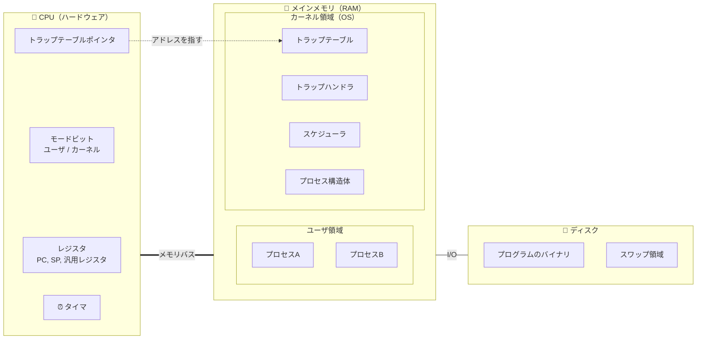
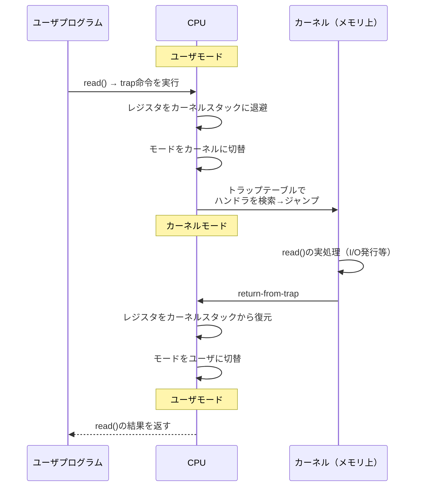
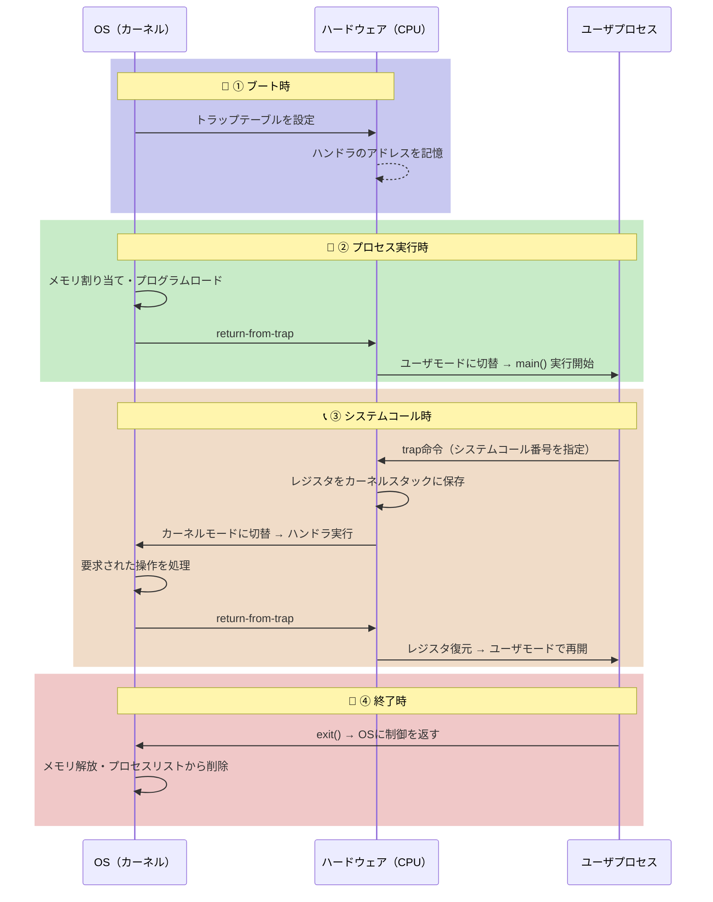
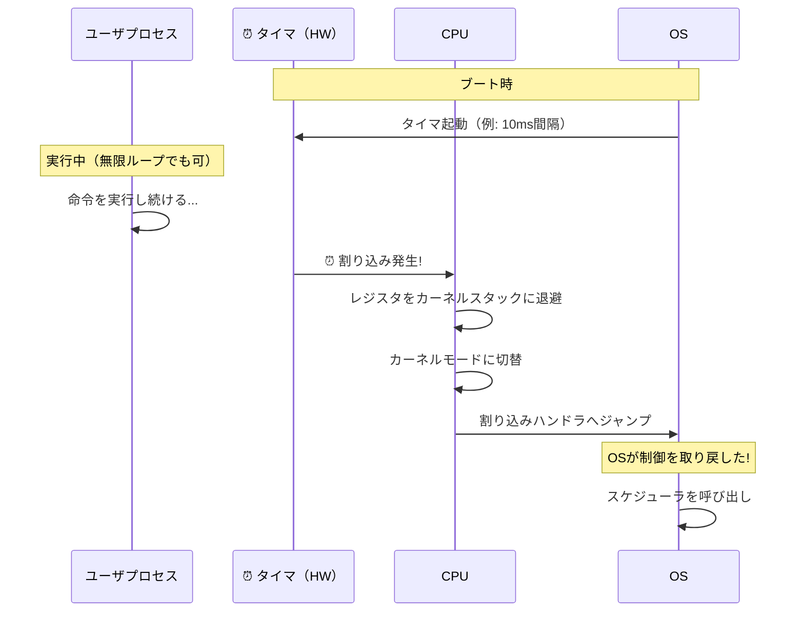
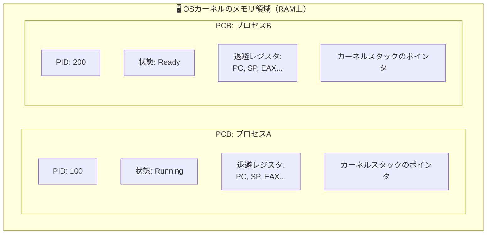
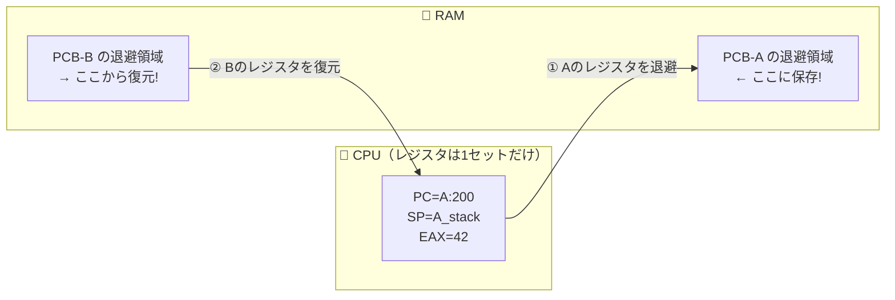
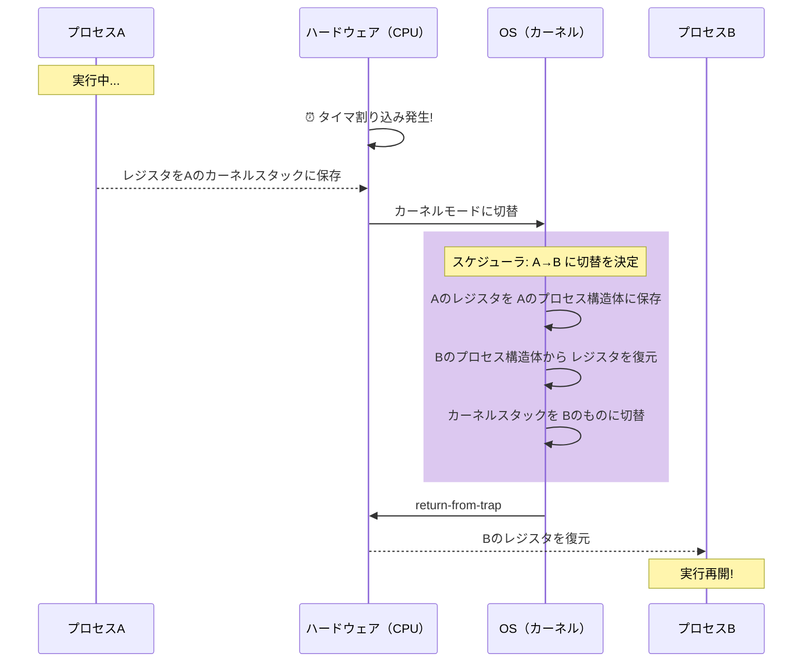

# 6. 制限付き直接実行（Limited Direct Execution）

前章まででプロセスの概念とAPIを学んだ。では、OSは実際にどうやってプログラムを高速に実行しつつ、同時にコントロールを失わないようにしているのだろうか？ CPUを仮想化するには、複数のプロセスでCPUを時分割（タイムスライス）して共有する必要がある。しかし、この仕組みを実現するには2つの課題がある。

1. **パフォーマンス**: オーバーヘッドを最小限に抑えながら仮想化を実現するには？
2. **制御**: プロセスにCPUの制御を奪われないようにするには？

OSは**制御を失わずに高いパフォーマンスを得る**必要がある。これがCPU仮想化の中心的な課題だ。

## 6.1 基本手法：直接実行

最も単純なアイデアは、プログラムをCPU上で直接実行することだ。OSは以下の手順でプロセスを開始する。

1. プロセスリストにエントリを作成
2. メモリを割り当て、プログラムコードをロード
3. エントリポイント（`main()`など）を見つけてジャンプ

シンプルだが、2つの問題がある。

- プログラムが「やってはいけないこと」を実行するのをどう防ぐか？
- 実行中のプロセスを止めて別のプロセスに切り替えるには？

## 6.2 問題1：制限付き操作

直接実行はハードウェア上でネイティブに動作するため高速だ。しかし、ディスクI/Oの発行やシステムリソースへのアクセスなど、制限すべき操作をどう扱うか？

以降の説明を理解するために、まずコンピュータの物理的な構造を押さえておこう。**カーネル（OS）はソフトウェアであり、メモリ上に存在する**。一方、**CPUはハードウェアであり、レジスタやモードビットを内蔵している**。両者は別物だ。

> 💡 この図の要点：**カーネルはメモリ上のソフトウェア**だが、CPUが「カーネルモード」で動作しているときだけ実行される。CPUのトラップテーブルポインタは、メモリ上のトラップテーブルの場所を指す。つまり「カーネルがCPUにトラップテーブルの場所を教える」とは、**カーネルのコードがCPU内のレジスタにメモリアドレスを書き込む**ということだ。

### ユーザモードとカーネルモード

この問題を解決するために、プロセッサには2つの動作モードがある。

- **ユーザモード**: アプリケーションが動作するモード。できることが制限されている（例：I/O要求を直接発行できない）
- **カーネルモード**: OSが動作するモード。I/O要求の発行を含む、すべての特権操作が可能

### システムコールの仕組み

ユーザプログラムが特権操作を行いたい場合、**システムコール**を使う。その流れは次の通り。

1. プログラムが**トラップ命令**を実行

> 💡 **トラップ命令**とは、プログラムが「OSに助けを求める」ための特別なCPU命令。実行すると、CPUが自動的にユーザモードからカーネルモードに切り替わり、OS側のコードが動き始める。「非常ベルを鳴らす」ようなイメージだ。

2. CPUがカーネルモードに切り替わり、カーネル内のトラップハンドラにジャンプ
3. カーネルが要求された操作を実行
4. **return-from-trap命令**でユーザモードに戻る

トラップ実行時、ハードウェアは呼び出し元のレジスタ（プログラムカウンタ、フラグなど）を**カーネルスタック**に保存する。return-from-trapでこれらを復元し、ユーザプログラムの実行を再開する。

> 💡 **カーネルスタック**とは、OS（カーネル）専用の作業メモリ領域。ユーザプログラムが使う「ユーザスタック」とは別に、各プロセスごとにカーネル用のスタックが用意されている。トラップ時にレジスタの値をここに退避することで、OS処理後にユーザプログラムへ安全に戻れる。

### トラップテーブル

トラップ時にカーネル内のどのコードを実行するかは、起動時にOSが設定する**トラップテーブル**で決まる。

> 💡 **トラップテーブル**とは、「どのイベントが起きたら、どの処理を実行するか」を登録した対応表のこと。電話の短縮ダイヤル帳のように、番号→処理先をあらかじめ登録しておく仕組みだ。

- OSはブート時に、各種イベント（システムコール、ハードディスク割り込み、キーボード割り込みなど）に対応するハンドラの場所をハードウェアに通知する
- ハードウェアはこの情報を記憶し、イベント発生時に適切なハンドラにジャンプする

ユーザコードはジャンプ先のアドレスを直接指定できず、**システムコール番号**を通じて間接的にサービスを要求する。これが保護の仕組みとして機能する。

### LDE（Limited Direct Execution）プロトコルの流れ

> 💡 **LDEプロトコル**とは、「プログラムをCPU上で直接実行させるが、危険な操作だけはOSが管理する」という約束事の全体像。ここまで説明してきたユーザモード/カーネルモードの切り替え、トラップテーブル、システムコールの仕組みをまとめたものだ。

1. **ブート時**: カーネルがトラップテーブルを初期化し、CPUにその場所を記憶させる
2. **プロセス実行時**: カーネルがプロセスの準備（メモリ割り当てなど）を行い、return-from-trapでユーザモードに切り替えて実行開始
3. **システムコール時**: プロセスがトラップ → OSが処理 → return-from-trapで戻る
4. **終了時**: プロセスが`main()`から戻り、`exit()`でOSに制御を返す

## 6.3 問題2：プロセス間の切り替え

プロセスがCPU上で動作しているとき、OSは動作していない。OSが動作していなければ、何もできない。では、どうやってCPUの制御を取り戻すのか？

### 協調的アプローチ

古いシステム（旧Mac OSなど）では、プロセスが自発的にCPUを手放すことを前提としていた。プロセスはシステムコールを通じて頻繁にOSに制御を渡す。

**問題点**: プロセスが無限ループに陥ると、OSは制御を取り戻せない。唯一の手段はマシンの再起動。

### 非協調的アプローチ：タイマ割り込み

現代のOSでは、**タイマ割り込み**を使う。タイマデバイスが一定間隔で割り込みを発生させ、実行中のプロセスを停止してOSの割り込みハンドラを実行する。

- ブート時にOSがタイマを起動（特権操作）
- タイマが定期的に割り込みを発生
- 割り込み発生時、ハードウェアが実行中プロセスのレジスタをカーネルスタックに保存
- OSの割り込みハンドラが実行される

> 💡 **協調的アプローチ**ではプロセスが自発的にCPUを手放す必要があったが、**タイマ割り込み**なら、プロセスが無限ループに陥ってもハードウェアが強制的にOSに制御を戻す。これが現代OSの安全性の要だ。

これにより、プロセスが協力的でなくても、OSは確実にCPUの制御を取り戻せる。

### コンテキストスイッチ

OSが制御を取り戻した後、現在のプロセスを継続するか、別のプロセスに切り替えるかを**スケジューラ**が決定する。切り替える場合、OSは**コンテキストスイッチ**を実行する。

> 💡 **コンテキストスイッチ**とは、現在動いているプロセスの「作業状態」を丸ごと保存し、別のプロセスの保存済み状態を復元して切り替える操作。料理中に別の料理に取りかかるとき、まな板の状態を写真に撮って保存し、別の料理の写真を見て作業台を再現するようなイメージだ。

#### プロセス構造体（PCB）とは？

レジスタを「保存する」と言ったが、どこに保存するのか？ OSは各プロセスの情報を**プロセス構造体（PCB: Process Control Block）**というデータ構造に保持している。PCBは**OSのカーネルメモリ（RAM上）** に存在し、プロセスごとに1つずつある。

> 💡 **PCBはOSが管理する「履歴書」のようなもの**。プロセスのID、現在の状態、中断時のレジスタ値、カーネルスタックの場所などが記録されている。コンテキストスイッチでは、このPCBにレジスタを退避し、別プロセスのPCBからレジスタを復元する。

#### コンテキストスイッチの手順

1. 現在のプロセスのレジスタ値をそのプロセスの**PCB（メモリ上）**に保存
2. 次に実行するプロセスのレジスタ値を**PCBから**復元
3. カーネルスタックを切り替え
4. return-from-trapで新しいプロセスの実行を再開

**📸 レジスタはどこに保存されるか:**

> 💡 CPUのレジスタは**1セットしかない**。だからプロセスを切り替えるには、今の値をPCB（RAM上）に保存して、次のプロセスのPCBから値を書き戻す。物理的にメモリの中身が変わるわけではなく、**CPUが「どこを見ているか」が変わる**。

**レジスタの保存/復元には2種類ある。**

| タイミング | 保存主体 | 保存先 |
|---|---|---|
| タイマ割り込み発生時 | ハードウェア | カーネルスタック |
| プロセス切り替え時 | OS（ソフトウェア） | プロセス構造体のメモリ |

## 6.4 並行性の問題

「システムコール中にタイマ割り込みが来たら？」「割り込み処理中に別の割り込みが来たら？」

OSはこれらの状況に対処する必要がある。基本的な対策は次の2つ。

1. **割り込み処理中の割り込み無効化**: 1つの割り込みを処理している間、他の割り込みを無効にする（ただし長時間の無効化は割り込みの喪失につながるので注意）
2. **ロック機構**: 内部データ構造への同時アクセスを保護するためにロックを使用する（特にマルチプロセッサで重要）

並行性の詳細は本書の第2部で扱う。

## 6.5 まとめ

**制限付き直接実行（LDE）** のポイント：

- プログラムはCPU上で直接実行する（高速）
- ただし、ハードウェアの仕組みでプロセスの操作を制限する
- **ユーザモード/カーネルモード**で特権操作を制御
- **トラップテーブル**でシステムコールのエントリポイントを管理
- **タイマ割り込み**でOSがCPUの制御を取り戻す
- **コンテキストスイッチ**でプロセス間を切り替え

これらの仕組みにより、OSはプロセスを効率的に実行しつつ、マシンの制御を維持できる。次の課題は「どのプロセスをいつ実行すべきか？」＝スケジューリングだ。

---

[← 前へ: 05. プロセスAPI](./05.md) | [次へ: 07. スケジューリング入門 →](./07.md)

