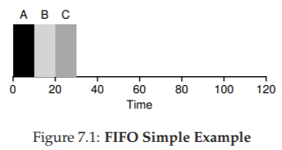
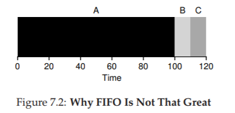
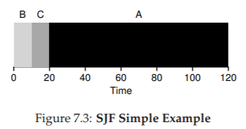
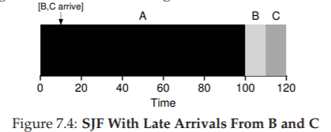
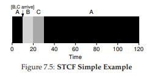
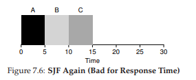
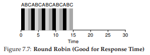
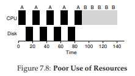
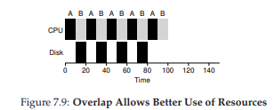

# 7. スケジューリング入門

この章では、OSスケジューラが採用するスケジューリング方針（ポリシー）を学ぶ。スケジューリングの考え方はコンピュータ以前から存在し、工場の生産管理などから発想が取り入れられてきた。

## 7.1 ワークロードの仮定

まず、いくつかの非現実的な仮定からスタートし、徐々に緩和していく。

1. 各ジョブの実行時間は同じ
2. すべてのジョブが同時に到着する
3. 開始したジョブは完了まで実行される
4. すべてのジョブはCPUのみを使用する（I/Oなし）
5. 各ジョブの実行時間は既知である

## 7.2 スケジューリングの評価指標

異なるスケジューリング方針を比較するために、**指標（メトリック）** が必要だ。

### ターンアラウンドタイム

ジョブが到着してから完了するまでの時間。

$$T_{turnaround} = T_{completion} - T_{arrival}$$

すべてのジョブが同時到着（$T_{arrival} = 0$）なら、ターンアラウンドタイム = 完了時刻。

### 応答時間

ジョブが到着してから初めてスケジュールされるまでの時間。

$$T_{response} = T_{firstrun} - T_{arrival}$$

パフォーマンスと公平さはしばしばトレードオフの関係にある。

## 7.3 FIFO（First In, First Out）

最も基本的なアルゴリズム。到着順に実行する。

**例**: A, B, C（各10秒）が同時到着

平均ターンアラウンドタイム: $(10 + 20 + 30) / 3 = 20$ 秒

### FIFOの問題：コンボイ効果

仮定1を緩和して、ジョブの実行時間が異なる場合を考える。

**例**: A = 100秒、B = C = 10秒

Aが先に来ると、BとCはAの完了を待たされる。平均ターンアラウンドタイム: $(100 + 110 + 120) / 3 = 110$ 秒。

これが**コンボイ効果** ― 短いジョブが長いジョブの後ろに並んでしまう問題。スーパーのレジで大量の買い物客の後ろに並ぶようなもの。

## 7.4 SJF（Shortest Job First）

**最短ジョブを先に実行する。**

同じ例でBとCを先に実行すると、平均ターンアラウンドタイム: $(10 + 20 + 120) / 3 = 50$ 秒。FIFOの110秒から大幅に改善。

すべてのジョブが同時到着する場合、SJFは最適なスケジューリングアルゴリズムだ。

### SJFの問題

仮定2を緩和して、ジョブが異なる時刻に到着する場合を考える。

**例**: A（100秒）がt=0に到着、B・C（各10秒）がt=10に到着。SJFでもAが先に動き始めているため、B・Cはwait。

平均ターンアラウンドタイム: $(100 + (110-10) + (120-10)) / 3 = 103.33$ 秒。再びコンボイ問題が発生。

## 7.5 STCF（Shortest Time-to-Completion First）

仮定3（ジョブは完了まで実行）を緩和し、**プリエンプション**（実行中のジョブを中断して別のジョブを実行）を導入する。

STCFは、残り時間が最も短いジョブを常に優先する。

B・Cが到着した時点でAを中断し、B・Cを先に実行。平均ターンアラウンドタイム: $((120-0) + (20-10) + (30-10)) / 3 = 50$ 秒。

## 7.6 新しい指標：応答時間

ターンアラウンドタイムだけでは不十分だ。タイムシェアリングシステムの登場で、ユーザはインタラクティブな応答を期待するようになった。

STCFは応答時間には悪い。3つのジョブが同時到着した場合、3番目のジョブは前の2つが完了するまで全くスケジュールされない。

## 7.7 ラウンドロビン（RR）

ジョブを完了まで実行するのではなく、**タイムスライス**（一定時間）ごとにジョブを切り替える。

**例**: A, B, C（各5秒）、タイムスライス = 1秒

- **SJFの応答時間**: $(0 + 5 + 10) / 3 = 5$ 秒
- **RRの応答時間**: $(0 + 1 + 2) / 3 = 1$ 秒

RRは応答時間に優れるが、ターンアラウンドタイムは最悪に近い（各ジョブの完了をできるだけ引き延ばすため）。

### タイムスライスの長さ

- **短い** → 応答時間は良いが、コンテキストスイッチのオーバーヘッドが増える
- **長い** → オーバーヘッドは減るが、応答時間が悪化する

コンテキストスイッチのコストは、レジスタの保存/復元だけでなく、CPUキャッシュ・TLB・分岐予測器の内容がフラッシュされることも含む。

### トレードオフ

| 方式 | ターンアラウンドタイム | 応答時間 |
|---|---|---|
| SJF / STCF | ◎ | ✕ |
| RR | ✕ | ◎ |

パフォーマンスを重視すると公平さが犠牲になり、公平さを重視するとパフォーマンスが犠牲になる。

## 7.8 I/Oの考慮

仮定4（I/Oなし）を緩和する。

ジョブがI/O要求を出すと、I/O完了までCPUを使わない。この間に別のジョブをスケジュールすべきだ。

**例**: A（50ms、10msごとにI/O）とB（50ms、I/Oなし）

Aの各10msサブジョブを独立ジョブとして扱い、STCFで短い方を優先する。AのI/O中にBを実行し、CPUを有効活用する。

## 7.9 実行時間が未知の場合

仮定5（実行時間が既知）を緩和すると、SJF/STCFの「最短ジョブを選ぶ」ことができなくなる。実行時間を知らずにSJF的な振る舞いを実現し、かつ応答時間も良好にするにはどうすればよいか？

次の章で紹介する**マルチレベルフィードバックキュー（MLFQ）** がその答えだ。

## 7.10 まとめ

- **SJF / STCF**: 最短ジョブ優先でターンアラウンドタイムを最適化
- **ラウンドロビン**: ジョブを交互に実行して応答時間を最適化
- **I/Oの活用**: I/O中に他のジョブを実行してCPUを有効活用
- **未解決の課題**: 実行時間が未知の場合のスケジューリング → MLFQで解決

---

[← 前へ: 06. 制限付き直接実行](./06.md) | [次へ: 08. MLFQ →](./08.md)

