# 10. マルチプロセッサスケジューリング（応用）

> 🎯 **この章を学ぶ理由**: マルチコアCPUが当たり前の今、複数CPUでのスケジューリングは必須知識。キャッシュの一貫性やロック競合など、マルチコア特有の問題を理解する。
> **前提知識**: 7-9章（スケジューリング）、26章（並行性の基礎）

マルチコアプロセッサの普及により、複数CPUでのスケジューリングが重要になった。この章ではマルチプロセッサスケジューリングの基本を学ぶ。

> **注意**: この章は並行性（本書の第2部）の知識が前提。先に読んで後から戻ってくるのも良い。

## 10.1 背景：マルチプロセッサアーキテクチャ

### キャッシュの仕組み

シングルCPUシステムでは、キャッシュがメインメモリの頻繁にアクセスされるデータのコピーを保持し、高速アクセスを実現する。

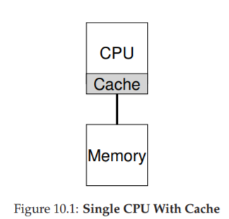

キャッシュが有効に機能する理由は**局所性**にある。

- **時間的局所性**: 一度アクセスしたデータは、近い将来また使われる可能性が高い（例：ループ内の変数）
- **空間的局所性**: あるアドレスにアクセスしたら、近くのアドレスも使われる可能性が高い（例：配列の走査）

### マルチCPUでのキャッシュ一貫性問題

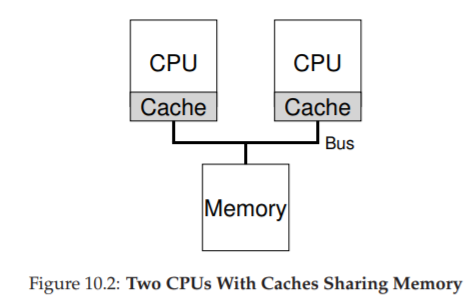

複数CPUが共有メモリを使うと問題が起きる。

**例**:
1. CPU1がアドレスAの値D を読み、キャッシュに保存
2. CPU1が値をD'に更新（キャッシュのみ更新、メインメモリはまだD）
3. OSがプロセスをCPU2に移動
4. CPU2がアドレスAを読むと、メインメモリから古い値Dを取得してしまう

これが**キャッシュ一貫性問題**だ。

### 解決策：バススヌーピング

各キャッシュがメモリバスを監視し、他のCPUによるメモリ更新を検知する。更新を検知したら、自分のキャッシュのコピーを無効化または更新する。

> 💡 **バススヌーピング**とは、各CPUのキャッシュがメモリの「伝言板」（バス）を常に盗み見して、他のCPUがデータを書き換えたら「あ、自分の持ってるコピーは古いな」と気づく仕組み。「スヌープ（盗み見る）」が名前の由来だ。

## 10.2 同期を忘れるな

ハードウェアがキャッシュ一貫性を保証しても、プログラムレベルでの同期は必要だ。

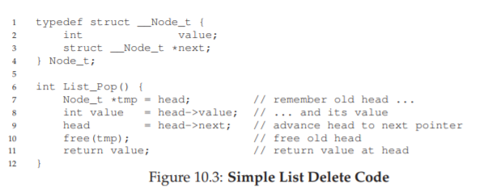

共有データ構造への同時アクセスには**ロック（ミューテックス）** が必要。例えば、共有リンクリストから要素を削除する場合、ロックなしだと2つのスレッドが同じ要素を削除しようとして問題が起きる。

ただし、ロックにはパフォーマンスコストがあり、CPUの数が増えるほど同期のオーバーヘッドも増大する。

## 10.3 キャッシュアフィニティ

プロセスが特定のCPUで実行されると、そのCPUのキャッシュにプロセスの状態が蓄積される。次回も同じCPUで実行すれば、キャッシュを再利用できて高速。これが**キャッシュアフィニティ**だ。

> 💡 **キャッシュアフィニティ**は「なじみのキッチンなら作業が早い」ということ。毎回違うキッチン（CPU）に行くと、道具の場所（キャッシュ）を覆え直さなければならず効率が悪くなる。

毎回異なるCPUでプロセスを実行すると、キャッシュの再構築が必要になり性能が低下する。スケジューラはできるだけ同じCPUにプロセスを割り当てるべきだ。

## 10.4 シングルキュースケジューリング（SQMS）

最もシンプルなアプローチ。すべてのジョブを1つのキューに入れ、各CPUがキューからジョブを取り出す。

### 利点
- 実装がシンプル
- 既存のシングルCPUスケジューリングポリシーをそのまま再利用できる

### 欠点

**スケーラビリティの問題**: キューへのアクセスにロックが必要。CPU数が増えるとロック競合が激化し、オーバーヘッドが増大する。

**キャッシュアフィニティの問題**: ジョブがCPU間を移動しがちで、キャッシュの恩恵を受けにくい。

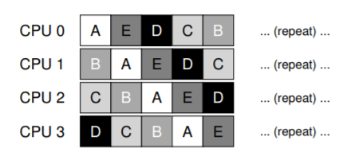

アフィニティを考慮する場合、一部のジョブを固定しつつ1つのジョブだけを移動させるなどの工夫が必要。

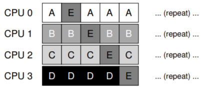

## 10.5 マルチキュースケジューリング（MQMS）

CPUごとに個別のキューを持つアプローチ。

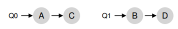

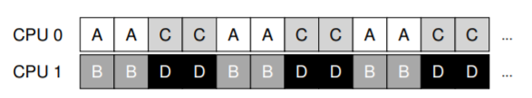

### 利点
- **スケーラビリティ**: CPU数が増えてもキュー数が増えるだけで、ロック競合が少ない
- **キャッシュアフィニティ**: ジョブは同じCPU上に留まるため、キャッシュを有効活用

### 問題：負荷の不均衡

ジョブが終了すると、キュー間でジョブ数に偏りが生じる。

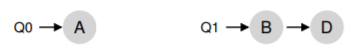

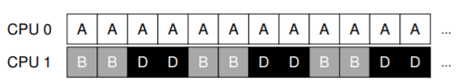

最悪の場合、1つのCPUがアイドル状態になる。

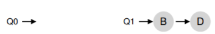

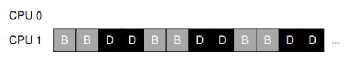

### 解決策：ワークスティーリング

ジョブが少ないキュー（ソース）が、ジョブの多いキュー（ターゲット）からジョブを「盗む」。

> 💡 **ワークスティーリング**は、暴いているレジが忙しいレジから客を「こっちへどうぞ」と引き受けるような仕組み。CPUが自分のキューが空になったら、他CPUのキューからジョブをもらってくる。

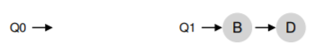

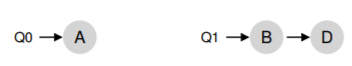

チェック頻度のトレードオフ：
- **頻繁すぎる** → オーバーヘッドが増え、スケーラビリティが低下
- **少なすぎる** → 負荷の不均衡が長時間続く

## 10.6 Linuxのマルチプロセッサスケジューラ

Linuxでは3つの異なるスケジューラが開発されてきた。

| スケジューラ | キュー方式 | 特徴 |
|---|---|---|
| O(1) | マルチキュー | 優先度ベース（MLFQに類似） |
| CFS | マルチキュー | 決定論的な比例配分（ストライドスケジューリングに類似） |
| BFS | シングルキュー | EEVDF方式に基づく比例配分 |

シングルキューでもマルチキューでも成功例があり、どちらが常に優れているとは言えない。

## 10.7 まとめ

| 方式 | スケーラビリティ | キャッシュアフィニティ | 負荷バランス | 実装の複雑さ |
|---|---|---|---|---|
| SQMS | ✕ | ✕ | ◎ | シンプル |
| MQMS | ◎ | ◎ | 要工夫（ワークスティーリング） | 複雑 |

どちらのアプローチにも長所と短所がある。汎用スケジューラの設計は難しく、小さなコード変更が動作に大きな影響を与える。

---

[← 前へ: 09. プロポーショナルシェア](./09.md) | [次へ: 13. アドレス空間 →](./13.md)

