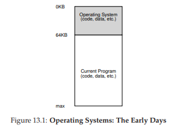
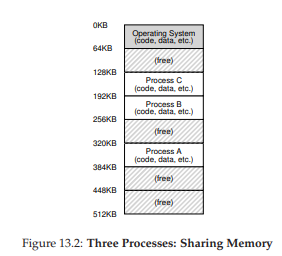
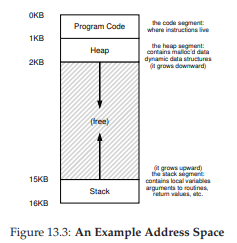

# 13. アドレス空間（Address Space）

ここから「メモリの仮想化」に入る。コンピュータの**物理メモリ（RAM）**は、バイト単位でアクセスできる巨大な配列のようなものだ。各バイトには0から始まる番号（**物理アドレス**）が付いている。複数のプログラムが同時にこの物理メモリを使いたいとき、互いのデータを壊さずにどう共存させるか——この章ではOSがこの問題をどう解決してきたかを見ていく。

## 13.1 初期のシステム

初期のコンピュータでは、メモリの抽象化はほとんどなかった。OS（実質的にはライブラリ）がメモリの一部を占有し、残りの物理メモリを1つの実行中プログラムが直接使用していた。



## 13.2 マルチプログラミングとタイムシェアリング

マシンが高価だった時代、複数のプロセスを同時に実行する**マルチプログラミング**が登場し、CPU利用効率が向上した。さらに、プログラマが対話的にマシンと連携する**タイムシェアリング**の時代が到来し、プロセスの切り替え時にメモリの内容をディスクに退避する方法も試みられた。しかし、メモリ全体をディスクに保存するのは遅すぎた。

そこで、複数のプロセスを同時にメモリに常駐させる方式が採用された。



ただし、この方式では**保護**が重要になる。あるプロセスが他のプロセスのメモリを読み書きできてはならない。

## 13.3 アドレス空間

OSが提供するメモリの抽象化が**アドレス空間**だ。実行中プログラムのメモリのビューを表す。

アドレス空間には以下の要素が含まれる。

- **コード**: プログラムの命令。静的で、アドレス空間の先頭に配置
- **ヒープ**: `malloc()`などで動的に確保されるメモリ。コードの直後から下方向に成長
- **スタック**: 関数呼び出しの追跡、ローカル変数の格納。アドレス空間の末尾から上方向に成長



ヒープとスタックをそれぞれ反対方向に成長させることで、空間を柔軟に利用できる。

**重要**: プログラムが「アドレス0にロードされている」と思っていても、実際にはそのプログラムは物理メモリの任意のアドレスに配置されている。この仮想アドレスから物理アドレスへの変換が、**メモリの仮想化**の核心だ。

### 仮想アドレスの例

```c
#include <stdio.h>
#include <stdlib.h>
int main(int argc, char *argv[]) {
    printf("location of code : %p\n", (void *) main);
    printf("location of heap : %p\n", (void *) malloc(1));
    int x = 3;
    printf("location of stack : %p\n", (void *) &x);
    return x;
}
```

Cプログラムで表示されるアドレスはすべて**仮想アドレス**。物理メモリ上の実際の位置を知っているのはOSとハードウェアだけだ。

## 13.4 仮想メモリの目標

仮想メモリ（VM）システムには3つの主要な目標がある。

| 目標 | 内容 |
|---|---|
| **透明性** | プログラムはメモリが仮想化されていることを意識しない。独自の物理メモリを持つかのように動作する |
| **効率性** | 仮想化のオーバーヘッドを最小化（TLBなどのハードウェアサポートを活用） |
| **保護** | プロセス間のメモリを分離し、他のプロセスやOSのメモリへのアクセスを防止 |

**分離の原則**: 互いに適切に分離されたエンティティは、一方が障害を起こしても他方に影響を与えない。マイクロカーネル設計はこの分離をOS内部にも適用する。

## 13.5 まとめ

仮想メモリシステムは、プログラムに大きなプライベートアドレス空間の錯覚を提供する。OSはハードウェアの助けを借りて、仮想メモリ参照を物理アドレスに変換し、複数のプロセスが同時にメモリを共有しながらも互いを保護する。次の章からは、仮想メモリを実現するための具体的なメカニズムを学んでいく。

---

<div align="center">

[← 前へ: 10. マルチプロセッサスケジューリング](./10.md) | [次へ: 14. メモリAPI →](./14.md)

</div>
