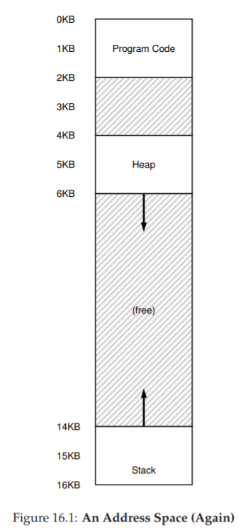
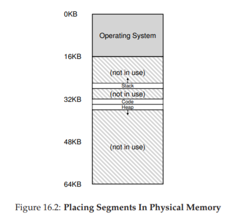
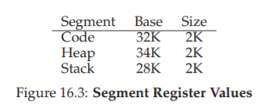
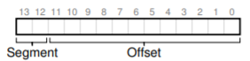
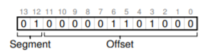
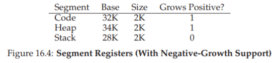
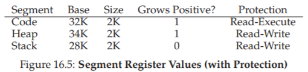
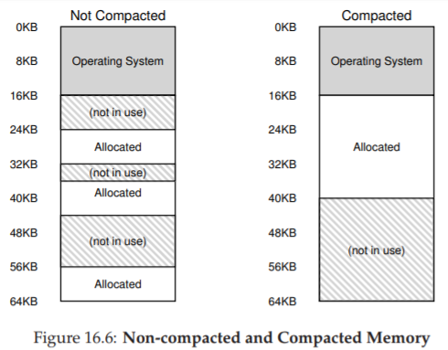

# 16. セグメンテーション（Segmentation）

ベースと境界の方式では、アドレス空間全体をメモリに配置する。しかし、スタックとヒープの間の巨大な空き領域が無駄に物理メモリを占有してしまう。



## 16.1 セグメンテーション：ベース/バウンドの一般化

解決策は、アドレス空間の**論理セグメント（コード・ヒープ・スタック）それぞれに独立したベース/バウンドのペア**を持たせること。

> 💡 **セグメンテーション**とは、アドレス空間を「コード」「ヒープ」「スタック」といった意味のあるまとまり（セグメント）に分割し、それぞれを物理メモリ上の別々の場所に配置する手法。前章の「アドレス空間を丸ごと配置」する方式の改良版だ。



これにより、使用中のメモリだけが物理メモリの領域を割り当てられ、大きな疎なアドレス空間にも対応できる。



### アドレス変換の例

仮想アドレス100（コードセグメント内）の場合：
- オフセット（100）+ ベース値（32KB）= 物理アドレス32868
- オフセットが境界値（2KB）未満であることを確認

仮想アドレス4200（ヒープセグメント内）の場合：
- ヒープオフセット = 4200 - 4096 = 104
- 104 + ベース値（34KB）= 物理アドレス34920

境界値を超えるアドレスにアクセスしようとすると、ハードウェアがトラップを発生させ、OSがプロセスを終了させる。これが**セグメンテーションフォルト**の由来だ。

## 16.2 セグメントの識別方法

### 明示的アプローチ

仮想アドレスの**上位ビットでセグメントを識別**する。



例えば14ビット仮想アドレスの場合、上位2ビットでセグメントを選択し、残り12ビットがオフセットになる。



```c
// 14ビット仮想アドレスからセグメントとオフセットを取得
Segment = (VirtualAddress & SEG_MASK) >> SEG_SHIFT
Offset = VirtualAddress & OFFSET_MASK
if (Offset >= Bounds[Segment])
    RaiseException(PROTECTION_FAULT)
else
    PhysAddr = Base[Segment] + Offset
```

### 暗黙的アプローチ

アドレスの生成方法からセグメントを判断する。
- プログラムカウンタから生成 → コードセグメント
- スタックポインタから生成 → スタックセグメント
- その他 → ヒープセグメント

## 16.3 スタックの扱い

スタックは逆方向（高いアドレスから低いアドレスへ）に成長する。ハードウェアは成長方向を示す追加ビットを持つ。



仮想アドレス15KB（スタック内）の変換：
1. 上位2ビット（11）→ スタックセグメント
2. オフセット = 3KB
3. 負のオフセット = 3KB - 4KB（最大セグメントサイズ）= -1KB
4. 物理アドレス = ベース（28KB）+ (-1KB) = 27KB

## 16.4 共有のサポート

メモリ節約のため、セグメントを複数プロセス間で共有できる。特にコードセグメントの共有が一般的。

これを安全に実現するために**保護ビット**を追加する。



コードセグメントを**読み取り・実行専用**に設定すれば、複数プロセスが同じ物理メモリのコードを共有しても安全。

## 16.5 粗粒度 vs 細粒度セグメンテーション

- **粗粒度**: 少数の大きなセグメント（コード・ヒープ・スタック）に分割
- **細粒度**: 多数の小さなセグメントに分割（Multicsなど）。セグメントテーブルをメモリに格納して管理

## 16.6 OSの課題

### コンテキストスイッチ

セグメントレジスタの保存・復元が必要。

### 外部断片化



可変サイズのセグメントにより、物理メモリが小さな空き領域の断片で埋められ、大きなセグメントを割り当てられなくなる。

**対策**:
- **コンパクション**: セグメントを再配置して空き領域をまとめる（コストが高い）
- **空きリスト管理アルゴリズム**: ベストフィット、ワーストフィット、ファーストフィットなど（完全な解決にはならない）

> 💡 **外部断片化**とは、空きメモリの合計は十分なのに、細切れに散らばっていて大きな連続領域が取れない状態。ロッカーの空きが両端に点在していて、大きな荷物を入れられない状況に似ている。一方、後の章で出てくる**内部断片化**は、割り当てた領域の中に使われない部分が残る問題だ。

## 16.7 まとめ

セグメンテーションにより、アドレス空間内の未使用領域を物理メモリに配置せずに済み、メモリを効率的に使える。コード共有も可能。

しかし、**外部断片化**と、**疎なヒープ内部の非効率**の問題が残る。これを本質的に解決するのが、次の章で学ぶ**ページング**だ。

---

<div align="center">

[← 前へ: 15. アドレス変換](./15.md) | [次へ: 17. 空きスペース管理 →](./17.md)

</div>
