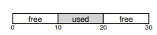
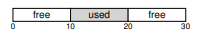
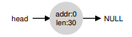
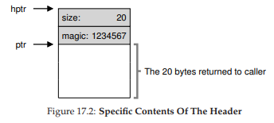
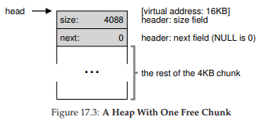
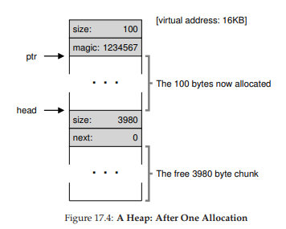
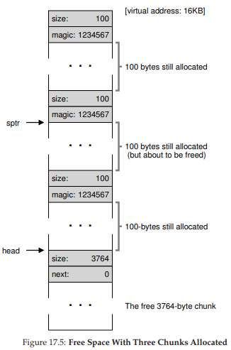
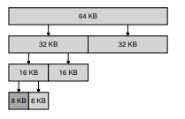

# 17. 空き領域管理（Free-Space Management）

> 🎯 **この章を学ぶ理由**: `malloc()`/`free()`の内部で何が起きているかを理解する。メモリの断片化やアロケータの設計は、パフォーマンスチューニングやガベージコレクションの理解にもつながる。
> **前提知識**: 14章（メモリAPI）

この章では、可変サイズのメモリ割り当て要求を処理する際の空き領域管理について学ぶ。`malloc()`のようなユーザレベルのメモリアロケータや、セグメンテーションを使う際のOSの物理メモリ管理に共通する課題だ。

固定サイズのユニットに分割されていれば管理は簡単だが、**可変サイズ**になると**外部断片化**が問題になる。空き領域の合計は十分でも、連続した空きが不足して割り当てに失敗する。



## 17.1 前提

- `malloc(size_t size)` と `free(void *ptr)` のインタフェースを想定
- `free()`にはサイズ引数がない → ライブラリがサイズを追跡する必要がある
- 一度ユーザに渡したメモリは移動できない（圧縮不可）

## 17.2 低レベルのメカニズム

### 分割（Splitting）と合体（Coalescing）



30バイトのヒープに、10バイトの空きチャンクが2つある場合を考える。

**分割**: 要求サイズより大きい空きチャンクを見つけたら、要求分と残りの2つに分割する。

**合体**: メモリが解放されたとき、隣接する空きチャンクをマージして大きな空きチャンクにする。これにより断片化を防ぐ。



### 割り当て領域サイズの追跡

`free()`にはサイズ引数がないため、メモリチャンクの直前に**ヘッダブロック**を配置してサイズ情報を格納する。

```c
typedef struct {
    int size;
    int magic;  // サニティチェック用
} header_t;
```



`free(ptr)`が呼ばれると、ライブラリは`ptr`の直前にあるヘッダからサイズを読み取る。解放される合計サイズ = ヘッダサイズ + データサイズ。

### 埋め込みフリーリスト

空きリスト自体を空き領域の中に構築する（`malloc()`を呼べないため）。

```c
typedef struct node_t {
    int size;
    struct node_t *next;
} node_t;
```



割り当てと解放の流れ：

1. 最初は1つの大きな空きチャンク
2. 割り当てるたびにチャンクを分割し、フリーリストの空きサイズが縮小
3. 解放されたチャンクをフリーリストに再追加
4. 隣接する空きチャンクを合体





### ヒープの拡張

ヒープの空きがなくなったら、`sbrk`などのシステムコールでOSに追加メモリを要求できる。

## 17.3 基本戦略

### ベストフィット

要求サイズ以上の空きチャンクの中で**最小のもの**を選ぶ。無駄を最小化するが、フリーリスト全体を検索する必要があり遅い。

### ワーストフィット

**最大のチャンク**を選ぶ。大きな空きを残す狙いだが、実際にはパフォーマンスが悪く断片化も多い。

### ファーストフィット

最初に見つかった十分大きなチャンクを選ぶ。高速だが、リスト先頭に小さな断片がたまりやすい。アドレス順にリストをソートすると改善できる。

### ネクストフィット

前回の検索位置から探索を再開する。検索をリスト全体に分散させ、先頭の集中を防ぐ。

## 17.4 その他のアプローチ

### 分離リスト（Segregated Lists）

特定サイズの要求専用にメモリプールを用意する。断片化を減らし、割り当て・解放が高速になる。

**スラブアロケータ**（Jeff Bonwick考案）はこのアイデアの優れた実装で、カーネルオブジェクト（ロック、inode等）用に事前に確保されたオブジェクトキャッシュを使う。解放されたオブジェクトを初期化済みの状態で保持し、再利用時の初期化コストを省く。

> 💡 **スラブアロケータ**は、「同じサイズのモノを大量に使うなら、専用の在庫棚を用意する」という発想。例えば工場で同じ部品を繰り返し使うとき、毎回ゼロから作るより「洗浄済み部品」を棚にストックしておく方が効率的だ。

### バディ割り当て（Buddy Allocation）

空きメモリを2の冪乗サイズのブロックで管理する。



要求があるとブロックを再帰的に二等分し、十分小さいブロックを返す。解放時は「バディ」（対になるブロック）が空いていればマージし、再帰的に大きなブロックに戻す。

バディのアドレスは1ビットだけ異なるため、判定が非常に高速。ただし、2の冪乗サイズしか返せないため**内部断片化**が発生する。

### その他

現代のアロケータはバランス木などの高度なデータ構造を使う。マルチプロセッサ環境向けには、Hoardやjemallocなどスケーラブルなアロケータが開発されている。

## 17.5 まとめ

メモリアロケータの設計は多くのトレードオフを伴う。高速でスケーラブルかつ空間効率の良いアロケータの構築は、現代のコンピュータシステムにおける継続的な課題だ。ワークロードの特性を理解するほど、より効率的なアロケータを設計できる。

---

<div align="center">

[← 前へ: 16. セグメンテーション](./16.md) | [次へ: 18. ページング入門 →](./18.md)

</div>
