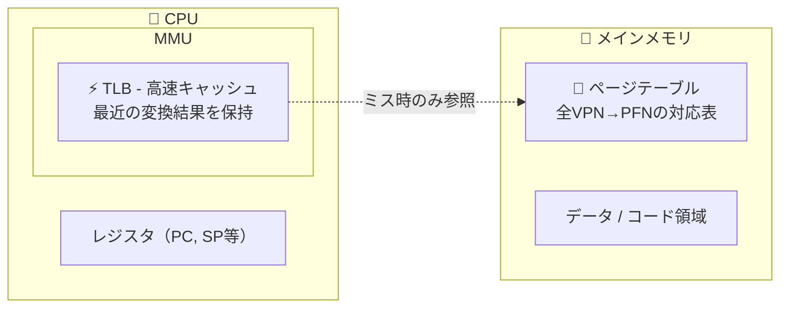
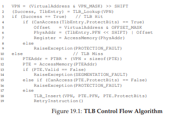
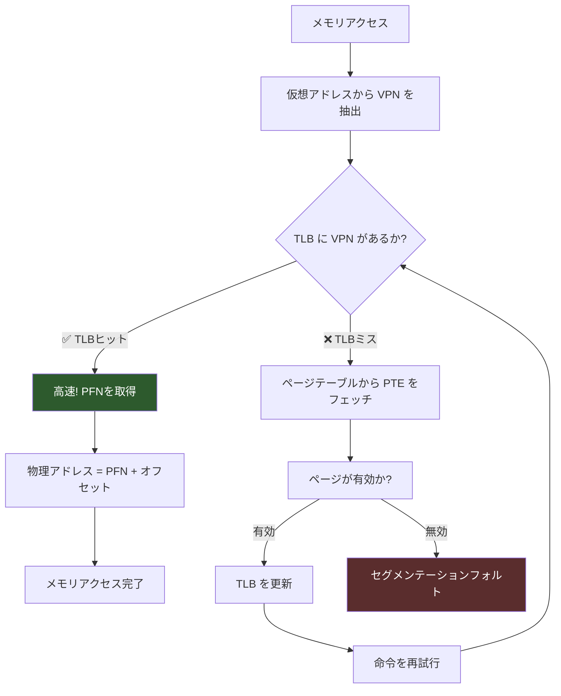
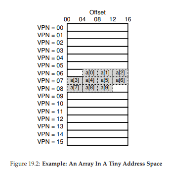
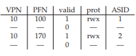
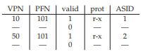
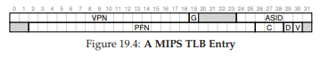

# 19. ページング：高速化（TLB）

> 🎯 **この章を学ぶ理由**: ページングは毎回のメモリアクセスに追加コストがかかる。TLBはこの問題を解決するハードウェアキャッシュで、プログラムの実行速度に直結する。TLBミスの理解はパフォーマンスチューニングの基礎。
> **前提知識**: 18章（ページングの仕組み）

ページングでは、すべてのメモリアクセスに対してページテーブルへの追加アクセスが必要で、パフォーマンスが低下する。この問題を解決するのが**TLB（Translation Lookaside Buffer）**だ。

TLBはMMU内のハードウェアキャッシュで、最近の仮想→物理アドレス変換を保持する。**アドレス変換キャッシュ**とも呼べる。

> 💡 **TLB（Translation Lookaside Buffer）**は、「よく使う電話番号をメモした付箋」のようなもの。毎回電話帳（ページテーブル）を引く代わりに、最近調べた変換結果を小さなメモに保存しておき、次回はメモを見るだけで済む。これによりアドレス変換が劇的に高速化する。

## 19.1 TLBの基本アルゴリズム

まず、TLBが物理的にどこにあるかを理解しよう。



> 💡 **TLBはCPU内のMMUに内蔵された超高速キャッシュ**（数十〜数百エントリ）。ページテーブルはメモリ上にある完全な変換表。TLBに変換があれば**メモリアクセスなしで**変換できる（＝高速）。なければメモリ上のページテーブルを参照する（＝遅い）。



1. 仮想アドレスからVPNを抽出
2. TLBにそのVPNの変換があるか確認
3. **TLBヒット**: PFNを取得し、オフセットと結合して物理アドレスを生成（高速）
4. **TLBミス**: ページテーブルからPTEをフェッチし、TLBを更新して命令を再試行

TLBは一般的なケース（ヒット）では非常に高速。ミスが頻発するとパフォーマンスが著しく低下する。



## 19.2 配列アクセスの例

16バイトページ、8ビット仮想アドレス空間で、仮想アドレス100から始まる10個の4バイト整数配列を考える。



配列要素のアクセスパターン：

| アクセス | VPN | TLB結果 |
|---|---|---|
| a[0] | 06 | **ミス**（初回アクセス） |
| a[1] | 06 | ヒット |
| a[2] | 06 | ヒット |
| a[3] | 07 | **ミス**（新ページ） |
| a[4]-a[6] | 07 | ヒット×3 |
| a[7] | 08 | **ミス**（新ページ） |
| a[8]-a[9] | 08 | ヒット×2 |

**TLBヒット率: 70%**。初回アクセスにも関わらず、配列要素がページ内に密集しているため**空間的局所性**によりヒット率が向上する。

ページサイズが大きいほど、またループを繰り返すほど（**時間的局所性**）、TLBのパフォーマンスはさらに向上する。

## 19.3 TLBミスの処理：ハードウェア vs ソフトウェア

### ハードウェア管理TLB（CISC系: x86など）

ハードウェアがページテーブルを直接参照し、TLBを更新する。ページテーブルの構造はハードウェアが規定する。

### ソフトウェア管理TLB（RISC系: MIPS, SPARCなど）

```c
VPN = (VirtualAddress & VPN_MASK) >> SHIFT
(Success, TlbEntry) = TLB_Lookup(VPN)
if (Success == True)   // TLBヒット
    if (CanAccess(TlbEntry.ProtectBits) == True)
        Offset = VirtualAddress & OFFSET_MASK
        PhysAddr = (TlbEntry.PFN << SHIFT) | Offset
        Register = AccessMemory(PhysAddr)
    else
        RaiseException(PROTECTION_FAULT)
else                   // TLBミス
    RaiseException(TLB_MISS)  // OSのハンドラへ
```

TLBミス時にハードウェアが例外を発生させ、**OSのトラップハンドラ**が処理する。

**重要な注意点**:
- TLBミスハンドラからのreturn-from-trapは、トラップを引き起こした命令に戻る（再試行のため）
- TLBミスハンドラ自体がTLBミスを起こさないよう、ハンドラのアドレスをTLBに固定するか物理メモリに配置する

ソフトウェア管理の**利点**: OS側が任意のデータ構造でページテーブルを実装でき、柔軟性が高い。

## 19.4 TLBの内容

一般的なTLBは32〜128エントリで、**完全連想型**（どの位置にでも格納可能）。

エントリの構成：

```
VPN | PFN | 有効ビット | 保護ビット | その他のビット
```

TLB内の有効ビットとページテーブル内の有効ビットは意味が異なる：
- **ページテーブルの有効ビット**: ページがプロセスに割り当てられているか（0なら不正アクセス→プロセス終了）
- **TLBの有効ビット**: そのTLBエントリに有効な変換が格納されているか（起動直後は全エントリが無効）

## 19.5 コンテキストスイッチとTLB

TLBの変換は現在実行中のプロセスにのみ有効。プロセスを切り替えると、前のプロセスの変換が残ってしまう。

### 解決策1: TLBフラッシュ

コンテキストスイッチ時にTLBの全エントリを無効化する。シンプルだが、切り替え後に必ずTLBミスが発生するためコストが高い。

### 解決策2: ASID（アドレス空間識別子）



TLBエントリに**ASID**（アドレス空間識別子）を追加する。異なるプロセスの変換を同時にTLBに保持でき、フラッシュが不要になる。

> 💡 **ASID（Address Space Identifier）**は、TLBエントリに「この変換はどのプロセスのものか」を示すタグを付ける仕組み。これにより、プロセス切り替え時にTLBを全消去する必要がなくなる。

ASIDにより、異なるプロセスが同じ物理ページを共有する場合（コードページの共有など）も適切に処理できる。



## 19.6 置換ポリシー

TLBがいっぱいのとき、どのエントリを追い出すか。

- **LRU（Least Recently Used）**: 最も長くアクセスされていないエントリを追い出す。局所性を活用
- **ランダム**: 単純で、LRUのワーストケース（n+1ページのループ）を避けられる

## 19.7 実際のTLBエントリ：MIPS R4000



- 19ビットVPN → 24ビットPFN（最大64GBの物理メモリをサポート）
- 8ビットASID
- グローバルビット（G）: 全プロセスで共有されるページ用
- ダーティビット、有効ビット
- 3ビットのコヒーレンスビット
- TLB管理命令: TLBP（検索）、TLBR（読み取り）、TLBWI（指定位置に書き込み）、TLBWR（ランダム位置に書き込み）

## 19.8 まとめ

TLBにより、アドレス変換のオーバーヘッドはほぼ解消される。一般的なケースでは、プログラムのパフォーマンスはメモリが仮想化されていないかのように動作する。

ただし、TLBの容量を超えるページにアクセスするプログラムでは多数のTLBミスが発生し、パフォーマンスが低下する。この問題に対しては、ラージページのサポートなどでTLBのカバレッジを拡大する方法がある。

---

<div align="center">

[← 前へ: 18. ページング入門](./18.md) | [次へ: 20. 小さなテーブル →](./20.md)

</div>
