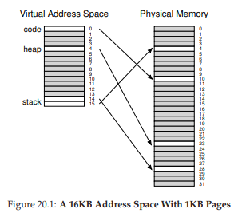
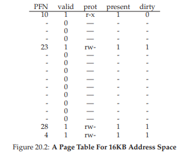
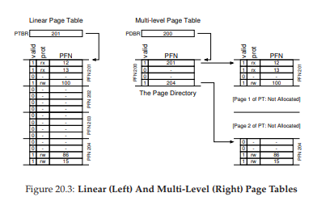
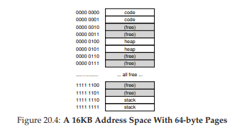
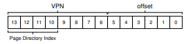
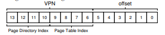
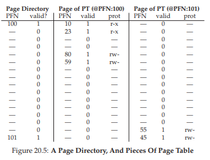
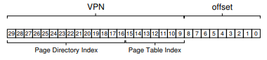
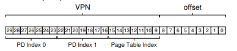
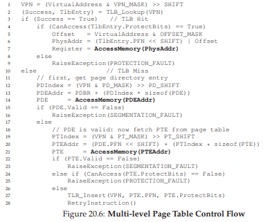

# 20. ページング：小さなテーブル（Smaller Tables）

> 🎯 **この章を学ぶ理由**: ページテーブルは巨大になりうる（プロセスあたり数MB）。マルチレベルページテーブルなどの工夫は、実際のOSで使われているメモリ効率化の技法。
> **前提知識**: 18章（ページテーブルの基本構造）

線形ページテーブルは巨大になる。32ビットアドレス空間、4KBページ、4バイトPTEの場合、プロセスあたり4MB。100プロセスで数百MBがページテーブルだけに消費される。このサイズをどう縮小するか。

## 20.1 単純な解決策：大きなページ

ページサイズを4KBから16KBにすると、VPNが20ビット→18ビットになり、ページテーブルは4MB→1MBに縮小する。

しかし、大きなページは**内部断片化**を招く。ページ内の未使用スペースが増えてメモリの無駄になるため、一般的には4KB〜8KBの小さなページサイズが使われる。

## 20.2 ハイブリッドアプローチ：ページングとセグメンテーション

Jack Dennis（Multics）の発案。アドレス空間全体に1つのページテーブルではなく、**論理セグメント（コード・ヒープ・スタック）ごとに個別のページテーブル**を持つ。





各セグメントのベースレジスタが、そのセグメントのページテーブルの物理アドレスを保持する。境界レジスタは有効ページ数を示す。

```
SN = (VirtualAddress & SEG_MASK) >> SN_SHIFT
VPN = (VirtualAddress & VPN_MASK) >> VPN_SHIFT
AddressOfPTE = Base[SN] + (VPN * sizeof(PTE))
```

**利点**: スタックとヒープの間の未割り当てページがページテーブル内のスペースを消費しない。

**問題点**:
- セグメンテーションの前提（アドレス空間の特定の使用パターン）に依存するため柔軟性が低い
- ページテーブルが可変サイズになるため**外部断片化**が再発する

## 20.3 マルチレベルページテーブル

線形ページテーブルを**ツリー構造**にする手法。多くの現代システム（x86など）が採用。

> 💡 **マルチレベルページテーブル**は、巨大な電話帳1冊を「市刮区別→町名別→個人」のように階層化したもの。「この市刮区には誰も住んでいない」ならそのセクション丸ごと省略できるので、空間が節約できる。

### 基本的な考え方

1. ページテーブルをページサイズの単位に分割
2. PTEのページ全体が無効なら、そのページを割り当てない
3. **ページディレクトリ**で、各ページテーブルページの有無を管理



### 利点

1. **使用量に比例したメモリ消費**: アドレス空間が疎なら、ページテーブルも小さくなる
2. **メモリ管理の容易さ**: 各部品がページ内に収まるため、連続した物理メモリが不要

### コスト

- **時間空間のトレードオフ**: TLBミス時に2回のメモリアクセスが必要（ページディレクトリ + PTE）
- 実装の複雑さが増す

### 具体例

16KBアドレス空間、64バイトページ、4バイトPTEの場合：
- 256エントリの線形ページテーブル（1KB）→ 16ページに分割
- ページディレクトリ: 16エントリ（ページテーブルの各ページに対応）



VPNの上位4ビットでページディレクトリにインデックス、下位4ビットでページテーブルページ内にインデックスする。





```
PTEAddr = (PDE.PFN << SHIFT) + (PTIndex * sizeof(PTE))
```



### 2レベル以上のテーブル

ページディレクトリ自体が1ページに収まらないほど大きい場合、さらにレベルを追加する。

例：30ビットアドレス空間、512バイトページの場合、ページディレクトリが2^14エントリ（128ページ分）になり、さらに上位のページディレクトリが必要。





### TLBとの組み合わせ

マルチレベルテーブルの複雑なルックアップが発生するのは**TLBミス時のみ**。TLBヒット時のパフォーマンスは変わらない。



## 20.4 逆ページテーブル

プロセスごとではなく、**物理ページごとに1エントリ**を持つ方式。各エントリが「このページを使うプロセスと仮想ページ番号」を記録する。

検索を高速化するためにハッシュテーブルを併用する（PowerPCなど）。

## 20.5 ページテーブルのディスクへのスワップ

ページテーブル自体が大きすぎる場合、カーネル仮想メモリに配置してディスクにスワップ可能にするシステムもある。

## 20.6 まとめ

ページテーブルの構築は必ずしも単純な配列である必要はない。マルチレベルテーブルや逆ページテーブルなど、**時間と空間のトレードオフ**を考慮して適切な構造を選択する。ソフトウェア管理TLBを使えば、OS設計者が自由にデータ構造を選べるため、イノベーションの余地が大きい。

---

<div align="center">

[← 前へ: 19. TLB](./19.md) | [次へ: 21. 物理メモリを超えて：メカニズム →](./21.md)

</div>
