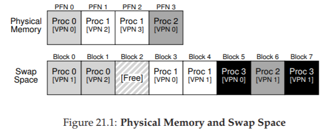
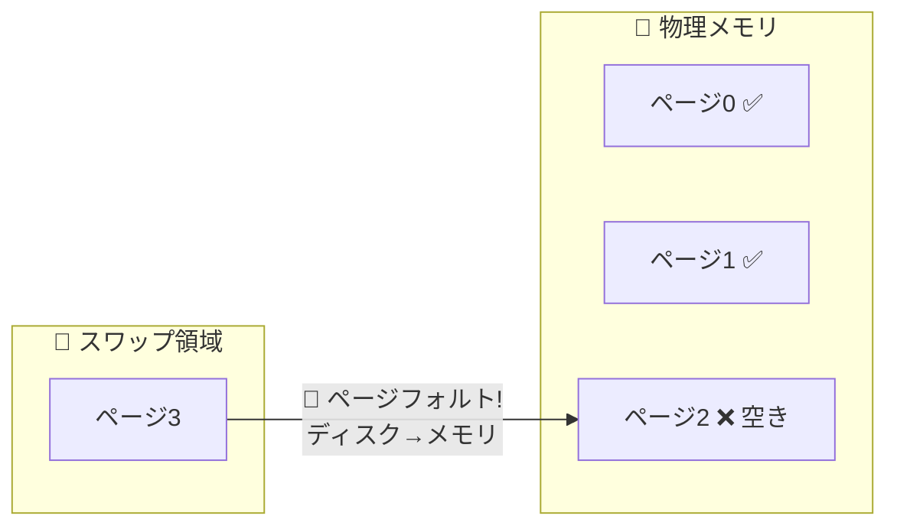
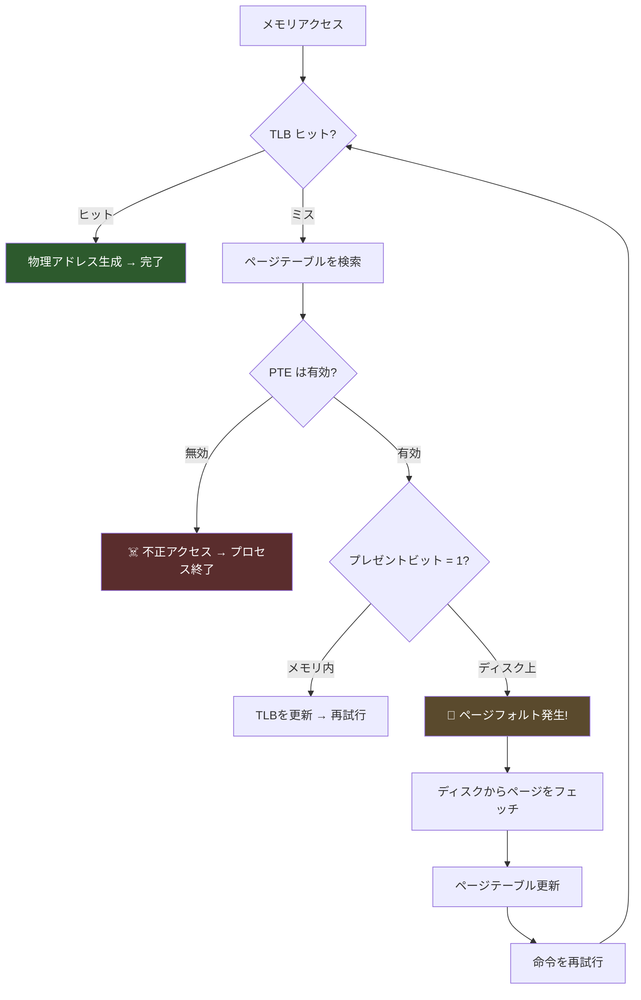
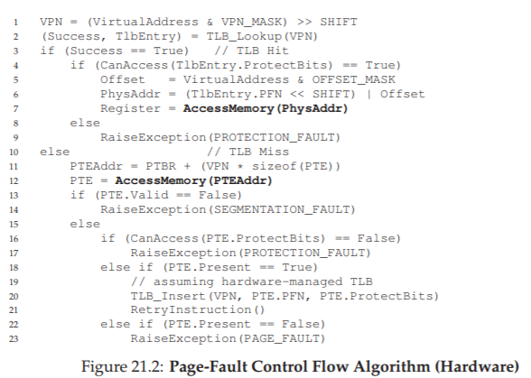
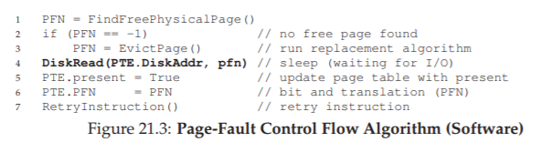

# 21. 物理メモリを超えて：メカニズム（Beyond Physical Memory: Mechanisms）

> 🎯 **この章を学ぶ理由**: 物理メモリより大きなプログラムをどう動かすか。スワップ（ディスクとメモリの入れ替え）の仕組みは、「なぜメモリ不足でPCが遅くなるか」という日常的な疑問への答えでもある。
> **前提知識**: 18章（ページング）、19章（TLB）

ここまでは、アドレス空間が物理メモリに収まると仮定してきた。しかし実際には、多数のプロセスが同時に動作し、それぞれが大きなアドレス空間を持つ。物理メモリだけでは足りない。

## 21.1 スワップ空間

物理メモリに収まらないページを退避させるために、ディスク上に**スワップ空間**を確保する。OSはページ単位でスワップ領域の読み書きを行う。

> 💡 **スワップ空間**とは、ディスク上に確保された「メモリの拡張領域」。机の上（物理メモリ）が書類でいっぱいになったら、今使わない書類を引き出し（ディスク）にしまうようなもの。必要になったら引き出しから机に戻す。

この例では、3つのプロセスが物理メモリを共有し、一部のページがディスク上のスワップ領域に配置されている。Proc 3はすべてのページがスワップアウトされているため、現在実行されていない。

なお、プログラムのコードページはファイルシステム上のバイナリから読み込めるため、スワップ領域に書き出す必要はなく、メモリを安全に解放して再利用できる。

## 21.2 プレゼントビット

ページがメモリ内にあるかディスク上にあるかを判断するために、PTEに**プレゼントビット**を追加する。

### メモリ参照の流れ

1. 仮想アドレスからVPNを抽出し、TLBを検索
2. **TLBヒット**: PFNを取得し物理アドレスを生成（高速）
3. **TLBミス**: ページテーブルからPTEを検索
   - プレゼントビット = 1 → メモリ内にある。PFNをTLBに登録して再試行
   - プレゼントビット = 0 → **ページフォルト**が発生

ページフォルトとは、物理メモリに存在しないページにアクセスする行為のことだ。

> 💡 **ページフォルト**は「エラー」ではなく、正常な動作の一部。「必要な書類が机の上にない」というシグナルで、OSはディスクから読み込んでメモリに配置する。ただしディスクアクセスが発生するため非常に遅い。

## 21.3 ページフォルトの処理

ページフォルトが発生すると、OSの**ページフォルトハンドラ**が実行される。

処理の流れ：
1. PTEのビットから、該当ページの**ディスク上のアドレス**を取得
2. ディスクにI/O要求を発行し、ページをメモリにフェッチ
3. ページテーブルを更新（プレゼントビットを設定、PFNを記録）
4. 命令を再試行 → TLBミス → TLB更新 → TLBヒット → アクセス完了

なぜハードウェアではなくOSがページフォルトを処理するのか：
- ディスクアクセスは非常に遅い（ミリ秒単位）ため、ソフトウェアのオーバーヘッドは無視できる
- ハードウェアがスワップ領域やI/Oの詳細を知る必要がなくなり、設計がシンプルになる

I/O中はプロセスがブロック状態になるため、OSは他のプロセスを実行できる。これにより**マルチプログラミング**でハードウェアを有効活用する。

## 21.4 メモリがいっぱいの場合

新しいページをスワップインするための空きフレームがない場合、OSは既存のページを**ページアウト**して空きを作る必要がある。どのページを退去させるかを決める仕組みが**ページ置換ポリシー**だ。

悪い判断をすると、プログラムはメモリ速度ではなくディスク速度で動作することになる。現代の技術では1万〜10万倍遅くなりうる。

## 21.5 ページフォルト制御フロー

### ハードウェア側の動作

TLBミス時の3つのケース：
1. **ページが有効かつメモリ内**: PTEからPFNを取得し、TLBに登録して再試行
2. **ページが有効だがメモリ外**: ページフォルトハンドラを実行
3. **ページが無効**: 不正アクセス。プロセスを終了

### OS側の動作

1. 空き物理フレームを探す（なければ置換アルゴリズムを実行）
2. スワップ領域からページを読み込むI/O要求を発行
3. ページテーブルを更新し、命令を再試行

## 21.6 実際の置換タイミング

OSはメモリが完全にいっぱいになるまで待つのではなく、**積極的にメモリを確保する**。

多くのOSは**上限値（HW）**と**下限値（LW）**を設定する：
- 空きページ数がLWを下回ると、**スワップデーモン**（ページデーモン）がバックグラウンドで起動
- 空きページ数がHWに達するまでページを退去させる
- 完了したらスリープ

一度に多くのページをまとめて書き出す**クラスタリング**により、ディスクI/Oの効率を向上させることもできる。

## 21.7 まとめ

この章では、物理メモリを超えるメモリにアクセスする仕組みを学んだ。プレゼントビットを使ってページの所在を管理し、ページフォルト時にはOSがディスクからページを読み込む。これにより、プロセスは自分が連続した大きなメモリを持っているかのように動作できる。次章では、どのページを退去させるかの**ポリシー**を学ぶ。

---

[← 前へ: 20. 小さなテーブル](./20.md) | [次へ: 22. 物理メモリを超えて：ポリシー →](./22.md)

