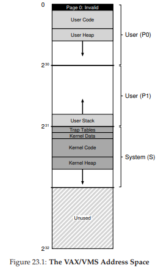

# 23. VAX/VMSの仮想メモリシステム（The VAX/VMS Virtual Memory System）

仮想メモリの学習の締めくくりとして、VAX/VMSオペレーティングシステムの仮想メモリマネージャを見てみよう。これまでの章で学んだ概念が、実際のメモリ管理システムにどう組み合わさっているかを確認するのが目的だ。

## 23.1 背景

VAX-11ミニコンピュータは、1970年代後半にDigital Equipment Corporation（DEC）が開発したアーキテクチャだ。DECはミニコンピュータの時代に大きなシェアを持っていたが、一連の判断ミスとPCの台頭によって衰退していった。

このシステムのOSはVAX/VMS（単にVMSとも）と呼ばれ、設計の中心人物はDave Cutlerだった。彼は後にMicrosoftでWindows NTの開発を主導する。VMSは、低価格モデルからハイエンドまで幅広いVAXマシンで動作する必要があったため、多様なシステムで効果的に機能する仕組みとポリシーが求められた。

> **核心的な問い：「汎用性の呪い」をどう避けるか？**
> OSは幅広い用途に対応しようとすることで、どの環境でも最適に動かないという問題（汎用性の呪い）に陥りがちだ。VMSの場合、さまざまなハードウェア構成に対応する必要があったため、この課題は特に深刻だった。

さらに、VMSはアーキテクチャ自体の弱点をソフトウェアで補った好例でもある。OSは通常ハードウェアに頼って効率的な抽象化を行うが、ハードウェア設計が完璧とは限らない。VMSはハードウェアの不備を巧みにカバーして、実用的なシステムを構築した。

## 23.2 メモリ管理ハードウェア

VAX-11は、1プロセスあたり32ビットの仮想アドレス空間を持ち、ページサイズは512バイトだった。仮想アドレスは23ビットのVPN（仮想ページ番号）と9ビットのオフセットで構成される。VPNの上位2ビットでセグメントを識別し、**ページングとセグメンテーションのハイブリッド方式**を採用していた。

アドレス空間の構造は次の通り：

- **プロセス空間（下半分）**
  - **P0**: ユーザプログラムとヒープ（下方向に成長）
  - **P1**: スタック（上方向に成長）
- **システム空間 S（上半分）**: OSのコードとデータ。全プロセスで共有される

### ページテーブルのサイズ問題

512バイトという小さなページサイズは、単純な線形ページテーブルだと巨大になるという問題があった。VMSは2つの方法でこれに対処した。

**①アドレス空間の分割**: P0とP1にそれぞれ別のページテーブルを持たせることで、スタックとヒープの間の未使用領域にはページテーブルが不要になる。base/boundsレジスタで各テーブルの位置とサイズを管理する。

**②ページテーブルをカーネル仮想メモリに配置**: ユーザ用ページテーブル（P0・P1）をカーネルの仮想メモリ（セグメントS）に置く。メモリが逼迫すれば、ページテーブル自体もディスクにスワップアウトできる。

ただし、この方式ではアドレス変換が複雑になる。P0/P1のアドレスを変換するには、まずシステムページテーブル（物理メモリ上）を引いてページテーブルの物理アドレスを得て、次にそのページテーブルから目的のページを探す。TLBがうまく機能すれば、この二段階の検索は回避できる。

## 23.3 実際のアドレス空間

実際のアドレス空間は、これまで想定してきた単純なモデルよりずっと複雑だ（図23.1参照）。



いくつかの注目ポイント：

### NULLポインタとセグメンテーションフォルト

コードセグメントはページ0から始まらない。ページ0はアクセス不可に設定されており、NULLポインタの逆参照を検出するためだ。

```c
int *p = NULL; // p = 0
*p = 10;       // 仮想アドレス0への書き込み → トラップ発生
```

ハードウェアがVPN 0をTLBで探してミスし、ページテーブルを参照すると無効エントリと分かる。その結果、OSにトラップが発生し、プロセスが終了する。

### カーネルの共有マッピング

カーネルのコードとデータは各プロセスのアドレス空間にマップされている。コンテキストスイッチではP0・P1のレジスタだけ切り替え、Sのレジスタは変更しない。この設計により：

- OSはユーザ空間のポインタから直接データを読める（`write()`などのシステムコールで便利）
- カーネルのページテーブルもスワップ対象にできる

カーネルのコードは保護された「ライブラリ」のように各プロセスから見える。ページテーブルの保護ビットで権限レベルを設定し、ユーザコードからシステムデータへの不正アクセスはトラップで阻止される。

## 23.4 ページ置換

VAXのページテーブルエントリ（PTE）には、有効ビット、保護フィールド（4ビット）、ダーティビット、OS予約フィールド（5ビット）、物理フレーム番号（PFN）がある。**しかし参照ビットがない**。そのため、VMSはハードウェアのサポートなしにどのページがアクティブかを判断する必要があった。

### セグメント化FIFO

メモリの公平な分配と参照ビットの欠如に対処するため、開発者は**セグメント化FIFOポリシー**を採用した。

- 各プロセスに**RSS（Resident Set Size）**と呼ばれる最大常駐ページ数を設定
- 各プロセスのページはFIFOリストで管理
- RSSを超えると最も古いページが退去

FIFOだけでは性能が不十分なため、VMSは**2つのセカンドチャンスリスト**を導入した：

1. **グローバルクリーンページリスト**: 変更されていないページの待機場所
2. **ダーティページリスト**: 変更済みページの待機場所

プロセスがRSSを超えると、退去ページはクリーン/ダーティに応じて対応するリストの末尾に移される。このページが再びアクセスされれば、ディスクI/Oなしで「再利用」できる。セカンドチャンスリストが大きいほど、LRUに近い性能を発揮する。

### ページクラスタリング

512バイトの小さなページでは、スワップ時のディスクI/Oが非効率になりやすい。VMSは**クラスタリング**を使い、ダーティリストから複数ページをまとめてディスクに一括書き込みすることで効率を高めた。

> **参照ビットのエミュレーション**
> VAXには参照ビットがなかったが、保護ビットを使ってエミュレートできた（BabaogluとJoyによる手法）。すべてのページをアクセス不可に設定し、アクセス時にトラップで記録する。後で「まだアクセス不可のままのページ = 最近使われていない」と判断できる。ただし、頻繁にやりすぎるとオーバーヘッドが大きく、少なすぎると情報が得られないため、バランスが重要だ。

## 23.5 その他のVMトリック

VMSには、現代のOSにも受け継がれている2つの重要な最適化がある。

### デマンドゼロ

ヒープにページを追加するとき、すぐには物理メモリを割り当てない。ページテーブルにアクセス不可のエントリを入れておき、実際にアクセスされたときに初めて物理ページを確保してゼロクリアする。一度も使われなければ、この作業は完全にスキップされる。

> **TIP: 怠惰であれ**
> 作業を遅延させることは多くの利点がある。①現在の操作の遅延を減らして応答性が向上する。②作業自体が不要になる場合がある（例：ファイルが削除されるまで書き込みを遅延させれば、書き込み自体が不要になる）。

### コピーオンライト（COW）

ページをコピーする代わりに、コピー元とコピー先の両方のアドレス空間で同じページを共有し、読み取り専用にマークする。読み取りだけなら実際のデータコピーは発生しない。どちらかが書き込もうとしたときに初めてトラップが発生し、その時点で新しいページを割り当ててコピーする。

COWは特に`fork()`で威力を発揮する。`fork()`はアドレス空間の完全コピーを作るが、直後に`exec()`で上書きされることが多い。COWならほとんどのページを実際にコピーせずに済み、不要なコピーを大幅に回避できる。

## 23.6 まとめ

VAX/VMSの仮想メモリシステムの全体像を見てきた。ページングとセグメンテーションのハイブリッド、セグメント化FIFOによる置換ポリシー、セカンドチャンスリスト、デマンドゼロ、コピーオンライトなど、これまでの章で学んだ概念が実際のシステムでどう統合されているかが分かるだろう。これらの古典的なアイデアの多くは、現代のOSにも受け継がれている。

---

<div align="center">

[← 前へ: 22. 物理メモリを超えて：ポリシー](./22.md) | [次へ: 26. 並行性入門 →](./26.md)

</div>
