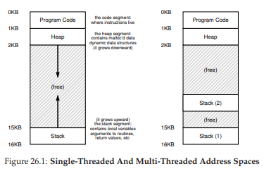
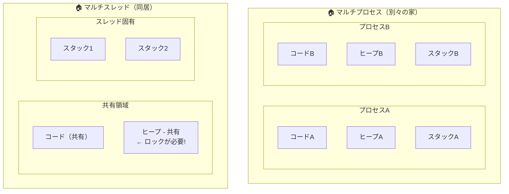
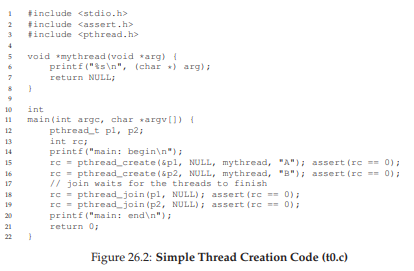
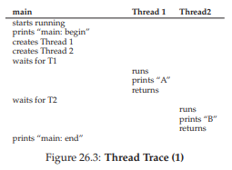
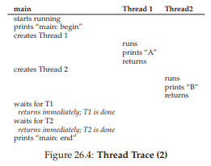
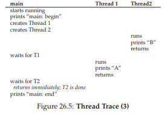
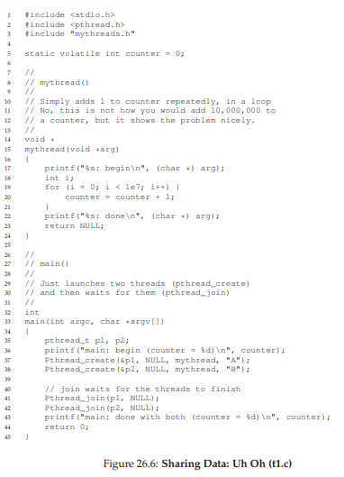
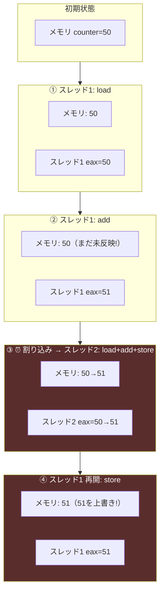
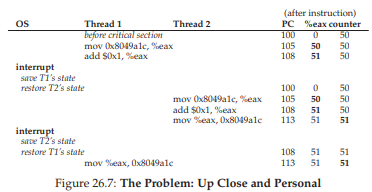

# 26. 並行性入門（Concurrency: An Introduction）

ここまでは、単一CPUを複数の仮想CPUに変換する方法（プロセス）と、各プロセスに大きなプライベートメモリを提供する方法（仮想メモリ）を見てきた。ここからは新しい抽象化、**スレッド**を導入する。

## スレッドとは

従来のプロセス（シングルスレッドプロセス）は1つのプログラムカウンタ（PC）を持つ。マルチスレッドプログラムは複数のPCを持ち、複数の実行ポイントが同時に存在する。

スレッドはプロセスに似ているが、大きな違いがある：**同じアドレス空間を共有し、同じデータにアクセスできる**。プロセスが「別々の家に住む住人」だとすれば、スレッドは「同じ家に住むルームメイト」だ。共有のリビングやキッチン（メモリ）を使えるが、だからこそ「誰がいつ冷蔵庫を開けるか」（データへの同時アクセス）に注意が必要になる。

スレッドの状態はプロセスと似ており、PC、レジスタセットを持つ。スレッド間のコンテキストスイッチではレジスタの退避・復元が必要だが、**アドレス空間（ページテーブル）の切り替えは不要**だ。スレッドの状態はスレッド制御ブロック（TCB）に保存される。

> 💡 **TCB（Thread Control Block）**は、プロセスのPCB（Process Control Block）のスレッド版。各スレッドのレジスタ値やスタックポインタなどを保存するデータ構造。プロセスのPCBよりも軽量で、アドレス空間の情報は含まない。

### スタックの分離

シングルスレッドプロセスではスタックは1つだが、マルチスレッドプロセスでは**スレッドごとにスタック**が存在する。



各スレッドのローカル変数やパラメータは、そのスレッド固有のスタック（スレッドローカルストレージ）に格納される。複数スタックがアドレス空間に配置されるため、従来のように「スタックとヒープが自由に成長する」という簡潔なモデルは成り立たなくなる。ただし、通常スタックはそれほど大きくならないため、実用上は問題にならない。

以下の図で、プロセスとスレッドの構造の違いを比較してみよう。



> 💡 **プロセスは「別々の家」**——メモリ空間が完全に分離されているので、お互いのデータに触れない。**スレッドは「同居人」**——コードとヒープを共有するので高速にデータをやり取りできるが、同時に同じデータを触ると壊れるリスクがある（→ ロックが必要）。

## 26.1 なぜスレッドを使うのか？

### 理由①：並列性

複数のCPUを搭載したシステムでは、各CPUにスレッドを割り当てて作業を分担できる。大きな配列の処理など、データを分割して同時処理（並列化）することで大幅な高速化が可能だ。

### 理由②：I/Oのオーバーラップ

I/O待ちでブロックしている間にも、別のスレッドが計算を進められる。Webサーバやデータベースなど、I/Oが頻繁なサーバアプリケーションでスレッドが活用される理由はここにある。

複数プロセスでも同様のことは可能だが、スレッドはアドレス空間を共有するためデータの共有が容易で、協調的な処理に自然に適している。

## 26.2 スレッド生成の例

2つのスレッドを作成し、それぞれが「A」または「B」を表示するプログラムを考える。



メインスレッドが2つのスレッドを作成し、`pthread_join()`で完了を待つ。実行順序はスケジューラ次第で変わる。



スレッド1が先に実行される場合もあれば、スレッド2が先に実行される場合もある。





スレッドの生成は関数呼び出しに似ているが、新しい実行の流れが呼び出し元から独立して動き始める点が異なる。どのスレッドがいつ実行されるかはスケジューラが決め、**実行順序は予測できない**。

## 26.3 共有データの問題

2つのスレッドがグローバル変数`counter`をそれぞれ1000万回インクリメントするプログラムを考える。期待される最終結果は2000万だ。



しかし、実行すると正しい結果が得られないことがある：

```
prompt> ./main
main: done with both (counter = 19345221)
```

実行するたびに結果が変わることすらある。なぜこのようなことが起こるのか？

## 26.4 問題の核心：制御されないスケジューリング

`counter++`のコンパイル結果を見てみよう。x86では以下の3命令になる：

```asm
mov 0x8049a1c, %eax   # メモリからレジスタにロード
add $0x1, %eax        # レジスタに1を加算
mov %eax, 0x8049a1c   # レジスタからメモリに書き戻し
```

次のシナリオを考える：

1. **スレッド1**がカウンタの値（50）をeaxにロード → eax = 50
2. スレッド1がaddを実行 → eax = 51
3. **ここでタイマー割り込み発生**。スレッド1の状態（eax=51）がTCBに保存される
4. **スレッド2**が実行開始。カウンタの値（まだ50）をeaxにロード → eax = 50
5. スレッド2がadd → eax = 51、メモリに書き戻し → counter = 51
6. **スレッド1**が再開。保存されていたeax = 51をメモリに書き戻し → counter = 51

2回インクリメントしたのに、結果は51。本来は52になるべきだった。

**📸 なぜ壊れるか — レジスタとメモリの値の変化:**



> 💡 問題の本質: **counter++は3つのCPU命令に分解される（load → add → store）**。この3命令の**途中で**別スレッドに切り替わると、スレッド1の中間結果（eax=51）は保存されるが、**メモリにはまだ反映されていない**。スレッド2は古い値（50）を読んでしまい、スレッド1の加算が上書きされて消える。



### 重要な用語

| 用語 | 意味 |
|---|---|
| **クリティカルセクション** | 共有リソースにアクセスするコード。複数スレッドの同時実行を許してはならない |
| **競合条件（レースコンディション）** | 複数スレッドがクリティカルセクションにほぼ同時に入り、タイミングによって結果が変わる状態 |
| **不確定プログラム** | 競合条件を含み、実行のたびに結果が異なりうるプログラム |
| **相互排除** | クリティカルセクション内で同時に実行できるスレッドを1つに制限すること |

## 26.5 アトミック性への期待

理想的には、`counter++`を1つの不可分な操作として実行できれば問題は解決する。しかし、あらゆる操作に対してハードウェアがアトミックな命令を用意するのは現実的ではない。

代わりに、ハードウェアが提供するいくつかの基本的なアトミック命令を組み合わせて、**同期プリミティブ**を構築する。これを使えば、クリティカルセクションへのアクセスを制御し、正しい結果を得られる。

> **アトミック操作とは：**「すべてか無か」。複数のアクションをグループ化し、最初から全部が実行されたか、まったく実行されていないかのどちらかに見える操作。途中の状態は外部から観測されない。

## 26.6 もうひとつの問題：他のスレッドの待機

並行プログラムにはクリティカルセクション以外にもう1つの典型的なパターンがある。あるスレッドが別のスレッドの処理完了を**待つ**必要がある場合だ（例：ディスクI/Oの完了待ち）。このスリープ/ウェイクの仕組みも、以降の章で取り上げる。

## 26.7 まとめ：なぜOSの授業で学ぶのか？

OSは最初の並行プログラムであり、割り込みの導入当初から共有データ構造（ページテーブル、プロセスリスト、ファイルシステム構造など）の同期が必須だった。ここで生まれた技術が、後にマルチスレッドアプリケーションにも広く応用されている。

---

<div align="center">

[← 前へ: 23. VAX/VMS](./23.md) | [次へ: 27. スレッドAPI →](./27.md)

</div>
