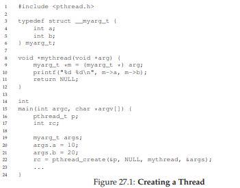
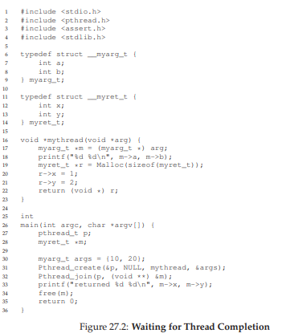
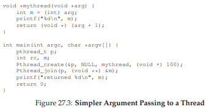
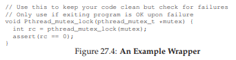

# 27. 幕間：スレッドAPI（Interlude: Thread API）

この章ではPOSIXスレッド（pthreads）ライブラリの主要APIを紹介する。ロックや条件変数の概念は以降の章で詳しく扱うため、ここではAPIリファレンスとして活用してほしい。

## 27.1 スレッドの生成

POSIXでのスレッド生成は`pthread_create()`で行う。

```c
#include <pthread.h>
int pthread_create(pthread_t *thread,
                   const pthread_attr_t *attr,
                   void *(*start_routine)(void*),
                   void *arg);
```

| 引数 | 説明 |
|---|---|
| `thread` | スレッド識別子。初期化のためポインタを渡す |
| `attr` | スレッド属性（スタックサイズ、優先度など）。通常はNULLでデフォルト使用 |
| `start_routine` | スレッドが実行する関数。`void*`を受け取り`void*`を返す |
| `arg` | `start_routine`に渡す引数 |

`void*`を使うことで、任意の型の引数と戻り値を扱える。引数をパッケージ化するには構造体が便利だ。



## 27.2 スレッドの完了

スレッドの完了を待つには`pthread_join()`を使う。

```c
int pthread_join(pthread_t thread, void **value_ptr);
```

- `thread`: 待機対象のスレッド（`pthread_create()`で初期化されたもの）
- `value_ptr`: スレッドの戻り値を受け取るポインタ。不要ならNULLを渡す



引数や戻り値が単純な型（intなど）であれば、構造体にパッケージ化する必要はない。



### 注意：スタック上の変数を返してはいけない

```c
void *mythread(void *arg) {
    myret_t r;  // スタック上に割り当て → 危険！
    r.x = 1;
    r.y = 2;
    return (void *) &r;  // 関数終了後にスタックは無効になる
}
```

スレッド関数のスタック上の変数へのポインタを返すと、その変数は関数の終了とともに無効になり、未定義の動作を引き起こす。

### joinが不要な場合

Webサーバのようにワーカースレッドが無期限に動作する場合、joinは不要なこともある。一方、並列計算のように全スレッドの完了を待ってから次の段階に進む場合にはjoinが必須だ。

## 27.3 ロック

クリティカルセクションの相互排除にはロック（ミューテックス）を使う。

```c
int pthread_mutex_lock(pthread_mutex_t *mutex);
int pthread_mutex_unlock(pthread_mutex_t *mutex);
```

基本的な使い方：

```c
pthread_mutex_t lock = PTHREAD_MUTEX_INITIALIZER;
pthread_mutex_lock(&lock);
x = x + 1;  // クリティカルセクション
pthread_mutex_unlock(&lock);
```

### ロックの初期化

**方法①：静的初期化**
```c
pthread_mutex_t lock = PTHREAD_MUTEX_INITIALIZER;
```

**方法②：動的初期化**
```c
int rc = pthread_mutex_init(&lock, NULL);
assert(rc == 0);
// 使用後は pthread_mutex_destroy(&lock) を呼ぶ
```

### エラーチェック

ロック/アンロックの戻り値は必ずチェックすべきだ。チェックを怠ると、複数スレッドが同時にクリティカルセクションに入る可能性がある。ラッパー関数を用意すると便利だ。



### その他のロック関数

```c
int pthread_mutex_trylock(pthread_mutex_t *mutex);   // 非ブロッキング
int pthread_mutex_timedlock(pthread_mutex_t *mutex,
                            struct timespec *abs_timeout); // タイムアウト付き
```

通常はこれらの使用は避けるが、デッドロック回避などの場面で有用なこともある。

## 27.4 条件変数

あるスレッドが別のスレッドの処理完了を待つ必要があるとき、**条件変数**を使う。

```c
int pthread_cond_wait(pthread_cond_t *cond, pthread_mutex_t *mutex);
int pthread_cond_signal(pthread_cond_t *cond);
```

### 待機側

```c
pthread_mutex_t lock = PTHREAD_MUTEX_INITIALIZER;
pthread_cond_t  cond = PTHREAD_COND_INITIALIZER;

pthread_mutex_lock(&lock);
while (ready == 0)
    pthread_cond_wait(&cond, &lock);
pthread_mutex_unlock(&lock);
```

### シグナル送信側

```c
pthread_mutex_lock(&lock);
ready = 1;
pthread_cond_signal(&cond);
pthread_mutex_unlock(&lock);
```

### 重要なポイント

1. **シグナル送信時もロックを保持する**こと。競合条件を防ぐため
2. **`wait`はロックを一時的に解放**してスリープし、起床時にロックを再取得する
3. **条件チェックは`while`ループで行う**（`if`ではない）。疑似的な起床（スプリアスウェイクアップ）があるため、起床後に条件を再確認する必要がある

### フラグでのスピン待ちは避ける

```c
// やってはいけない！
while (ready == 0)
    ;  // スピン → CPUの無駄使い＋バグの温床
```

フラグによるアドホックな同期はバグが発生しやすい。研究によると、このような同期の約半数にバグが含まれていた。**常に条件変数を使うこと**。

## 27.5 コンパイルと実行

pthreadsプログラムのコンパイルには`-pthread`フラグが必要：

```
prompt> gcc -o main main.c -Wall -pthread
```

## 27.6 まとめ

pthreadsの基本（スレッド生成・完了・ロック・条件変数）を紹介した。スレッドプログラミングで難しいのはAPIではなく、並行処理のロジック設計そのものだ。

### APIガイドライン

- **シンプルに保つ**：ロックやシグナルのコードはできるだけ単純に
- **スレッド間の相互作用を最小化**する
- **ロックと条件変数は必ず初期化**する
- **戻り値を必ずチェック**する
- **スタック上の変数への参照を返さない**
- **スレッド間の通知には条件変数を使う**（フラグでのスピンは不可）
- **マニュアルページを活用する**（`man -k pthread`で全APIを確認可能）

---

<div align="center">

[← 前へ: 26. 並行性入門](./26.md) | [次へ: 28. ロック →](./28.md)

</div>
