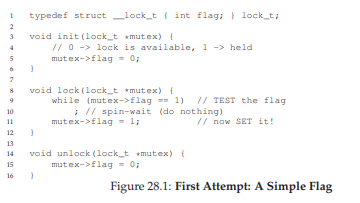
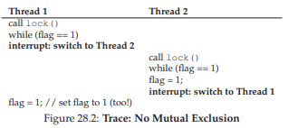
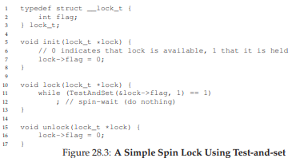
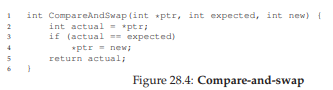
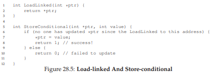
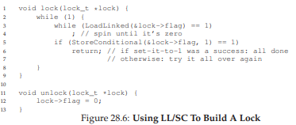
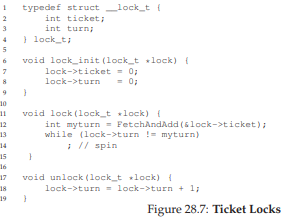
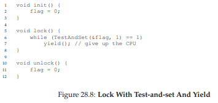
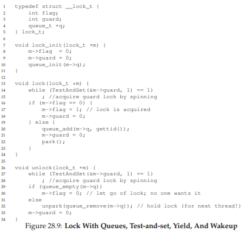
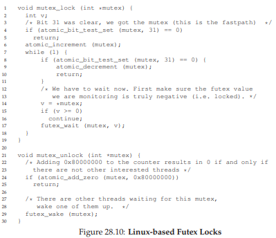

# 28. ロック（Locks）

並行プログラミングの核心的な課題は、一連の命令をアトミックに実行したいのに、割り込みやマルチプロセッサの存在でそれができないことだ。この章では**ロック**を使ってクリティカルセクションを保護する方法と、その実装を詳しく見ていく。

## 28.1 ロックの基本

```c
lock_t mutex;           // グローバルなロック変数
lock(&mutex);
balance = balance + 1;  // クリティカルセクション
unlock(&mutex);
```

ロック変数は2つの状態を持つ：**使用可能（フリー）**か**取得済み（保持）**か。`lock()`を呼ぶと、フリーならロックを取得してクリティカルセクションに入る。他のスレッドが保持中なら、解放されるまで戻らない。`unlock()`でロックを解放し、待機中のスレッドがあればその1つが取得できるようになる。

## 28.2 Pthreadでのロック

POSIXでは相互排除にmutexを使う：

```c
pthread_mutex_t lock = PTHREAD_MUTEX_INITIALIZER;
Pthread_mutex_lock(&lock);
balance = balance + 1;
Pthread_mutex_unlock(&lock);
```

異なるデータに異なるロックを使う（細粒度ロック戦略）ことで、並行性を向上させられる。

## 28.3 ロックの構築

ロックを構築するには、**ハードウェアサポート**と**OSサポート**の両方が必要だ。

## 28.4 ロックの評価基準

| 基準 | 内容 |
|---|---|
| **正しさ** | 相互排除を提供するか？ |
| **公平性** | すべてのスレッドがいずれロックを取得できるか？飢餓は起きないか？ |
| **パフォーマンス** | 競合なし／単一CPU上の競合／複数CPU上の競合でのオーバーヘッドは？ |

## 28.5 割り込みの無効化

最も初期のアプローチ。クリティカルセクション中に割り込みをオフにする。

```c
void lock()   { DisableInterrupts(); }
void unlock() { EnableInterrupts(); }
```

**問題点**：
- 特権操作をアプリケーションに許可する必要がある（悪用の危険）
- **マルチプロセッサでは機能しない**
- 割り込みの喪失によるシステム障害の可能性
- 性能が悪い

OS内部での限定的な用途（内部データ構造の保護）には使われることもある。

## 28.6 失敗例：単純なロード／ストア

単一のフラグ変数を使い、通常のロード／ストアでロックを実装する試み。



**問題①：正しさ**：2つのスレッドが同時にフラグ=0を見てフラグ=1に設定し、ともにクリティカルセクションに入れてしまう。



**問題②：パフォーマンス**：スピン待ち（フラグの値を無限にチェックし続ける）はCPUサイクルの無駄。

## 28.7 テストアンドセット（Test-And-Set）によるスピンロック

ハードウェアが提供するアトミック命令。古い値を返しつつ、新しい値を設定する操作を**不可分に**実行する。

```c
int TestAndSet(int *old_ptr, int new) {
    int old = *old_ptr;   // 古い値を取得
    *old_ptr = new;       // 新しい値を設定
    return old;           // 古い値を返す（これら全体がアトミック）
}
```



**動作**：
- フラグ=0のとき：TestAndSet(&flag, 1)は0を返し、フラグを1に設定 → ロック取得
- フラグ=1のとき：TestAndSet(&flag, 1)は1を返し続ける → スピンして待機
- ロック所有者がunlock()でフラグ=0に戻すと、待機中のスレッドがロックを取得可能に

このようなロックを**スピンロック**と呼ぶ。ロックが利用可能になるまでCPUサイクルを消費して回転する。

> 💡 **スピンロック**は、「ドアが開くまでノックし続ける」ような単純なロック。待ち時間が短ければ効率的だが、長いとCPUを浪費する。スリープして待つ方式（後述）とは対照的だ。

**評価**：
- 正しさ：○（相互排除を提供）
- 公平性：×（飢餓の可能性あり）
- パフォーマンス：マルチCPUでは良好、シングルCPUでは非効率

> **Petersonのアルゴリズム**：ロード／ストアだけでロックを実現する歴史的アプローチだが、現代のハードウェア（緩和メモリモデル）では正しく動作しない。

## 28.8 コンペアアンドスワップ（Compare-And-Swap）

```c
int CompareAndSwap(int *ptr, int expected, int new) {
    int actual = *ptr;
    if (actual == expected)
        *ptr = new;
    return actual;
}
```



Test-And-Setと同等のスピンロックを構築できる：

```c
void lock(lock_t *lock) {
    while (CompareAndSwap(&lock->flag, 0, 1) == 1)
        ; // spin
}
```

Compare-And-SwapはTest-And-Setより強力で、**ロックフリー同期**などの高度な技法にも使われる。

## 28.9 ロードリンク／ストア条件付き（Load-Linked / Store-Conditional）

MIPSやARM、PowerPCなどで提供される命令ペア。



- **ロードリンク**：通常のロードと同じくメモリから値を読む
- **ストア条件付き**：ロードリンク以降にそのアドレスへの書き込みがなければ成功（1を返す）、あれば失敗（0を返す）



## 28.10 フェッチアンドアド（Fetch-And-Add）とチケットロック

```c
int FetchAndAdd(int *ptr) {
    int old = *ptr;
    *ptr = old + 1;
    return old;  // アトミックに実行
}
```

これを使って**チケットロック**を構築できる：



各スレッドがチケット番号を取得し、自分の番号が来るまで待つ。**全スレッドの進行を保証**する点が、単純なスピンロックとの決定的な違いだ。

## 28.11 スピンが多すぎる問題

スピンロックの根本的な問題：ロック保持者がプリエンプトされると、他のスレッドはタイムスライス全体をスピンに費やす。N個のスレッドが競合していれば、N-1タイムスライスが無駄になる。

**ハードウェアだけでは不十分。OSのサポートが必要だ。**

## 28.12 yield()アプローチ

スピンの代わりにCPUを他のスレッドに明け渡す。



`yield()`はスレッドを実行可能状態に移行させ、別のスレッドに実行機会を与える。

- 2スレッドの場合はうまく機能する
- 100スレッドの場合：ロック保持者が再実行されるまで99回のコンテキストスイッチが発生 → コストが高い
- **飢餓の問題は未解決**

## 28.13 キューを使う：スピンの代わりにスリープ

スケジューラ任せにせず、**どのスレッドが次にロックを取得するか**を明示的に制御する。

Solarisの`park()`（スレッドをスリープさせる）と`unpark(threadID)`（指定スレッドを起床させる）を使った実装：



**ポイント**：
- ガード（guard）をスピンロックとして使い、ロック内部のフラグとキューの操作を保護（スピンは数命令のみ）
- ロックが保持中なら、スレッドをキューに追加してスリープ
- ロック解放時にキューから次のスレッドを起床 → **飢餓を回避**
- 起床したスレッドにはロックが直接渡される（flagは0に戻さない）

### ウェイクアップ／ウェイトレース

`park()`の直前にコンテキストスイッチが発生すると、ロックが解放されても永遠にスリープしてしまう問題がある。Solarisは`setpark()`でこれを解決：パークの意思を事前に表明し、パーク前にunparkされたら即座にリターンする。

### 優先度の逆転

優先度の高いスレッドが、低いスレッドが持つロックを待ってスピンすると、低いスレッドが実行されずシステムがハングする。解決策：
- スピンロックの使用を避ける
- **優先度の継承**：待機中の高優先度スレッドの優先度を低いスレッドに一時的に付与

## 28.14 LinuxのFutex

Linuxの`futex`は、Solarisのインタフェースに似たカーネルレベルのサポートを提供する。

- **`futex_wait(address, expected)`**：アドレスの値がexpectedと等しければスリープ
- **`futex_wake(address)`**：キューで待機中のスレッドを1つ起床

> 💡 **futex（Fast Userspace muTEX）**は、「競合がないときはカーネルを通らず高速に、競合時だけカーネルの助けを借りる」というLinux固有の仕組み。通常のロックの内部実装として使われている。



Linuxのpthread mutexは単一の整数でロック状態とウェイタ数を管理し、**競合がない場合は最小限のアトミック操作だけ**で済むように最適化されている。

## 28.15 2フェーズロック

スピンとスリープを組み合わせたハイブリッドアプローチ：

> 💡 **2フェーズロック**は、「まず短時間スピンしてみて、ダメならスリープする」という戦略。ドアを少しノックして、すぐ開かないなら椅子に座って待つ、というイメージ。短時間の競合ではスピンで高速に解決し、長時間の競合ではCPUを浪費しない。

1. **第1フェーズ**：短時間スピンしてロック取得を試みる（すぐに解放される場合に有効）
2. **第2フェーズ**：取得できなければスリープし、ロック解放時に起床される

Linuxのmutexはこの方式を採用しており、1回スピンしてからfutex_waitでスリープする。

## 28.16 まとめ

ロックの構築には以下が必要だ：

- **ハードウェアプリミティブ**：Test-And-Set、Compare-And-Swap、Load-Linked/Store-Conditional、Fetch-And-Add
- **OSサポート**：park/unpark（Solaris）、futex（Linux）

これらを組み合わせることで、正しく、公平で、効率的なロックが実現できる。

---

<div align="center">

[← 前へ: 27. スレッドAPI](./27.md) | [次へ: 29. 並行データ構造 →](./29.md)

</div>
