# 29. ロックベースの並行データ構造（Lock-based Concurrent Data Structures）

> 🎯 **この章を学ぶ理由**: ロックを「どこに」「どう」追加すれば正しくかつ高速なスレッドセーフデータ構造を作れるか。粗粒度ロック vs 細粒度ロックの設計パターンは実務で頻出する。
> **前提知識**: 28章（ロックの仕組み）

データ構造にロックを追加してスレッドセーフにする方法を見ていこう。ロックの追加方法はデータ構造の正しさとパフォーマンスの両方を左右する。

## 29.1 並行カウンタ

### シンプルな実装

最も基本的なアプローチは、全操作を1つのロックで保護すること。

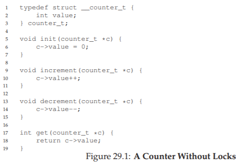

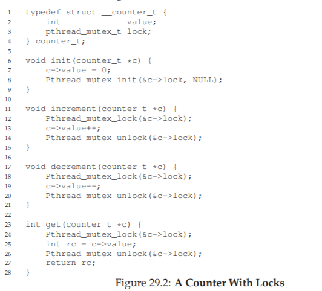

単一のロックで全操作を囲む設計を**モニター**パターンと呼ぶこともある。正しく動作するが、スレッド数が増えるとパフォーマンスが急激に悪化する。

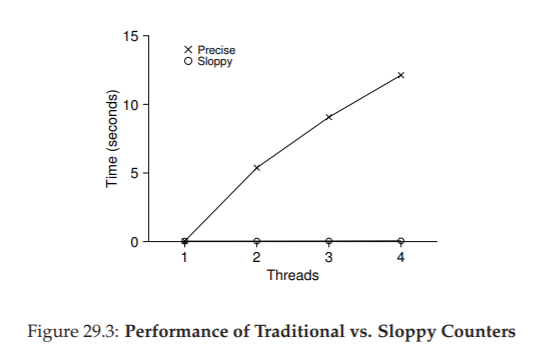

1スレッドで約0.03秒の処理が、2スレッドでは5秒以上かかる。理想的にはスレッドを増やしても処理時間が変わらない**完璧なスケーリング**を目指したい。

### スケーラブルカウンティング（Sloppy Counter）

**CPUコアごとにローカルカウンタ**を持ち、定期的にグローバルカウンタに集約する方式。

- 各スレッドは自分のCPUのローカルカウンタを更新（ローカルロックで保護）
- ローカル値が閾値Sに達したら、グローバルカウンタに加算してローカルをリセット
- CPU間の競合が発生しないため、更新がスケーラブル

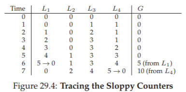

**閾値Sのトレードオフ**：
- S小 → グローバル値の精度は高いがスケーラビリティは低い
- S大 → スケーラビリティは高いがグローバル値に遅れが生じる

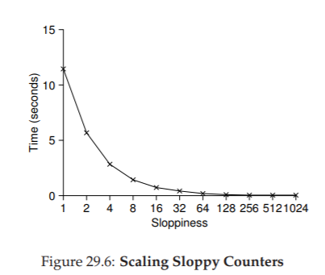

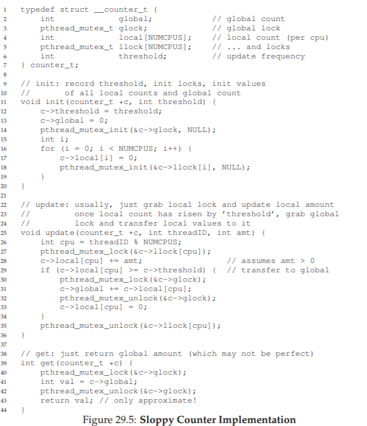

## 29.2 並行リンクリスト

### 基本実装

挿入時にロックを取得し、完了時に解放する。

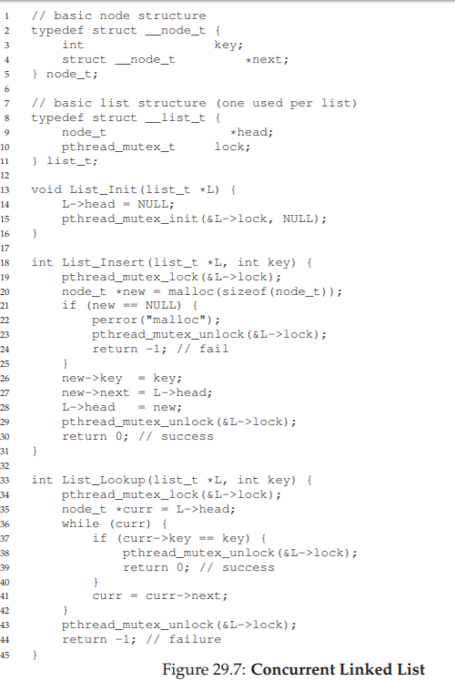

`malloc()`が失敗した場合のエラーパスでもロックの解放を忘れないよう注意が必要だ。Linuxカーネルのバグの約40%が、こうした稀なコードパスで発見されている。

**改善版**：ロックのスコープを最小化し、共通の終了パスを使うことでバグの可能性を減らす。`malloc()`はスレッドセーフなので、共有リストの更新時だけロックを保持すれば十分だ。

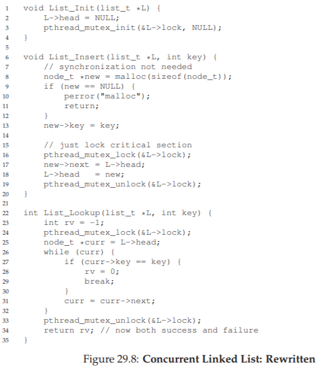

### ハンドオーバーハンドロック

リスト全体ではなく、**ノードごとにロック**を持ち、トラバース時に次のノードのロックを取得してから現在のノードのロックを解放する。

概念的にはリスト操作の並行性が向上するが、実際には各ノードでのロック取得・解放のオーバーヘッドが大きく、**単一ロックのシンプルな実装より遅くなることが多い**。

> **並行性を高めることが必ずしも高速化にはつながらない。**両方の実装を作って実測比較するのが確実だ。

> **ロックと制御フローに注意。**エラーや早期リターンの前にロックを解放し忘れるバグを防ぐため、ロックのスコープを最小限にし、共通の終了パスを使う。

## 29.3 並行キュー

MichaelとScottによる設計では、ヘッドとテールに**別々のロック**を使い、エンキューとデキューの同時実行を可能にしている。

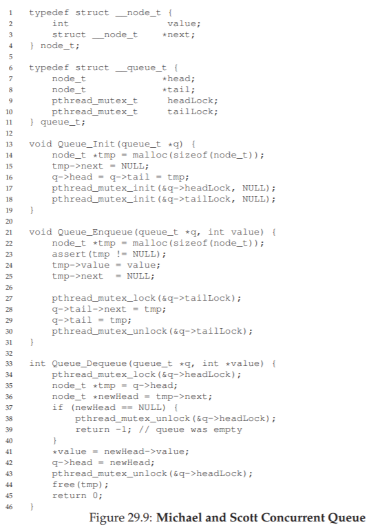

ダミーノードを使ってヘッドとテールの操作を分離するのがポイントだ。

## 29.4 並行ハッシュテーブル

**ハッシュバケットごとにロック**を持つ設計で、高い並行性を実現。

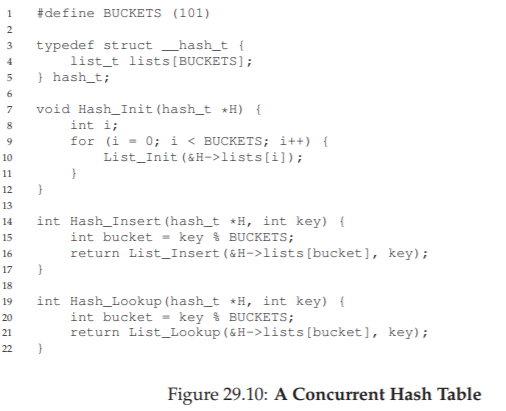

各バケットは並行リンクリストで実装されており、バケットごとにロックが独立しているため、異なるバケットへの操作は完全に並行して実行できる。

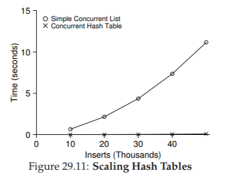

並行ハッシュテーブルは非常にスケーラブルだが、単一ロックのリンクリストはスケールしない。

> **時期尚早な最適化を避けよ（Knuthの法則）。**まず単一の大きなロックで正しく動作する実装を作り、パフォーマンスが問題になった場合にのみ最適化する。Linuxも当初は単一の大きなカーネルロック（BKL）を使用し、後にマルチコア時代に合わせて細粒度化した。

## 29.5 まとめ

並行データ構造の設計で学んだ重要な教訓：

1. **まず単純なロック**（大きなロック1つ）で始める
2. **制御フロー変更時のロック解放**に注意する
3. **並行性を高めても必ずしも速くならない** — オーバーヘッドとのバランスが重要
4. **パフォーマンス問題は存在する場合にのみ**対処する
5. 実測比較で判断する

---

[← 前へ: 28. ロック](./28.md) | [次へ: 30. 条件変数 →](./30.md)

