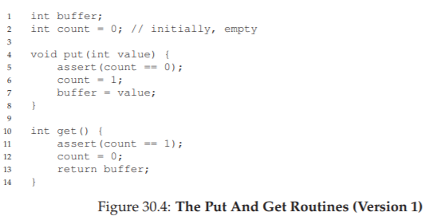
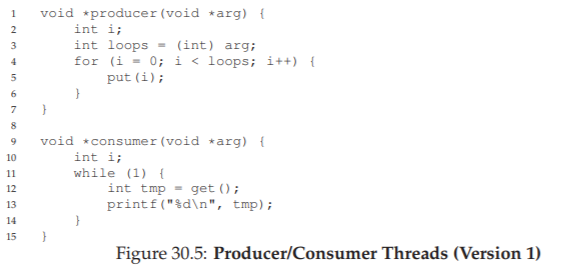
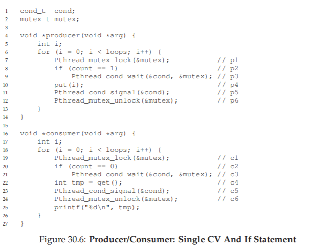
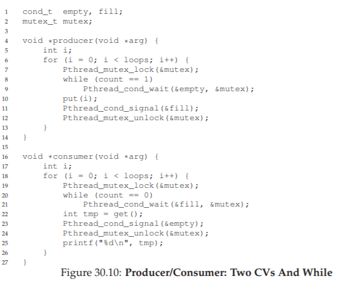
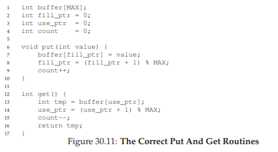
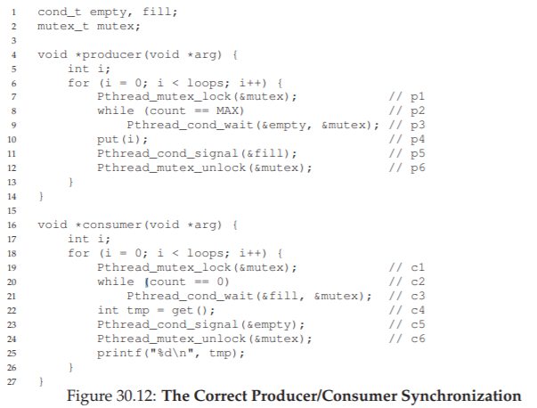
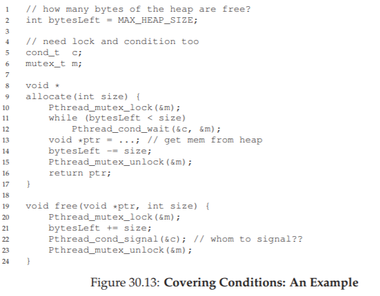

# 30. 条件変数（Condition Variables）

ロックだけでは、並行プログラムに必要なすべてを表現できない。スレッドが「ある条件が成り立つまで待機する」という動作が必要になる場面がある。たとえば、親スレッドが子スレッドの完了を待つ「join()」の実装だ。条件が真になるまでスピンして待つ方法は動くが、CPUを無駄に消費してしまう。もっと効率的な方法はないだろうか？

> **CRUX: 条件の待機をどう実現するか**
> スレッドが先に進む前に、ある条件が成り立つのを待ちたい場合がある。スピンは非効率で、場合によっては正しくない。では、スレッドはどのように条件を待つべきか？

## 30.1 定義とルーチン

**条件変数**は、実行状態が望ましくないとき、スレッドが自分自身をキューに入れてスリープできる仕組みだ。他のスレッドがその状態を変更したとき、待機中のスレッドを起こして続行させることができる。この考えはDijkstraの「プライベートセマフォ」に端を発し、後にHoareが「条件変数」と名付けた。

条件変数には`wait()`と`signal()`の2つの操作がある。POSIX APIでは次のように宣言する。

```c
pthread_cond_wait(pthread_cond_t *c, pthread_mutex_t *m);
pthread_cond_signal(pthread_cond_t *c);
```

`wait()`はミューテックスもパラメータとして受け取る。`wait()`が呼ばれると、ロックを解放し、呼び出しスレッドをアトミックにスリープさせる。スレッドが起こされたときは、`wait()`から戻る前にロックを再取得する。この設計は、スリープ中の競合状態を防ぐためだ。

### joinの実装

図30.3のコードで具体例を見よう。2つのケースがある。

**ケース1：親が先に実行される場合。** 親は`thr_join()`でロックを取得し、子がまだ完了していないことを確認し、`wait()`でスリープする。子が実行されると`thr_exit()`でdoneを1に設定し、signalで親を起こす。親は`wait()`から戻り、処理を続行する。

**ケース2：子が先に実行される場合。** 子がdoneを1にしてsignalを送るが、待機中のスレッドはないので何も起きない。親が`thr_join()`を呼ぶと、doneが既に1なので、waitせずにそのまま返る。

重要な点がいくつかある。

**状態変数（done）が必要な理由。** もし状態変数なしでsignal/waitだけ使うと、子が先にsignalを送った場合、待機スレッドがないので通知が失われる。その後親がwaitすると永遠にスタックする。

**ロックが必要な理由。** ロックなしでやろうとすると、微妙な競合状態が発生する。親がdone==0を確認した後、waitを呼ぶ前に割り込まれ、子がdoneを1にしてsignalを送る。しかし親はまだwaitしていないので起こされない。親が再開してwaitすると、永遠にスリープする。

**whileループを使う理由。** ifではなくwhileで条件をチェックするのがベストプラクティスだ。この理由は次のセクションで明らかになる。

> **TIP: signalを送るとき、常にロックを保持せよ**
> すべてのケースで厳密に必要ではないが、条件変数を使うときはsignalの発行時にロックを保持しておくのが最も簡単で安全だ。waitはセマンティクス上、常にロック保持が前提なので、signal/waitの両方でロックを保持するのが正しい。

## 30.2 プロデューサ/コンシューマ問題（有界バッファ）

Dijkstraが最初に提起したこの問題は、プロデューサがデータをバッファに入れ、コンシューマがそこからデータを取り出すというものだ。Webサーバのリクエストキューや、UNIXパイプ（`grep foo file.txt | wc -l`）が実例だ。

バッファは共有リソースなので、同期アクセスが必要になる。まず最もシンプルな実装を見てみよう。



`put()`はバッファが空のとき値を格納し、`get()`はバッファが満杯のとき値を取り出す。



### 壊れた解法：ifと単一の条件変数

図30.6は、単一の条件変数condと1つのロックを使った最初の試みだ。



プロデューサ1つ、コンシューマ1つなら動く。しかしコンシューマが2つになると問題が起きる。

**問題1：ifによる二重消費。** コンシューマTc1がwaitでスリープ中に、プロデューサがバッファを埋めてTc1を起こす。しかしTc1が実行される前に、別のコンシューマTc2がバッファを消費してしまう。Tc1がwaitから戻って`get()`を呼ぶと、バッファは空でアサーション違反。

これは**Mesaセマンティクス**の特徴だ。signalはスレッドを起こすだけで、起こされたスレッドが実行されるまで状態が保持される保証はない。対照的にHoareセマンティクスは即座に実行される保証を提供するが、実際のシステムはすべてMesaセマンティクスを採用している。

### 改善：ifからwhileへ

```diff
-if (count == 0)
+while (count == 0)
     wait(&cond, &mutex);
```

whileにすれば、起こされたスレッドは条件を再チェックし、バッファが空なら再びスリープする。

しかしまだ問題がある。**条件変数が1つしかないため、コンシューマが別のコンシューマを起こしてしまう可能性がある。** Tc1がバッファを消費→signalを送る→Tc2が起きる（プロデューサではなく）→Tc2もバッファが空でスリープ→プロデューサも既にスリープ→全員がスリープしてデッドロック。

### 正しい解法：2つの条件変数

```c
cond_t empty, fill;
```

プロデューサはemptyを待ち、fillにsignalを送る。コンシューマはfillを待ち、emptyにsignalを送る。こうすれば、コンシューマが別のコンシューマを起こす問題は解消される。



### 最終的な正しい解法：複数バッファスロット

効率性と並行性を高めるため、バッファスロットを複数にする。スリープ前に複数の値を生産・消費できるため、コンテキストスイッチが減る。




プロデューサは全バッファが満杯のときのみスリープし、コンシューマは全バッファが空のときのみスリープする。

> **TIP: 条件チェックにはwhile（ifではなく）を使え**
> whileを使えば、Mesaセマンティクスのもとでも安全だ。疑似ウェイクアップ（1つのsignalで複数スレッドが起きる実装）にも対応できる。

## 30.3 カバリング条件（Covering Conditions）

LampsonとRedellの論文から、もう1つの興味深い例を見てみよう。マルチスレッドのメモリアロケータにおける問題だ。



空きが0バイトの状態で、スレッドTaが`allocate(100)`、スレッドTbが`allocate(10)`を呼ぶ。両方スリープする。第3のスレッドTcが`free(50)`を呼ぶ。signalで1つのスレッドを起こすが、Taが起きた場合はまだ足りないのでスリープに戻る。Tbを起こせれば問題ないが、どちらを起こすかは制御できない。

**解法：`pthread_cond_broadcast()`を使う。** signalの代わりにbroadcastで全待機スレッドを起こす。必要のないスレッドは条件を再チェックして再びスリープする。パフォーマンスコストはあるが、正しさは保証される。

これをLampsonとRedellは**カバリング条件**と呼んだ。目覚めるべきスレッドをすべてカバーするからだ。より良い解法があればそちらを使うべきだが（プロデューサ/コンシューマの2条件変数のように）、カバリング条件は汎用的な解決策として使える。

## 30.4 まとめ

条件変数は、ロックと並ぶ重要な同期プリミティブだ。スレッドをスリープさせることで、スピンによるCPU浪費を避けつつ、プロデューサ/コンシューマ問題やカバリング条件といった同期問題を洗練された方法で解決できる。

## 参考文献

[D68] "Cooperating sequential processes" Edsger W. Dijkstra, 1968
[D72] "Information Streams Sharing a Finite Buffer" E.W. Dijkstra, 1972
[D01] "My recollections of operating system design" E.W. Dijkstra, 2001
[H74] "Monitors: An Operating System Structuring Concept" C.A.R. Hoare, 1974
[L11] "Pthread cond signal Man Page" 2011
[LR80] "Experience with Processes and Monitors in Mesa" B.W. Lampson, D.R. Redell, 1980
[O49] "1984" George Orwell, 1949

---

<div align="center">

[← 前へ: 29. 並行データ構造](./29.md) | [次へ: 31. セマフォ →](./31.md)

</div>
