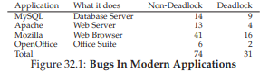
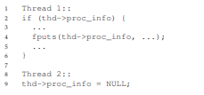
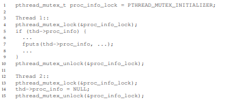
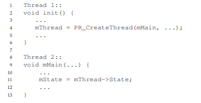
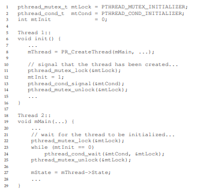

# 32. よくある並行性バグ（Common Concurrency Problems）

研究者たちは長年、並行性のバグを調査してきた。初期の研究はデッドロックに集中していたが、近年は非デッドロック型のバグにも注目が集まっている。この章では実際のコードベースで見られる並行性バグのパターンを学び、より堅牢なコードを書くための知見を得る。

> **CRUX: よくある並行性バグへの対処法**
> 並行性バグにはパターンがある。それを理解することが、正しい並行コードを書く第一歩だ。

## 32.1 どんなバグが存在するか

Luらの研究は、MySQL、Apache、Mozilla、OpenOfficeの4つの主要OSSを詳細に分析した。合計105個の並行性バグのうち、74個が非デッドロック、31個がデッドロックだった。



## 32.2 非デッドロックバグ

非デッドロックバグの大部分は、**原子性違反**と**順序違反**の2種類に分類される。

### 原子性違反（Atomicity-Violation）

MySQLで見つかった例を見てみよう。



スレッド1がproc_infoのNULLチェックを行った後、`fputs()`を呼ぶ前に割り込まれ、スレッド2がproc_infoをNULLに設定する。スレッド1が再開するとNULLポインタ参照でクラッシュする。

正式な定義は「複数のメモリアクセス間で意図した直列化可能性が侵害される（コード領域がアトミックであることを前提としているが、実行時にアトミック性が強制されない）」だ。

**修正：** 共有変数へのアクセスをロックで囲む。



### 順序違反（Order-Violation）



スレッド2がmThreadの初期化を前提としているが、スレッド2が先に実行されるとmThreadが未初期化のままアクセスされる。

正式な定義は「2つのメモリアクセス間で意図した順序が反転する（AがBの前に実行されるべきだが、実行時にはその順序が強制されない）」だ。

**修正：** 条件変数で順序を強制する。



### まとめ

Luらの研究した非デッドロックバグの97%が原子性違反か順序違反だった。これらのパターンを意識することで、バグを避けやすくなる。

## 32.3 デッドロックバグ

デッドロックは、スレッドが互いに相手の持つリソースを待ち合うことで発生する。

> 💡 **デッドロック**は、「あなたが先にどうぞ」「いえ、あなたが先に」とお互いに譲り合って永遠に動けなくなる状態。ただしOSの世界では「譲り合う」のではなく、「互いに相手の持っているものを待って動けない」状態だ。

```c
Thread 1:               Thread 2:
pthread_mutex_lock(L1); pthread_mutex_lock(L2);
pthread_mutex_lock(L2); pthread_mutex_lock(L1);
```

### デッドロックが起きる理由

1. **コンポーネント間の複雑な依存関係。** 仮想メモリシステムとファイルシステムが互いを呼び出すなど、循環依存が自然に発生しうる。
2. **カプセル化の性質。** 実装の詳細が隠蔽されているため、ロックの取得順序がインターフェースの外からは見えない。JavaのVector.AddAll()のような例では、呼び出し元から隠れたデッドロックが起きうる。

### デッドロックの4条件

デッドロックが発生するには以下の4条件がすべて成立する必要がある。

1. **相互排除** — リソースの排他的使用を要求する
2. **ホールド・アンド・ウェイト** — リソースを保持したまま追加のリソースを待つ
3. **プリエンプションなし** — リソースを強制的に奪えない
4. **循環待ち** — スレッドが循環チェーンを形成する

### 予防策

#### 循環待ちの防止

最も実用的な方法は、ロック取得に全順序または部分順序を設ける。L2の前に必ずL1を取得するなどのルールを定める。Linuxカーネルでは、メモリマッピングコードに10種類のロック取得順序がコメントとして記載されている。

> **TIP: ロックアドレスで取得順序を強制する**
> 2つのロックを取得する関数では、ロックのメモリアドレスの大小で取得順序を決めると、引数の順序に関わらずデッドロックを防げる。

#### ホールド・アンド・ウェイトの防止

すべてのロックを一度に取得する。グローバルな防御ロックを使い、複数ロックの取得を1つのアトミック操作にする。ただし、並行性が低下する欠点がある。

#### プリエンプションなしの克服

`pthread_mutex_trylock()`を使い、ロック取得に失敗したら保持中のロックを解放してリトライする。ただし**ライブロック**の問題がある（両スレッドが永遠にリトライを繰り返す）。ランダムな遅延を挟むことで軽減できる。

> 💡 **ライブロック**はデッドロックの親戚。デッドロックは「動けなくなる」のに対し、ライブロックは「動いてはいるが進まない」状態。狭い通路で二人がお互いに譲り合って同じ方向によけ続けるようなもの。

#### 相互排除の回避

ロックフリーのデータ構造を使う。compare-and-swap命令などのハードウェアアトミック命令で、ロックなしに値を安全に更新できる。

```c
void AtomicIncrement(int *value, int amount) {
    do {
        int old = *value;
    } while (CompareAndSwap(value, old, old + amount) == 0);
}
```

リスト挿入のロックフリー実装なども可能だが、完全なロックフリーデータ構造の構築は容易ではない。

### スケジューリングによるデッドロック回避

各スレッドがどのロックを必要とするか事前に分かっていれば、デッドロックが起きないようにスケジュールできる。DijkstraのBanker's Algorithmがその例だ。ただし汎用的ではなく、並行性を制限する場合がある。

### 検出と回復

デッドロックを許容し、発生を検出したら対処する（再起動など）。データベースシステムでよく使われる手法だ。

> **TIP: すべてを完璧にする必要はない（Tom West's Law）**
> まれにしか起きない問題には、完璧な防止策をかけなくてもよい場合がある。ただし、スペースシャトルを作っているなら話は別だ。

## 32.4 まとめ

非デッドロックバグ（原子性違反・順序違反）は驚くほど一般的だが、修正は比較的簡単だ。デッドロックは慎重なロック順序設計で予防するのが実践的な最善策だ。ロックフリーアプローチも有望だが、汎用性と開発の複雑さに課題がある。最良の解決策は、MapReduceのようにロックを使わないプログラミングモデルかもしれない。

## 参考文献

[B+87] "Concurrency Control and Recovery in Database Systems" Philip A. Bernstein et al., 1987
[C+71] "System Deadlocks" E.G. Coffman et al., 1971
[D64] "Een algorithme ter voorkoming van de dodelijke omarming" Edsger Dijkstra, c.1964
[GD02] "MapReduce: Simplified Data Processing on Large Clusters" Sanjay Ghemawhat and Jeff Dean, 2004
[H01] "A Pragmatic Implementation of Non-blocking Linked-lists" Tim Harris, 2001
[H91] "Wait-free Synchronization" Maurice Herlihy, 1991
[H93] "A Methodology for Implementing Highly Concurrent Data Objects" Maurice Herlihy, 1993
[J+08] "Deadlock Immunity" Horatiu Jula et al., 2008
[K81] "Soul of a New Machine" Tracy Kidder, 1980
[K87] "Deadlock Detection in Distributed Databases" Edgar Knapp, 1987
[L+08] "Learning from Mistakes" Shan Lu et al., 2008
[T+94] "Linux File Memory Map Code" Linus Torvalds et al.

---

<div align="center">

[← 前へ: 31. セマフォ](./31.md) | [次へ: 33. イベントベース並行性 →](./33.md)

</div>
