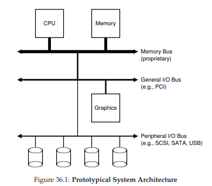
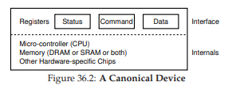
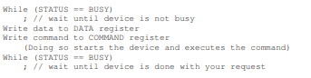
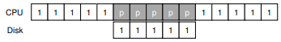
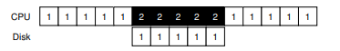
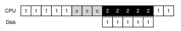
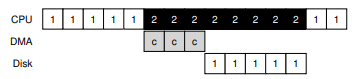
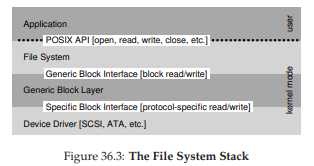
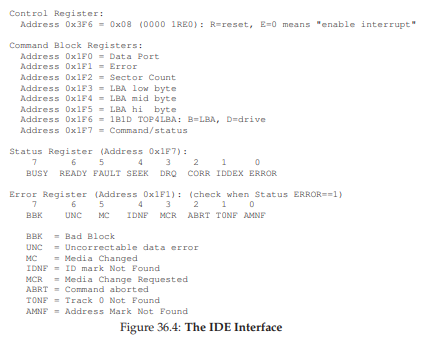
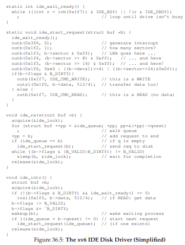

# 36. I/Oデバイス（I/O Devices）

ここから本書の第3部「永続性」に入る。これまでCPUの仮想化（プロセス、スケジューリング）とメモリの仮想化（アドレス空間、ページング）を学んできた。第3部では、電源を切ってもデータを失わないための技術——つまりストレージの世界を探求する。まずはI/Oデバイスの基本概念とOSとの対話方法を理解しておこう。入出力なしのプログラムは退屈だ——入力がなければ毎回同じ結果になるし、出力がなければ何のためのプログラムか分からない。

> **CRUX: I/Oをシステムにどう統合するか**
> 一般的な仕組みは何か？どうすれば効率化できるか？

## 36.1 システムアーキテクチャ

典型的なシステムは、メモリバスでCPUとメインメモリが接続され、その下に汎用I/Oバス（PCIなど）、さらに下に周辺バス（SCSI、SATA、USBなど）が配置されている。

なぜこの階層構造が必要か？物理法則とコストだ。バスは高速であるほど短くする必要があり、製造コストも高い。そのため、GPUのような高性能デバイスはCPUの近くに、ディスクやマウスのような低速デバイスは周辺バスに配置される。

## 36.2 標準デバイス

標準的なデバイスは2つの部分から構成される。**ハードウェアインターフェース**と**内部構造**だ。

ハードウェアインターフェースは、OSがデバイスの動作を制御するための手段を提供する。内部構造は、デバイスがその抽象化を実装する仕組みだ。最新のRAIDコントローラは数十万行のファームウェアで機能を実現している。

## 36.3 標準プロトコル

簡略化されたデバイスインターフェースは3つのレジスタで構成される。**ステータスレジスタ**（デバイスの現在の状態）、**コマンドレジスタ**（タスクの指示）、**データレジスタ**（データの受け渡し）だ。

プロトコルの4ステップは以下の通りだ。

1. **デバイスの準備を待つ** — ステータスレジスタをポーリング
2. **データをデータレジスタに送る** — CPUがデータをデバイスに転送する（プログラムI/O、PIO）
3. **コマンドをコマンドレジスタに書き込む** — デバイスがI/Oを開始
4. **完了を待つ** — ステータスレジスタを再びポーリング

このプロトコルの問題はポーリングの非効率さだ。CPUがデバイスの完了を待つだけで時間を浪費してしまう。

## 36.4 割り込みによるCPUオーバーヘッドの削減

ポーリングの代わりに、OSはI/O要求を発行した後、呼び出しプロセスをスリープさせて他のタスクに切り替える。デバイスが完了するとハードウェア割り込みが発生し、OSの割り込みサービスルーチン（ISR）にジャンプして処理を再開する。

割り込みにより、計算とI/Oのオーバーラップが可能になり、CPUの利用率が向上する。

> **TIP: 割り込みが常にPIOより優れているわけではない**
> 高速デバイスの場合、割り込み処理とコンテキストスイッチのコストがポーリングを上回ることがある。また、ネットワークパケットの大量到着で割り込みが殺到すると、ライブロックを起こす場合もある。ハイブリッドアプローチ——まずポーリングし、完了しなければ割り込みに切り替える——が有効な場合もある。

別の最適化として**割り込みの統合（coalescing）**がある。デバイスは割り込みを即座に発生させず、少し待って複数のリクエストの完了を1つの割り込みにまとめる。

## 36.5 DMAによる効率的なデータ移動

PIOでは大量のデータ転送時にCPUがデータコピーに占有される。

> **CRUX: PIOのオーバーヘッドをどう削減するか**

**DMA（ダイレクトメモリアクセス）**エンジンは、CPUの介入なしにデバイスとメインメモリ間の転送を調整する。OSはDMAエンジンに「どこのメモリから、どれだけのデータを、どのデバイスに」と指示するだけで、転送中はCPUが他の処理に使える。

> 💡 **DMA**は、「CPUがデータを一つ一つ運ぶ」代わりに、「専用の運搬車（DMAエンジン）に『あそこからここまで運んで』と指示するだけ」の仕組み。CPUは控えた時間で別の仕事ができる。

## 36.6 デバイスとの通信方法

デバイス通信には主に2つの方法がある。

1. **明示的I/O命令**  — x86のin/out命令のように、ポート番号を指定してデバイスレジスタにアクセスする。特権命令であり、OSのみが使用できる。
2. **メモリマップI/O** — デバイスレジスタをメモリアドレス空間にマッピングし、通常のload/store命令でアクセスする。

どちらにも決定的な優位性はなく、現在も両方が使われている。

## 36.7 OSへの統合：デバイスドライバ

多種多様なデバイスインターフェースの詳細をどう隠蔽するか。答えは古典的な抽象化だ。**デバイスドライバ**がデバイスの差異をカプセル化し、OSの残りの部分にはデバイス中立な汎用インターフェースだけが見える。

> 💡 **デバイスドライバ**は、OSとハードウェアの「通訳」。プリンタでもグラフィックスカードでも、ドライバのおかげでOSからは同じ「デバイス」として扱える。Linuxカーネルの70%以上がドライバコードであり、バグの主要因でもある。

Linuxにおけるファイルシステムスタックを見ると、ファイルシステムはディスクの詳細を知らず、汎用ブロックレイヤーにリクエストを発行するだけだ。そこから適切なデバイスドライバにルーティングされる。

ただし、カプセル化の代償もある。SCSIデバイスの豊富なエラー情報が汎用EIOエラーに丸められてしまうケースや、デバイスの特殊機能が使えなくなるケースがある。

Linuxカーネルのコードの70%以上がデバイスドライバだ。ドライバがバグの温床であり、カーネルクラッシュの主要因でもある。

## 36.8 ケーススタディ：シンプルなIDEディスクドライバ

IDEディスクは4種類のレジスタ（制御、コマンドブロック、ステータス、エラー）を持つシンプルなインターフェースを提供する。

基本プロトコルは以下の通りだ。

1. ステータスレジスタを読んでドライブの準備を待つ
2. コマンドレジスタにセクタ数・LBA・ドライブ番号を書き込む
3. コマンドレジスタにREAD/WRITEコマンドを発行しI/Oを開始
4. 書き込み時はDRQ状態を待ってデータポートにデータを書き込む
5. 転送セクタごとに割り込みを処理
6. ステータスレジスタでエラーをチェック

xv6のIDEドライバ（図36.5）は4つの関数で構成される。`ide_rw()`がリクエストのキュー管理、`ide_start_request()`がディスクへのコマンド発行、`ide_wait_ready()`がドライブ準備の確認、`ide_intr()`が割り込み処理を行う。

## 36.9 まとめ

OSがデバイスとやりとりする基本的な仕組みを学んだ。割り込みとDMAで効率化し、明示的I/O命令とメモリマップI/Oでアクセスし、デバイスドライバで詳細を隠蔽する。この基盤の上にファイルシステムなどの上位構造を構築していく。

## 参考文献

[A+11] "vIC: Interrupt Coalescing for Virtual Machine Storage Device IO" Irfan Ahmad et al., USENIX '11
[C01] "An Empirical Study of Operating System Errors" Andy Chou et al., SOSP '01
[CK+08] "The xv6 Operating System" Russ Cox et al.
[D07] "What Every Programmer Should Know About Memory" Ulrich Drepper, 2007
[G08] "EIO: Error-handling is Occasionally Correct" Haryadi Gunawi et al., FAST '08
[L94] "AT Attachment Interface for Disk Drives" Lawrence J. Lamers
[MR96] "Eliminating Receive Livelock in an Interrupt-driven Kernel" Jeffrey Mogul et al., USENIX '96
[S08] "Interrupts" Mark Smotherman
[S03] "Improving the Reliability of Commodity Operating Systems" Michael M. Swift et al., SOSP '03
[W10] "Hard Disk Driver" Washington State Course Homepage

---

[← 前へ: 33. イベントベース並行性](./33.md) | [次へ: 37. ハードディスク →](./37.md)

