# 37. ハードディスクドライブ（Hard Disk Drives）

ハードディスクドライブは何十年もの間、コンピュータシステムの永続的なデータストレージの中核だった。ファイルシステム技術の多くは、ディスクの動作特性を前提に設計されている。ファイルシステムソフトウェアを構築する前に、ディスクの仕組みを理解しておこう。

> **CRUX: ディスク上のデータの格納とアクセス**
> ハードディスクはどのようにデータを保存するか？インターフェースとは？ディスクスケジューリングはどうパフォーマンスを改善するか？

## 37.1 インターフェース

ディスクは多数のセクタ（各512バイトのブロック）で構成され、0からn-1まで番号が付いている。ディスクはセクタの配列と考えることができる。

ディスクメーカーが保証する唯一のアトミック操作は512バイトの単一書き込みだ。途中で電源が落ちると、より大きな書き込みは一部だけ完了する可能性がある（トーン書き込み）。

また、「書かれざる契約」として、**隣接するブロックへのアクセスは離れたブロックよりも高速**で、**連続アクセスがランダムアクセスよりもはるかに高速**であることが前提とされている。

## 37.2 基本ジオメトリ

- **プラッタ** — データを磁気的に保存する円盤状の硬い面。1枚以上あり、各プラッタは2つの面（サーフェス）を持つ。
- **スピンドル** — モータに接続され、プラッタを一定速度で回転させる。7,200〜15,000 RPMが典型的。
- **トラック** — サーフェス上のセクタの同心円。1つのサーフェスに数千のトラックがある。
- **ディスクヘッド** — 磁気パターンの読み書きを行う。各サーフェスに1つ。
- **ディスクアーム** — ヘッドをトラック間で移動させる。

## 37.3 シンプルなディスクドライブ

### 単一トラック：回転遅延

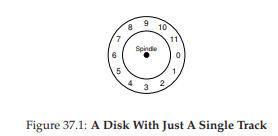
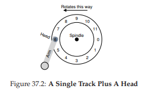

ヘッドの下に目的のセクタが回ってくるまで待つ時間を**回転遅延（rotational delay）**と呼ぶ。完全な1回転遅延がRなら、平均回転遅延はR/2だ。

### 複数トラック：シーク時間

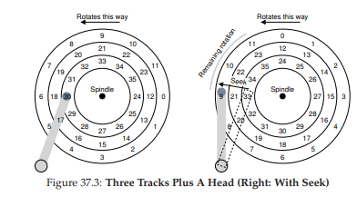

ヘッドを別のトラックに移動するプロセスを**シーク（seek）**と呼ぶ。シークには加速、惰性走行、減速、**セトリング（微調整）**の各フェーズがある。セトリングだけで0.5〜2msかかる。

シーク完了後、目的のセクタがヘッドの下に来るまで回転遅延を待ち、最後に**転送**（データの読み書き）を行う。I/O時間の全体像は：**シーク → 回転遅延 → 転送**。

### その他の詳細

- **トラックスキュー** — トラック切り替え時のヘッド移動時間を考慮し、隣接トラックのセクタをずらして配置する。
- **マルチゾーン** — 外側トラックは内側より多くのセクタを持つ。ゾーンごとにセクタ数が異なる。
- **トラックバッファ（キャッシュ）** — 通常8〜16 MBの小さなメモリ。読み取り時にトラック全体をキャッシュし、同じトラックへの後続アクセスを高速化。書き込みではライトバックとライトスルーの選択肢がある。

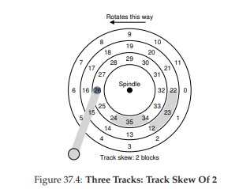

## 37.4 I/O時間の計算

I/O時間は3つの主要コンポーネントの合計だ。

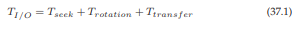

I/Oレートは転送サイズをI/O時間で割って計算する。

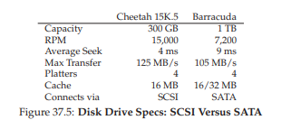

Seagateの2つのドライブで比較してみよう。

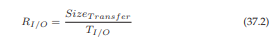

**ランダム仕事量**（4KBランダム読み取り）の計算：

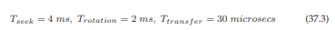

Cheetah: T_I/O ≈ 6ms → 約0.66 MB/s
Barracuda: T_I/O ≈ 13.2ms → 約0.31 MB/s

**シーケンシャル仕事量**（100 MB連続転送）では、Cheetahが約125 MB/s、Barracudaが約105 MB/s。

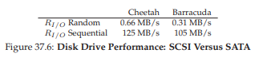

ランダムとシーケンシャルの性能差はCheetahで約200倍、Barracudaで300倍以上にもなる。

> **TIP: ディスクはシーケンシャルに使え**
> ランダムI/Oはパフォーマンスを劇的に低下させる。

## 37.5 ディスクスケジューリング

ディスクI/Oのコストが高いため、OSはI/Oの順序を最適化する役割を担ってきた。ジョブスケジューリングとは異なり、各ディスク要求の所要時間は推測可能なため、SJF（最短ジョブ優先）に近いアプローチが取れる。

### SSTF（最短シーク時間優先）

現在のヘッド位置から最も近いトラックの要求を先に処理する。

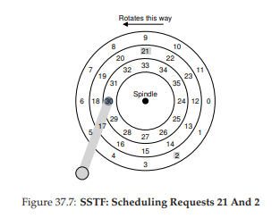

問題は**飢餓**だ。近いトラックへの要求が次々来ると、遠いトラックの要求が永遠に処理されない。

### エレベータ（SCAN / C-SCAN）

ディスクを一方向に走査しながら要求を処理し、端に達したら反転する。エレベータの動きに似ているため、この名前がある。F-SCANはスイープ中にキューをフリーズし、C-SCAN（Circular SCAN）は一方向だけに走査して外側トラックでリセットする。

SCANは飢餓を防ぐが、回転遅延を考慮していないため最適ではない。

### SPTF（最短ポジショニング時間優先）

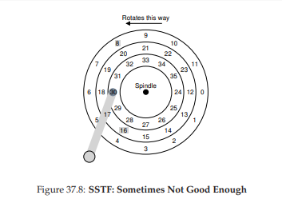

シークと回転の両方のコストを考慮して次の要求を選ぶ。現代のドライブではシークと回転がほぼ同等のコストを持つため、SPTFが有効だ。ただし、ヘッドの正確な位置やトラック境界はOS側からは分からないため、SPTFは通常ドライブ内部のコントローラで実行される。

> **TIP: それは場合による（Livny's Law）**

### その他の課題

- **I/Oマージ** — 隣接するブロックの要求を1つにまとめて効率化
- **先行スケジューリング** — すぐにI/Oを発行せず少し待つことで、より良い要求の到着を期待する（非作業保全アプローチ）
- **ドライブ内部スケジューラ** — 現代のドライブは複数の未処理要求を受け取り、内部でSPTFを実行できる

## 37.6 まとめ

ディスクの仕組みを概観した。シーク、回転遅延、転送の3要素がI/O時間を決定し、シーケンシャルアクセスとランダムアクセスでは劇的な性能差がある。ディスクスケジューリングはI/O順序の最適化によって性能を向上させるが、現代ではその多くがドライブ内部で行われている。

## 参考文献

[ADR03] "More Than an Interface: SCSI vs. ATA" Dave Anderson et al., FAST '03
[CKR72] "Analysis of Scanning Policies for Reducing Disk Seek Times" E.G. Coffman et al., 1972
[ID01] "Anticipatory Scheduling" Sitaram Iyer et al., SOSP '01
[JW91] "Disk Scheduling Algorithms Based On Rotational Position" D. Jacobson et al., 1991
[RW92] "An Introduction to Disk Drive Modeling" C. Ruemmler et al., 1994
[SCO90] "Disk Scheduling Revisited" Margo Seltzer et al., USENIX 1990
[SG04] "MEMS-based storage devices and standard disk interfaces" Steven W. Schlosser et al., FAST '04

---

[← 前へ: 36. I/Oデバイス](./36.md) | [次へ: 38. RAID →](./38.md)

