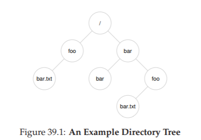

# 39. 幕間：ファイルとディレクトリ（Interlude: Files and Directories）

この章では、永続的なストレージを管理するOS抽象化の2本柱、**ファイル**と**ディレクトリ**を紹介する。これらはファイルシステムが提供するインターフェースだ。仮想化の章でプロセスAPIを学んだように、ここではファイルシステムAPIを学ぶ。

> **CRUX: 永続ストレージをどう管理するか**
> OSは永続データを管理するためにどんな抽象化を提供すべきか？APIはどうあるべきか？実装はどうなるか？

## 39.1 ファイルとディレクトリ

**ファイル**は読み書き可能なバイトの線形配列だ。各ファイルには低レベルの名前として**inode番号**が付与される。OSはファイルの内部構造には関知しない——バイト列を格納し、名前を付け、後からアクセスできるようにするだけだ。

> 💡 **inode（アイノード）**は、ファイルの「住民票」のようなもの。ファイル名は人間が読める「名前」だが、OS内部では番号（inode番号）で管理されている。inodeにはファイルのサイズ、所有者、ディスク上の位置などのメタデータが全て記録される。

**ディレクトリ**は、`（ユーザ可読名, 低レベル名）`のペアのリストを格納する特別なファイルだ。ディレクトリもinode番号を持つ。ディレクトリの中にサブディレクトリを配置することで**ディレクトリツリー**（ファイル階層）が構成される。



ツリーの起点は**ルートディレクトリ**（UNIXでは`/`）だ。パスの区切りにもスラッシュを使う。**絶対パス**はルートから始まり（`/foo/bar.txt`）、**相対パス**は現在の作業ディレクトリ（cwd）から始まる。

## 39.2 ファイルシステムインターフェース

### ファイルの作成

```c
int fd = open("foo", O_CREAT|O_WRONLY|O_TRUNC, S_IRUSR|S_IWUSR);
```

`open()`にO_CREATフラグを指定するとファイルが作成される。戻り値は**ファイルディスクリプタ（fd）**——プロセスごとに管理されるプライベートな整数で、以降のread/writeのハンドルとなる。

> 💡 **ファイルディスクリプタ（fd）**は、「レストランの整理券」のようなもの。ファイルを開くと番号がもらえ、その番号を使って「読む」「書く」「閉じる」などの操作を行う。プロセスごとに管理されるので、同じ番号でも別のプロセスのファイルにはアクセスできない。

### ファイルの読み書き

```c
// 読み取り
ssize_t bytesRead = read(fd, buffer, size);
// 書き込み
ssize_t bytesWritten = write(fd, buffer, size);
```

`strace`を使うと、プログラムが発行する全システムコールをトレースできる。`cat`コマンドの実行を`strace`で追うと、`open()`→`read()`→`write()`→`close()`の典型的なパターンが見える。

catはread()が0を返すまで繰り返し読み取りを行う（0はEOF＝ファイル末端を意味する）。

> **ASIDE: 情報のインポートとエクスポート**  
> データの受け渡しは大きく2種類ある。1つはファイルのバイトに意味を付与した構造化フォーマット（PDF、JPEGなど）、もう1つはSQLデータベースのようなシステムである。

### ノンシーケンシャルな読み書き

`lseek()`で現在のオフセットを移動し、ファイル内の任意の位置を読み書きできる。

```c
off_t lseek(int fildes, off_t offset, int whence);
```

### オープンファイルテーブル

各プロセスは**ファイルディスクリプタテーブル**を持ち、各エントリが**オープンファイルテーブル（OFT）**のエントリを指す。OFTは現在のオフセット、フラグ、inodeポインタなどを管理するシステム全体で共有されるデータ構造だ。


`fork()`で子プロセスが作られると、fdテーブルがコピーされ、子は親と同じOFTのエントリを共有する。`dup()`でも同様に、複数のfdが同じOFTエントリを共有できる。


### データの即時書き込み：fsync()

`write()`は通常、データをまずメモリ内のバッファに書き込み、後でディスクに書き出す。確実にディスクに書き込みたい場合は`fsync()`を使う。

```c
int fd = open("foo", O_CREAT|O_WRONLY|O_TRUNC);
write(fd, buffer, size);
fsync(fd);
close(fd);
```

データベースやジャーナリングファイルシステムのように、データの永続化タイミングが重要なシステムでは`fsync()`が欠かせない。

### ファイルのリネーム

```c
rename("foo", "bar");
```

`rename()`はアトミックに実行される。内部ではinode番号を付け替えるだけだ。このアトミック性を利用して、ファイルの安全な更新を行える。

```c
int fd = open("foo.txt.tmp", O_WRONLY|O_CREAT|O_TRUNC);
write(fd, buffer, size);
fsync(fd);
close(fd);
rename("foo.txt.tmp", "foo.txt");
```

仮に途中でクラッシュしても、元の`foo.txt`か新しい`foo.txt`のどちらかが残る。

### ファイル情報の取得：stat / fstat

```c
struct stat {
    dev_t     st_dev;     // デバイスID
    ino_t     st_ino;     // inode番号
    mode_t    st_mode;    // パーミッション
    nlink_t   st_nlink;   // ハードリンク数
    uid_t     st_uid;     // 所有者UID
    gid_t     st_gid;     // グループGID
    off_t     st_size;    // サイズ（バイト）
    blksize_t st_blksize; // ブロックサイズ
    blkcnt_t  st_blocks;  // 割り当てブロック数
    time_t    st_atime;   // 最終アクセス時刻
    time_t    st_mtime;   // 最終更新時刻
    time_t    st_ctime;   // 最終状態変更時刻
};
```

ファイルシステムは各ファイルについてこれらのメタデータを保持する。`ls -l`の表示情報の大半はここから来ている。

### ファイルの削除

```
> rm foo
```

`rm`は内部で`unlink()`システムコールを呼ぶ。なぜ「削除」ではなく「リンク解除」なのか？これを理解するにはリンクの概念を知る必要がある。

## 39.3 ディレクトリの操作

### ディレクトリの作成と削除

```c
mkdir("mydir", 0777);   // 作成
rmdir("mydir");         // 削除（空の場合のみ）
```

作成直後のディレクトリには`.`（自身）と`..`（親）の2エントリが存在する。

### ディレクトリの読み取り

```c
DIR *dp = opendir(".");
struct dirent *d;
while ((d = readdir(dp)) != NULL) {
    printf("%lu %s\n", (unsigned long) d->d_ino, d->d_name);
}
closedir(dp);
```

`ls`コマンドはこのインターフェースを使ってディレクトリの内容を一覧表示する。

## 39.4 ハードリンク

`link()`はファイルの既存のinode番号に新しい名前を付ける。

```c
link("file", "file2");  // file2は同じinode番号を指す
```

ファイルは実際には複数のエントリから参照可能であり、ファイル自体ではなくリンク（名前エントリ）を操作する。`unlink()`はリンクカウントを1つ減らし、カウントが0になって初めてデータが解放される。だから「リンク解除」なのだ。

## 39.5 シンボリックリンク（ソフトリンク）

ハードリンクにはいくつかの制限がある——ディレクトリにはリンクできない（循環を防ぐため）し、異なるファイルシステムをまたげない（inode番号がファイルシステムローカルなため）。

**シンボリックリンク**は、リンク先のパス名を文字列として格納する別のファイルだ。

```
> ln -s file file2
> stat file file2
... file:  Inode: 67158084 ...
... file2: Inode: 67158085 Links: 1 ...
```

シンボリックリンクは独自のinodeを持つ。元のファイルを削除すると**ダングリングリファレンス（宙ぶらりん参照）**になり、アクセス時にエラーとなる。

## 39.6 ファイルシステムの作成とマウント

`mkfs`がファイルシステムを作成し、`mount`が既存のディレクトリツリーの任意のポイントにマウントする。

```
> mount -t ext3 /dev/sda1 /home/users
```

マウントにより、異なるファイルシステムが1つの統一されたディレクトリツリーの下に統合される。

## 39.7 まとめ

ファイルとディレクトリのインターフェースは驚くほどシンプルだ。`open()`, `read()`, `write()`, `close()`でファイルを操作し、`mkdir()`, `opendir()`, `readdir()`でディレクトリを操作する。ハードリンクとシンボリックリンクはファイルへの柔軟な参照を提供し、マウントはファイルシステムを統合する。次の章では、これらのインターフェースがディスク上でどう実装されるかを見ていく。

## 参考文献

[K84] "Processes as Files" Tom Killian, USENIX 1984
[P09] "The Pathologies of Big Data" Adam Jacobs, ACM Queue 2009
[SR05] "Advanced Programming in the UNIX Environment" W. Richard Stevens and Stephen A. Rago, 2005

---

<div align="center">

[← 前へ: 38. RAID](./38.md) | [次へ: 40. ファイルシステム実装 →](./40.md)

</div>
