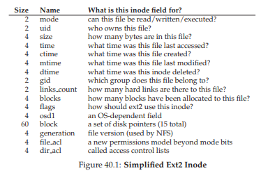
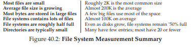
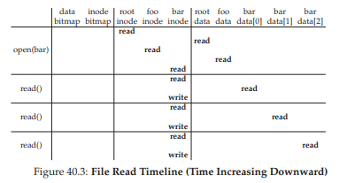
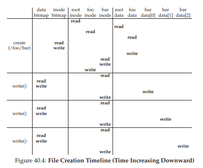

# 40. ファイルシステムの実装（File System Implementation）

前章でファイルシステムのインターフェースを学んだ。この章ではいよいよファイルシステムの実装に踏み込む。**vsfs（Very Simple File System）**という単純なファイルシステムを設計し、ファイルシステムがディスク上のデータ構造としてどう実現されるかを理解しよう。

> **CRUX: シンプルなファイルシステムをどう構築するか**
> ディスク上のデータ構造はどうなるか？ファイルとディレクトリに必要な情報を正確に把握し、オープン、読み取り、書き込みなどのアクセス経路はどうなるか？

## 40.1 考え方

ファイルシステムの理解には2つの側面がある。

1. **ディスク上のデータ構造** — データとメタデータをどのように格納するか
2. **アクセス方法** — プロセスがopen/read/writeを呼んだとき、何がどの順序で行われるか

## 40.2 全体の構成

ディスクをブロック（例:4KB）の配列と見なす。vsfsでは64ブロックのパーティションを例にとる。



領域の内訳は以下の通りだ。

- **データ領域**（ブロック8〜63: 56ブロック） — ユーザデータの格納先
- **inodeテーブル**（ブロック3〜7: 5ブロック） — ファイルのメタデータを格納
- **データビットマップ**（ブロック2: 1ブロック） — データブロックの使用状況
- **inodeビットマップ**（ブロック1: 1ブロック） — inodeの使用状況
- **スーパーブロック**（ブロック0: 1ブロック） — ファイルシステム全体のメタデータ



スーパーブロックにはinode数、データブロック数、各領域の開始位置、ファイルシステム種別のマジックナンバーなどが格納される。マウント時にOSはまずスーパーブロックを読み取る。

> 💡 ファイルシステムのディスク上の構造を図書館に例えると：**スーパーブロック**は「館の全体情報」、**ビットマップ**は「どの本棚が空いているかの管理帳」、**inodeテーブル**は「本の属性カード」、**データブロック**は「実際の本棚」だ。

## 40.3 ファイルの構成：inode

**inode（インデックスノード）**はファイルのメタデータを格納する構造体だ。inode番号（inumber）で参照される。



inumberからディスク上の位置を計算するのは単純な算術だ。

```
blk  = (inumber * sizeof(inode_t)) / blockSize
sector = ((blk * blockSize) + inodeStartAddr) / sectorSize
```


各inodeには以下の情報を含む。

- 種類（通常ファイル、ディレクトリ、etc.）
- サイズ
- 割り当てブロック数
- 保護情報（パーミッション）
- タイムスタンプ（作成/更新/アクセス）
- データブロックへのポインタ


### マルチレベルインデックス

ファイルが大きくなると直接ポインタだけでは足りない。そこで**間接ポインタ**を使う。

- **直接ポインタ** — データブロックを直接指す（12個程度）
- **間接ポインタ** — ポインタのブロックを指す。そのブロック内のポインタがデータブロックを指す
- **二重間接ポインタ** — 間接ブロックを指すブロック
- **三重間接ポインタ** — 二重間接ブロックを指すブロック



ext2/ext3では、12個の直接ポインタ + 1間接 + 1二重間接 + 1三重間接で、4KBブロックの場合4GB以上のファイルをサポートする。

この非対称な構造は、ほとんどのファイルが小さいという事実に基づく合理的な設計だ。小さいファイルはオーバーヘッドなく直接ポインタだけで管理でき、大きなファイルは必要に応じてインデックス構造が拡張される。

> **TIP: エクステントベースのアプローチ**
> 別のアプローチとして**エクステント**がある。ポインタ1つ＋長さ1つで連続ブロックの範囲を表現する。ファイルが連続配置されている場合に効率的だが、柔軟性はポインタベースに劣る。ext4やHFS+、NTFSなどが採用している。

## 40.4 ディレクトリの構成

ディレクトリの中身は`（エントリ名, inode番号）`のペアのリストだ。各エントリにはレコード長やエントリ名の長さも含まれる。


ファイル削除時はそのエントリのinode番号を0にし、前のエントリのレコード長を拡大して吸収する。

ディレクトリは単なるリスト（リニアリスト）の場合もあれば、B-treeを使う高性能実装（XFSなど）もある。ディレクトリは特別な種類のファイルなので、inode内のtypeフィールドで区別される。

## 40.5 フリースペースの管理

ビットマップを使い、各ブロック/inodeの使用状況を0/1で管理する。新しいファイルやデータブロックの割り当て時にビットマップを検索して空きを見つける。

ext2/ext3では、ファイルの連続性を高めるため、同じデータブロックグループから連続するブロックを事前に見つけて割り当てる**事前割り当て**ポリシーを使う。

## 40.6 アクセスパス：読み取り

`/foo/bar`を開いて読む場合のディスクI/Oを追跡してみよう。

1. **パスの解決** — ルートinode（通常inode 2）を読み、ルートディレクトリのデータブロックを読んで`foo`のinode番号を見つける。
2. `foo`のinodeを読み、`foo`のディレクトリデータから`bar`のinode番号を見つける。
3. `bar`のinodeを読み、ファイルの情報を取得。fdを割り当て、プロセスのオープンファイルテーブルに登録。
4. `read()`のたびにinodeからブロック位置を特定し、データブロックを読み、inodeのアクセス時刻を更新。


パスの深さに比例してI/O回数が増える。`open()`だけで、パスの各コンポーネントにつき2回（inode読み取り+ディレクトリデータ読み取り）のディスクI/Oが必要だ。

## 40.7 アクセスパス：書き込み

ファイルへの書き込みは読み取りよりもコストが高い。新しいブロックの割り当てが必要な場合、追加のI/Oが発生するからだ。

1. データビットマップの読み取り
2. データビットマップの書き込み（更新）
3. 新しいデータブロックの書き込み
4. inodeの読み取り（サイズ等の更新のため）
5. inodeの書き込み

ファイル作成の場合はさらに多い——inodeの割り当て（inodeビットマップの読み書き、新inodeの書き込み）、親ディレクトリの更新（データの読み書き、inodeの読み書き）も必要になる。


1ブロック3回の書き込みに対して、合計で10回ものI/Oが必要になる場合もある。

## 40.8 キャッシュとバッファリング

ディスクI/Oのコストを軽減するため、ほとんどのファイルシステムはメモリ内にキャッシュを持つ。

初期のファイルシステムは**固定サイズのスタティックパーティショニング**でメモリの一部をキャッシュに割り当てていたが、この方法はメモリの無駄が生じやすい。

現代のシステムでは**動的パーティショニング（ユニファイドページキャッシュ）**を使い、仮想メモリとファイルデータの間で柔軟にメモリを共有する。


キャッシュによりreadパスは大幅に高速化される。writeパスではバッファリングにより、複数の書き込みを1回のI/Oにまとめたり、不要な書き込み（すぐに削除されるファイルなど）を回避できる。ただし、書き込みのバッファリングはクラッシュ時のデータ損失リスクを伴う。

> **TIP: 耐久性/パフォーマンスのトレードオフ**
> ほとんどのアプリケーションは高速で良い。データベースのような重要な用途には`fsync()`や`O_DIRECT`で安全性を確保する。

## 40.9 まとめ

vsfsを通じてファイルシステムの基本構造を学んだ。ディスク上のデータはinode、データブロック、ビットマップ、スーパーブロックで構成される。ファイルの読み書きには多くのI/Oが必要だが、キャッシュとバッファリングでパフォーマンスを改善している。現実のファイルシステムはさらに高度な最適化とクラッシュ対策を備えている。

## 参考文献

[A+07] "Analysis of the NTFS Log Structure" Bhatt et al., 2007
[B07] "ZFS: The Last Word in File Systems" Jeff Bonwick and Bill Moore, 2007
[C+12] "Consistency Without Ordering" Vijay Chidambaram et al., FAST '12
[I01] "The Design and Implementation of a Log-structured File System" Mendel Rosenblum and John Ousterhout
[P09] "The Pathologies of Big Data" Adam Jacobs, ACM Queue 2009
[S+13] "XFS: The Big Storage File System for Linux" SGI
[SO90] "The Design and Implementation of a Log-Structured File System" Mendel Rosenblum and John K. Ousterhout, SOSP '91

---

<div align="center">

[← 前へ: 39. ファイルとディレクトリ](./39.md) | [次へ: 42. クラッシュ一貫性 →](./42.md)

</div>
