# 42. クラッシュ一貫性：fsckとジャーナリング（Crash Consistency: FSCK and Journaling）

前章まででファイルシステムのデータ構造（inode、ビットマップ、スーパーブロックなど、第40章参照）を学んだ。これらのデータ構造は永続的でなければならない。停電やクラッシュの後もデータを保持する必要がある。しかし、ディスク上の構造を更新する最中にクラッシュが起きたら——この**クラッシュ一貫性問題**がファイルシステム実装の難題だ。

> **CRUX: クラッシュに負けずにディスクを更新するには**
> 2つの書き込みの間でクラッシュや停電が起きうる。ファイルシステムはディスク上のイメージを合理的な状態に保つにはどうすればよいか？

## 42.1 詳細な例

ファイルに1つのデータブロックを追加する仕事量を考えよう。更新が必要なのは3つだ。

1. **inode (I[v2])** — 新ブロックを指すポインタとサイズの更新
2. **データビットマップ (B[v2])** — 新ブロックの割り当てマーク
3. **データブロック (Db)** — 実際のユーザデータ

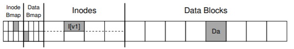
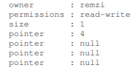
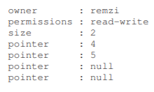
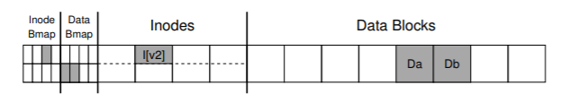

### クラッシュシナリオ

3つの書き込みのうち1つだけ成功した場合：

- **Dbのみ成功** — inodeもビットマップも更新されていないため、書き込みは無かったことになる。問題なし。
- **I[v2]のみ成功** — inodeがまだ書かれていないブロックを指す。ガベージデータを読むことに。ビットマップとの不整合も発生。
- **B[v2]のみ成功** — ビットマップはブロック使用中と言うが、どのファイルにも属さない。**スペースリーク**。

2つ成功し1つ失敗した場合：

- **I[v2] + B[v2]成功、Dbなし** — メタデータは一貫しているが、データブロックにはゴミが入っている。
- **I[v2] + Db成功、B[v2]なし** — inodeとビットマップの不整合。
- **B[v2] + Db成功、I[v2]なし** — データは正しいがinodeが指していない。

**📋 クラッシュシナリオまとめ:**

| 成功した書き込み | 結果 | 危険度 |
|---|---|---|
| Dbのみ | データは書いたが記録なし → 無かったことに | ⚪ 安全 |
| I[v2]のみ | inodeがゴミデータを指す | 🔴 危険 |
| B[v2]のみ | 使用中なのにどこからも参照されない | 🟡 スペースリーク |
| I[v2] + B[v2] | メタデータは整合だがデータはゴミ | 🔴 危険 |
| I[v2] + Db | inodeとビットマップが不整合 | 🔴 危険 |
| B[v2] + Db | データはあるがinodeが知らない | 🟡 不整合 |
| 全部成功 | 正常 | ⚪ 安全 |

> 💡 **6通り中4通りが危険**。だからfsckやジャーナリングが必要になる。ジャーナリングは「3つの書き込みをアトミック（全部成功or全部失敗）にする」ことで、この中間状態を根本的に排除する。

## 42.2 解決策 #1：ファイルシステムチェッカー（fsck）

初期のファイルシステムは不整合の発生を許容し、再起動時にfsckで修復する戦略を取った。

fsckの動作ステップ：

1. **スーパーブロック** — 健全性チェック。破損していれば代替コピーを使用
2. **フリーブロック** — 全inodeをスキャンし、割り当て済ブロックを特定。ビットマップを再構築
3. **iノードの状態** — 各inodeの種別フィールドなどを検証。修復不能ならクリア
4. **iノードリンク** — ディレクトリツリーを走査してリンクカウントを検証
5. **重複ポインタ** — 2つのinodeが同じブロックを参照していないかチェック
6. **不良ブロック** — 有効範囲外のポインタを検出・クリア
7. **ディレクトリチェック** — "."と".."のエントリ、inode参照の整合性を検証

**fsckの問題**：非常に遅い。3ブロックの更新の問題を解決するためにディスク全体をスキャンする。ディスク容量の増大に伴い、回復時間が現実的でなくなった。

## 42.3 解決策 #2：ジャーナリング（先行書き込みログ）

データベース管理システムから借りたアイデアだ。ディスクを更新する前に、「これからやろうとしていること」のメモをログ領域に書く。クラッシュが起きたらそのメモを見て再試行すればよい。回復時間はO(ディスクサイズ)からO(ログサイズ)に劇的に短縮される。

> 💡 **ジャーナリング（先行書き込みログ / WAL）**は、「工事をする前に計画書を書く」という発想。工事中に停電しても、計画書（ログ）を見ればどこまで終わったか分かり、続きから再開できる。データベースでも同じ「WAL（Write-Ahead Logging）」という名前で使われている。

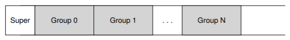
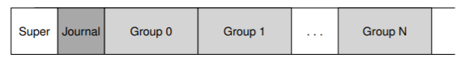

### データジャーナリング

ログには5つのブロックを書く：トランザクション開始ブロック(TxB)、I[v2]、B[v2]、Db、トランザクション終了ブロック(TxE)。

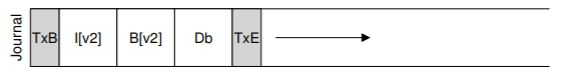

ログへの書き込みが完了したら、ファイルシステムの本来の場所に**チェックポイント**する。

**重要な問題**：5ブロックを一度にログに書くと、ディスクの内部スケジューリングで書き込み順序が入れ替わる可能性がある。TxEが先に書かれ、中間のデータブロックが後になると、不完全なトランザクションが有効に見えてしまう。

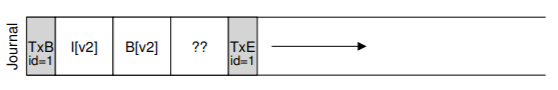

**対策**：2段階で書く。

1. **ジャーナルライト** — TxB + メタデータ + データをログに書き込み、完了を待つ
2. **ジャーナルコミット** — TxEを書き込み、完了を待つ（トランザクションのコミット）
3. **チェックポイント** — 更新を最終位置に書き込む

TxEは512バイトの単一セクタに収め、ディスクのアトミック書き込み保証を活用する。

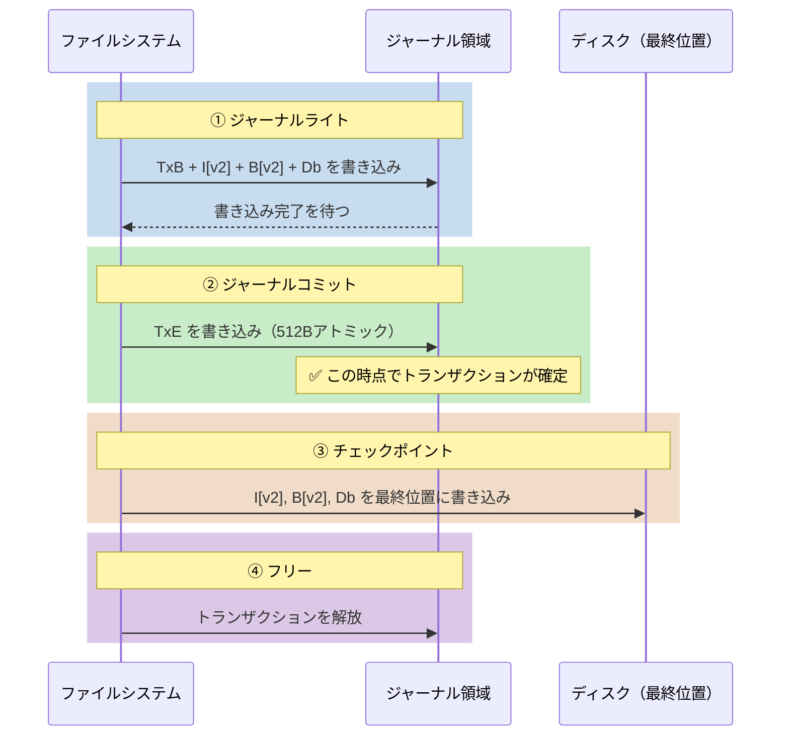

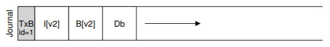
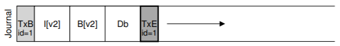

### リカバリ

- コミット前のクラッシュ → 保留中の更新をスキップ
- コミット後、チェックポイント前のクラッシュ → コミット済みトランザクションを再生（redoロギング）
- チェックポイント中のクラッシュ → 問題なし。最悪の場合、一部のブロックが重複書き込みされるだけ

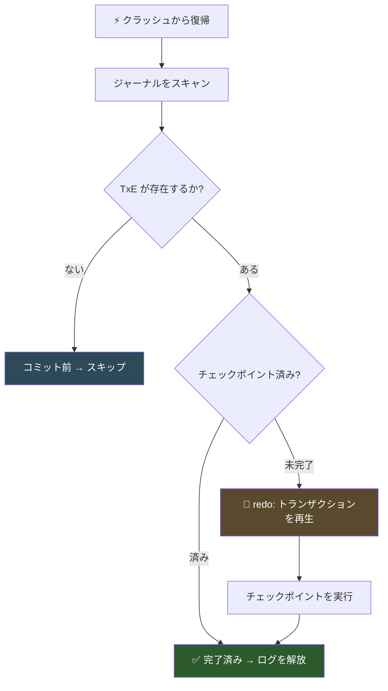

### バッチ処理

同じディレクトリに2つのファイルを作成する場合、個別にジャーナリングすると同じブロックを何度も書くことになる。ext3のようなファイルシステムは更新をグローバルトランザクションにバッファリングし、一度にコミットすることで書き込みトラフィックを削減する。

### ログの有限性

ログがいっぱいになると新しいコミットができなくなる。そのため、ログを**循環データ構造**として扱い、チェックポイント済みのトランザクションを解放する。ジャーナルスーパーブロックが最も古い未チェックポイントトランザクションを追跡する。

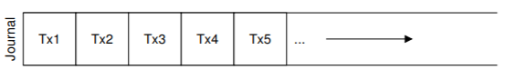
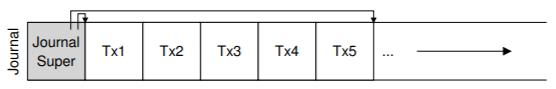

最終プロトコル：ジャーナルライト → ジャーナルコミット → チェックポイント → フリー。

### メタデータジャーナリング

データジャーナリングでは全データをディスクに2回書く。これは高コストだ。**メタデータジャーナリング**（ordered journaling）では、ユーザデータはジャーナルに書かず、ファイルシステムの最終位置にだけ書く。

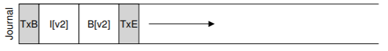

ただし順序が重要だ。データブロックを先にディスクに書いてからメタデータをジャーナリングしないと、inodeがゴミデータを指す可能性がある。

最終プロトコル：

1. データ書き込み（最終位置に）
2. ジャーナルメタデータ書き込み
3. ジャーナルコミット
4. チェックポイントメタデータ
5. フリー

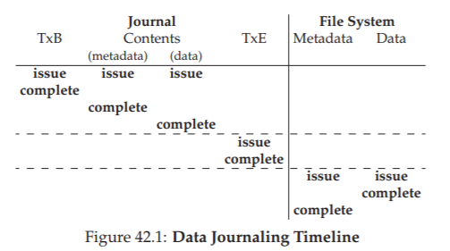
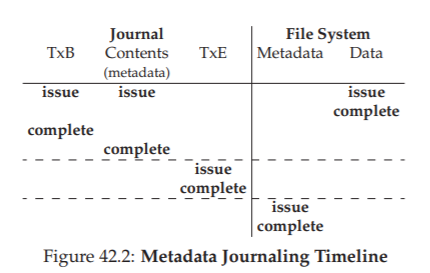

### ブロック再利用のトリックケース

ディレクトリを削除してそのブロックが新しいファイルに再利用されると、ジャーナル再生時に古いディレクトリデータで新しいファイルのデータが上書きされてしまう。ext3は**取り消しレコード（revoke record）**を使い、削除されたデータの再生を防止する。

## 42.4 解決策 #3：その他のアプローチ

- **ソフトアップデート** — 書き込みの順序を慎重に制御して不整合を防ぐ。実装が複雑
- **コピーオンライト（COW）** — ZFSなどが採用。既存のデータを上書きせず、新しい場所に書く
- **バックポインタベースの一貫性（BBC）** — 各データブロックに参照元への逆ポインタを追加
- **楽観的クラッシュ一貫性** — トランザクションチェックサムなどを使い、書き込みバリアの待ち時間を削減

## 42.5 まとめ

クラッシュ一貫性問題に対する2つの主要アプローチを学んだ。fsckは動くが遅い。ジャーナリングは回復をO(ログサイズ)に短縮し、現代の多くのファイルシステムで採用されている。最も一般的なのはメタデータジャーナリングで、ジャーナルトラフィックを削減しつつ合理的な一貫性保証を提供する。

## 参考文献

[B07] "ZFS: The Last Word in File Systems" Jeff Bonwick and Bill Moore
[C+12] "Consistency Without Ordering" Vijay Chidambaram et al., FAST '12
[C+13] "Optimistic Crash Consistency" Vijay Chidambaram et al., SOSP '13
[GP94] "Metadata Update Performance in File Systems" Gregory R. Ganger and Yale N. Patt, OSDI '94
[G+08] "SQCK: A Declarative File System Checker" Haryadi S. Gunawi et al., OSDI '08
[H87] "Reimplementing the Cedar File System Using Logging and Group Commit" Robert Hagmann, SOSP '87
[M+13] "ffsck: The Fast File System Checker" Ao Ma et al., FAST '13
[MK96] "Fsck - The UNIX File System Check Program" Marshall Kirk McKusick and T. J. Kowalski
[P+05] "IRON File Systems" Vijayan Prabhakaran et al., SOSP '05
[T98] "Journaling the Linux ext2fs File System" Stephen C. Tweedie, 1998
[T00] "EXT3, Journaling Filesystem" Stephen Tweedie, 2000

---

[← 前へ: 40. ファイルシステム実装](./40.md) | [次へ: 43. ログ構造FS →](./43.md)

