# 43. ログ構造ファイルシステム（Log-structured File Systems）

1990年代初頭、バークレーのRosenblumとOusterhoutのグループがLFS（Log-structured File System）を開発した。動機は4つの時代の変化にあった。

1. **メモリの増大** — 読み取りの大半がキャッシュで処理されるため、ディスクトラフィックは書き込みが主体になる
2. **ランダムI/OとシーケンシャルI/Oの巨大な性能差** — シーケンシャル書き込みを活用できれば大きな優位性
3. **既存ファイルシステムの一般的仕事量でのパフォーマンス低下** — FFSでも1ファイル作成に6回書き込みが必要で、短いシークと回転遅延が発生
4. **RAID非対応** — RAID-4/5の小さな書き込み問題を回避しない

> **CRUX: すべての書き込みをシーケンシャルにするには？**

## 43.1 ディスクへのシーケンシャル書き込み

ファイルにデータブロックDを書くとき、データブロックだけでなくinodeも更新が必要だ。LFSはこれらを隣接する場所に一緒にシーケンシャルに書く。

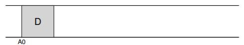
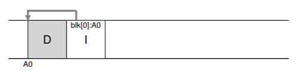

## 43.2 効率的にシーケンシャルに書く

連続した書き込みでも、書き込み間に時間があるとディスクが回転してしまい、待ち時間が生じる。効率的な書き込み性能には、多数の連続書き込みを一度に発行する必要がある。

LFSは**書き込みバッファリング**を使う。十分な更新がメモリに蓄積したら、それを**セグメント**として一括でシーケンシャルにディスクに書く。セグメントが十分大きければ（数MB）、効率的な書き込みが実現する。

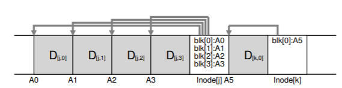

## 43.3 バッファリング量の決定

ピーク帯域幅のF%を達成するために必要なバッファサイズDは以下の式で求まる。

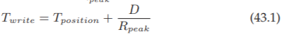
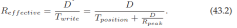
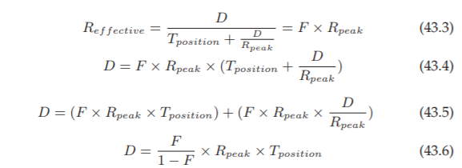

例：位置決め時間10ms、ピーク転送速度100 MB/s、F=0.9なら、D = 9 MB。

## 43.4 inodeの発見問題

従来のファイルシステムではinodeは固定位置の配列。FFS でも各シリンダグループ内の決まった場所にある。しかしLFSではinodeがディスク中に散らばっており、上書きもしないため、最新版のinodeの位置が不定だ。

## 43.5 間接参照による解決：inodeマップ（imap）

LFSは**inodeマップ（imap）**を導入する。inode番号を入力としてそのinodeの最新のディスクアドレスを返すデータ構造だ。

imapを固定位置に置くと毎回シークが発生するため、LFSはimapのチャンクを新しいデータと同じセグメントに一緒に書き込む。

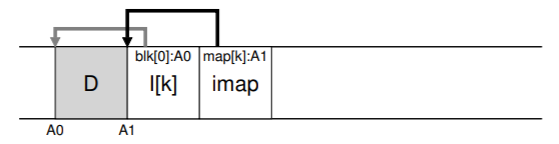

## 43.6 チェックポイントリージョン（CR）

imapのチャンクがディスク中に散らばるなら、どうやってimapを見つけるか？LFSはディスク上の固定位置に**チェックポイントリージョン（CR）**を持つ。CRはimapの最新ポインタを含み、30秒ごとなど定期的にしか更新しないため、パフォーマンスへの影響は最小限だ。

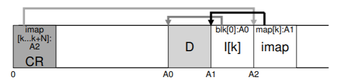

全体構造：CR → imap → inode → ファイルデータ。

## 43.7 ディスクからファイルを読む

1. CRを読んでimapの場所を取得
2. imapをメモリにキャッシュ（一度だけ）
3. inode番号からimapを引いてinodeのディスクアドレスを取得
4. inodeを読んで通常のUNIXファイルシステムと同様にデータブロックにアクセス

imapがキャッシュされていれば、読み取りI/O回数は通常のファイルシステムと同じだ。

## 43.8 ディレクトリ

ディレクトリの構造は従来と同じ（名前, inode番号）ペアのリストだ。LFSではこれらもシーケンシャルにディスクに書く。

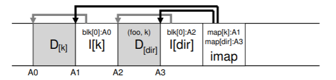

LFSのimapは**再帰的更新問題**も解決する。inodeの場所が変わっても、ディレクトリ自体を更新する必要はない——imapだけが更新される。

## 43.9 ガベージコレクション

LFSは常にファイルの最新版を新しい場所に書くため、古いバージョンのデータ（ゴミ）がディスク全体に散在する。

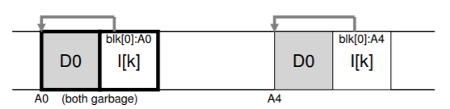
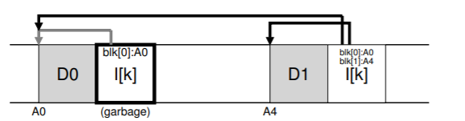

LFSクリーナーは**セグメント単位**で動作する。古いセグメントを読み込み、生きているブロックだけを新しいセグメントにまとめて書き出し、古いセグメントを解放する。M個の古いセグメントをN個の新しいセグメント（N < M）に圧縮する。

## 43.10 ブロック生存判定

各セグメントの先頭に**セグメントサマリブロック**を置き、各データブロックのinode番号とオフセットを記録する。

ブロックDの生存判定手順：

1. セグメントサマリからinode番号Nとオフセットを取得
2. imapでNの最新inodeを見つけて読む
3. inodeのポインタがDのアドレスを指していれば生存、そうでなければ死亡

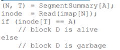
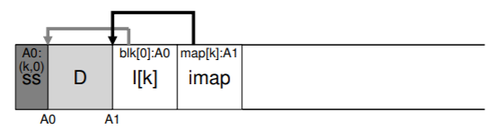

バージョン番号を使って判定を高速化することもできる。

## 43.11 クリーニングポリシー

いつクリーニングするか——定期的に、アイドル時に、ディスクがいっぱいの時。

どのセグメントをクリーニングするか——**ホットセグメント**（頻繁に上書きされる）はクリーニングを遅らせ、**コールドセグメント**（安定したデータ）は早めにクリーニングする。

## 43.12 クラッシュリカバリ

LFSはディスクの両端に2つのCRを保持し、交互に更新する。各CRにはタイムスタンプがヘッダーとフッターに書かれ、一致しないペアで更新中のクラッシュを検出できる。

セグメント書き込み中のクラッシュでは、CRが30秒ごとにしか更新されないため数秒分の更新が失われる可能性がある。LFSは**ロールフォワード**技法を使い、最後のCR以降に書き込まれたセグメントを調べて可能な限りデータを回復する。

## 43.13 まとめ

LFSはディスクへのすべての書き込みをシーケンシャルに変換し、大きなセグメントとしてまとめて書くことで高い書き込み性能を実現する。ガベージコレクションのコストが議論の焦点となったが、NetAppのWAFL、ZFS、btrfs、SSDのFTLなど、コピーオンライトの思想は現代の多くのシステムで受け継がれている。

> **TIP: 欠点を美点に変えよ**
> WAFLは古いファイル内容をスナップショット機能として活用し、クリーニング問題の多くを回避した。

## 参考文献

[RO91] "Design and Implementation of the Log-structured File System" Mendel Rosenblum and John Ousterhout, SOSP '91
[R92] "Design and Implementation of the Log-structured File System" Mendel Rosenblum, Ph.D. Dissertation
[HLM94] "File System Design for an NFS File Server Appliance" Dave Hitz et al., USENIX Spring '94
[B07] "ZFS: The Last Word in File Systems" Jeff Bonwick and Bill Moore
[R+13] "BTRFS: The Linux B-Tree Filesystem" Ohad Rodeh et al., ACM TOS 2013
[MR+97] "Improving the Performance of Log-structured File Systems with Adaptive Methods" Jeanna Neefe Matthews et al., SOSP 1997

---

[← 前へ: 42. クラッシュ一貫性](./42.md) | [次へ: 44. フラッシュベースSSD →](./44.md)

