# 44. フラッシュベースSSD（Flash-based SSDs）

長年のハードディスク支配に対し、フラッシュベースのソリッドステートドライブ（SSD）が永続ストレージの重要なプレーヤーとなった。機械的な可動部品がなく、トランジスタから構成されるが、DRAMと違い電力損失後もデータを保持する。

1980年代に舛岡富士雄が発明したNANDベースのフラッシュが基盤技術だ。フラッシュにはユニークな制約がある——ページに書き込む前にブロック全体を消去しなければならず、書き込みを繰り返すとセルが摩耗する。

> **CRUX: フラッシュベースのSSDをどう構築するか？**

## 44.1 単一ビットの格納

フラッシュはトランジスタ内にトラップされた電荷レベルで情報を保存する。

- **SLC**（Single Level Cell）— 1ビット/セル。高性能・高価
- **MLC**（Multi Level Cell）— 2ビット/セル。00/01/10/11を4段階の電荷レベルで表現
- **TLC**（Triple Level Cell）— 3ビット/セル。最も安価だが遅い

## 44.2 ビットからバンク/プレーンへ

フラッシュチップは多数のセルから構成される**バンク（プレーン）**で作られる。バンクは2つの単位でアクセスされる。

- **ブロック（消去ブロック）** — 128KB〜256KB。消去の単位
- **ページ** — 数KB。読み書きの単位

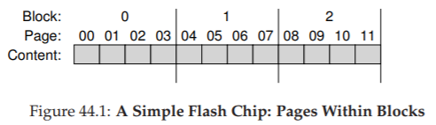

最重要ポイント：**ブロック内のページに書き込むには、まずブロック全体を消去しなければならない。**

## 44.3 基本的なフラッシュ操作

3つの低レベル操作がある。

- **Read（1ページ）** — 約10μs。ランダムアクセスの位置依存なし
- **Erase（1ブロック）** — 全ビットを1にリセット。数ms。非常に高価
- **Program（1ページ）** — ページの1を0に変更。約100μs

ページの状態遷移：INVALID → （消去で）ERASED → （プログラムで）VALID。内容を変更するにはブロック全体の消去が必要。

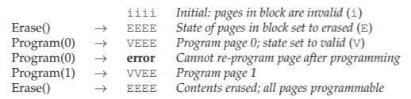

### 詳細な例

ページ0を上書きするには：

1. ブロック内の他のページの必要なデータを退避
2. ブロック全体を消去
3. ページ0を新しい内容でプログラム
4. 退避したデータも書き戻す

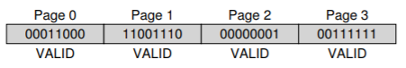
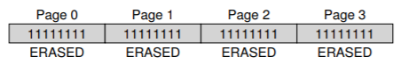
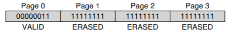

## 44.4 フラッシュの性能と信頼性

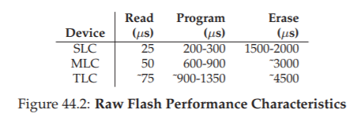

読み取りは非常に高速（約10μs）。プログラムはSLCで200μs、MLC/TLCではさらに遅い。消去は数msで、このコストの管理が設計の中心課題だ。

**信頼性**の主な課題は**摩耗（ウェア）**だ。消去/プログラムサイクルを繰り返すと余分な電荷が蓄積し、0と1の区別が困難になる。

- MLCブロックの典型的寿命：約10,000 P/Eサイクル
- SLCブロック：約100,000 P/Eサイクル

もう一つの問題は**ディスターバンス**——特定ページへのアクセスが隣接ページのビットを反転させる現象だ。

## 44.5 生のフラッシュからSSDへ

SSDは複数のフラッシュチップ、揮発性メモリ（SRAM）、制御ロジックで構成される。制御ロジックの核心が**FTL（Flash Translation Layer）**だ。

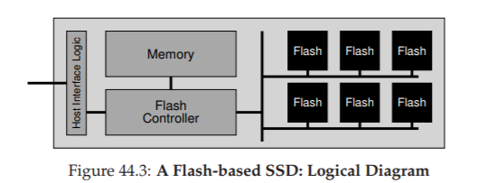

FTLは論理ブロックアドレスへの読み書きを、フラッシュの物理ページへの読み取り・消去・プログラム操作に変換する。性能と信頼性を両立させるのがFTLの役割だ。

> 💡 **FTL（Flash Translation Layer）**は、SSD内部の「羻訳層」。ファイルシステムからの「ブロックNに書け」という要求を、フラッシュ特有の制約（消去必須・摩耗）を隠しつつ効率的に実行する。MMUが仮想アドレスを物理アドレスに変換するのと同じ発想だ。

## 44.6 FTLの構成：悪いアプローチ（ダイレクトマップ）

論理ページNを物理ページNに直接マッピング。書き込みのたびにブロック全体を読み → 消去 → プログラムする必要があり、書き込み増幅が極端に大きく、性能と信頼性の両方で最悪だ。

## 44.7 ログ構造FTL

現代のFTLはログ構造を採用する。書き込みは常に次の空きページに追記し、マッピングテーブルで論理→物理の対応を管理する。

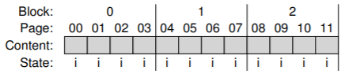
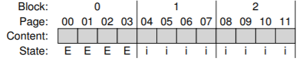
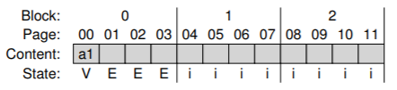
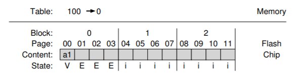
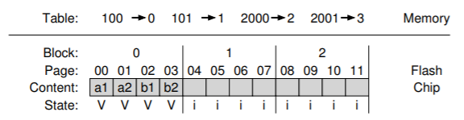

ログ構造により、消去は稀にしか発生せず、ダイレクトマップの高価なread-modify-writeを回避できる。書き込みが全ページに分散されるため、ウェアレベリングも自然に実現する。

## 44.8 ガベージコレクション

論理ブロックの上書きにより古いバージョン（ゴミ）がディスク上に残る。GCプロセスは：

1. ゴミページを含むブロックを見つける
2. そのブロックのライブページを読み込む
3. ライブページをログの末尾に書き出す
4. ブロック全体を消去して再利用

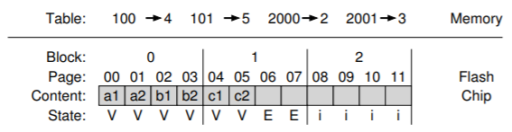
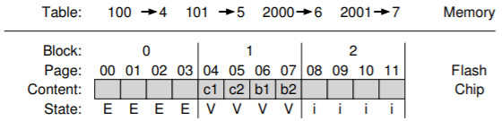

理想はデッドページだけのブロック——データ移行なしに即座に消去・再利用できる。**オーバープロビジョニング**（余分なフラッシュ容量の追加）でGCの影響を軽減する。

## 44.9 マッピングテーブルサイズ

ページレベルのマッピングは巨大になる。1TB SSDで4KBページなら1GBのメモリが必要だ。

### ブロックベースマッピング

ブロックごとに1ポインタだけ持てばテーブルサイズは大幅に減るが、小さな書き込みで大量のデータコピーが発生する。

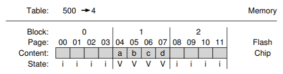
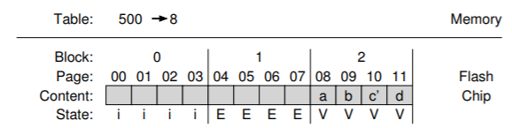

### ハイブリッドマッピング

**ログブロック**にはページレベルマッピング、**データブロック**にはブロックレベルマッピングを使う2階層方式。

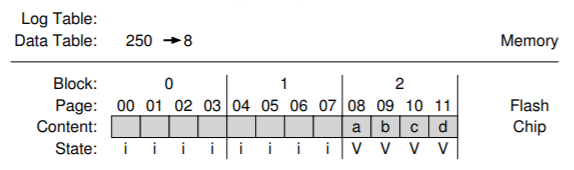
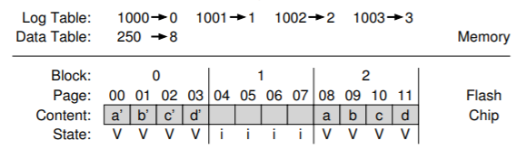

ログブロックをデータブロックに変換するマージ操作：

- **スイッチマージ** — ログブロックの内容がそのままブロックポインタで参照可能な場合。最良ケース
- **パーシャルマージ** — 一部のページだけ更新。不足ページのコピーが必要
- **フルマージ** — ログブロックのページが多くの異なるブロックに属する場合。最もコストが高い

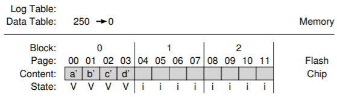
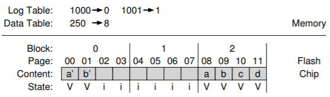

## 44.10 ウェアレベリング

消去/プログラムサイクルの均等分散により全ブロックがほぼ同時に寿命に達するようにする。ログ構造とGCが基本的な分散を行うが、長期間上書きされないコールドデータのブロックは別途移動する必要がある。

## 44.11 SSDの性能とコスト

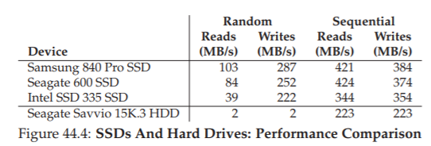

### 性能

SSDのランダムI/O性能はHDDを桁違いに上回る。ただしシーケンシャルI/Oでの差はずっと小さい。SSDのランダム書き込みが予想外に良好なのは、ログ構造FTLがランダム書き込みをシーケンシャル書き込みに変換するためだ。

### コスト

SSDはGB単価でHDDの10倍以上高い。ランダムI/O性能が重要ならSSD、大容量ストレージならHDD。両方を使うハイブリッドアプローチも一般的だ。

## 44.12 まとめ

フラッシュベースSSDの核心は、消去の高コストと摩耗という制約の下で高性能・高信頼なストレージを実現するFTLの設計にある。ログ構造アプローチ、ガベージコレクション、ウェアレベリング、ハイブリッドマッピングが現代SSDの基盤技術だ。

## 参考文献

[A+08] "Design Tradeoffs for SSD Performance" N. Agrawal et al., USENIX '08
[GY+09] "DFTL: a Flash Translation Layer Employing Demand-Based Selective Caching" Aayush Gupta et al., ASPLOS '09
[KK+02] "A Space-Efficient Flash Translation Layer" Jesung Kim et al., IEEE 2002
[M+14] "A Survey of Address Translation Technologies for Flash Memories" Dongzhe Ma et al., ACM Computing Surveys 2014
[BD10] "Write Endurance in Flash Drives" Simona Boboila et al., FAST '10
[Z+12] "De-indirection for Flash-based SSDs with Nameless Writes" Yiying Zhang et al., FAST '13

---

[← 前へ: 43. ログ構造FS](./43.md) | [次へ: 45. データ完全性 →](./45.md)

