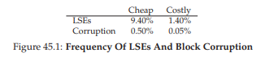
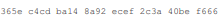
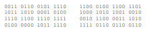
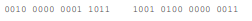
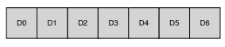
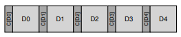
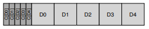
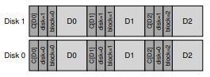

# 45. データ完全性と保護（Data Integrity and Protection）

> 🎯 **この章を学ぶ理由**: 「書き込んだデータが壊れていないことをどう保証するか」。チェックサム（CRC等）はネットワーク通信、ストレージ、Git等あらゆる場面で使われる基盤技術。
> **前提知識**: 37-38章（ディスクとRAID）

ストレージシステムは、書き込んだデータと同じデータを読み出せることをどう保証するか？この章ではデータ完全性（data integrity）を守る技法を学ぶ。

> **CRUX: データ完全性をどう確保するか**

## 45.1 ディスクの障害モード

RAIDの章で学んだフェイルストップモデル（ディスク全体が動作中か故障）に加え、現代のディスクには**部分的障害**がある。

### 潜在セクタエラー（LSE）

ディスクセクタが物理的に損傷し、読み取り時にエラーを返す。ヘッドクラッシュや宇宙線によるビット反転が原因。ディスク内のECCで検出可能。

### ブロック破損（サイレント障害）

ディスク自体が検出できない形でブロックデータが壊れる。バグのあるファームウェアによる誤った場所への書き込みや、障害のあるバス経由の転送が原因。**サイレントフォールト**——エラーの兆候なく不正なデータが返される。

150万台以上のディスクの3年間の調査結果：安価なドライブの約9%にLSE、約0.5%にブロック破損が発生。高価なドライブでも約1.4%にLSE、約0.05%にブロック破損。

**LSEsの追加知見：**
- 2年目以降にエラー率が増加
- ディスクサイズに比例してLSE数も増加
- LSEのあるディスクは追加のLSEを発生しやすい
- 空間的・時間的局所性がある
- ディスクスクラブが有効（大半のLSEはスクラブで発見）

**ブロック破損の追加知見：**
- ドライブモデルにより破損率が大きく異なる
- 仕事量やディスクサイズの影響は少ない
- 破損はディスク内・RAID内で独立ではない
- LSEとの相関は低い

## 45.2 潜在セクタエラーの処理

LSEは（定義上）容易に検出できる。ディスクがエラーを返したら、冗長メカニズムを使う。

- ミラーリングRAID → 代替コピーにアクセス
- パリティRAID → パリティグループから再構築

RAID-4/5でディスク全障害とLSEが同時に発生すると再構築が失敗する問題がある。NetAppのRAID-DPは2つのパリティディスクでこれに対処する。

## 45.3 破損の検出：チェックサム

サイレント障害にはチェックサムで対処する。データブロックから小さな要約値（チェックサム）を計算して保存し、読み取り時に再計算して照合する。

### 一般的なチェックサム関数

- **XOR** — 各チャンクのXOR。単純だが、同位置の2ビット変化を見落とす

- **加算** — 2の補数加算。高速だが、データシフトに弱い
- **Fletcherチェックサム** — s1とs2の2バイト計算。CRCに近い検出力で計算が簡単
- **CRC（巡回冗長検査）** — データをバイナリ除算し、余りをチェックサムとする。ネットワークで広く使用

### チェックサムのレイアウト

ドライブメーカーは520バイトセクタを使い8バイトのチェックサムを格納する。そうでない場合、n個のチェックサムを専用セクタにまとめる方式もある。

## 45.4 チェックサムの使用

読み取り時：

1. ディスクから格納済みチェックサム C_s(D) を読む
2. 読み取ったデータから計算チェックサム C_c(D) を求める
3. C_s(D) == C_c(D) なら正常、不一致なら破損検出

破損検出後は冗長コピーから回復。コピーがなければエラー返却。

## 45.5 新たな問題：誤った方向の書き込み（Misdirected Write）

ディスクコントローラがデータを正しく書くが、間違った場所に書いてしまう。チェックサムだけでは検出できない（データ自体は正しいため）。

**対策**：チェックサムに**物理ID（ディスク番号とセクタオフセット）**を追加する。読み取り時に物理IDが一致するか検証すれば、誤った方向の書き込みを検出できる。

## 45.6 最後の問題：失われた書き込み（Lost Write）

デバイスが書き込み完了を通知したが、実際にはデータがディスクに届いていない。古いデータが残る。格納済みチェックサムも物理IDも「古いけど正しい」ため検出できない。

**対策：**

- **Write Verify（Read After Write）** — 書き込み直後に読み戻して検証。確実だがI/Oが倍増し非常に遅い
- **別の場所にチェックサムを保持** — ZFSのようにinodeにデータブロックのチェックサムを含める。データブロックへの書き込みが失われてもinode内のチェックサムと不一致になる

## 45.7 スクラビング

多くのデータはめったにアクセスされないため、チェックサムも検証されない。ビット腐敗が全コピーに波及する前に発見するため、**ディスクスクラビング**——定期的に全ブロックを読み取ってチェックサムを検証する。夜間や週単位で実施。

## 45.8 チェックサムのオーバーヘッド

### スペース

4KBブロックに8バイトのチェックサムで約0.19%のオーバーヘッド。メモリ上のチェックサムは一時的で影響は小さい。

### 時間

データの格納時・アクセス時にCPUがチェックサムを計算。データコピーとチェックサム計算を1つの操作に組み合わせることで効率化できる。チェックサムが別に格納されている場合の追加I/Oと、バックグラウンドスクラビングのI/Oもコスト要因。

## 45.9 まとめ

チェックサムは現代のストレージシステムにおけるデータ保護の基盤技術だ。XOR、加算、Fletcher、CRCなど異なるチェックサムが異なる障害に対する保護を提供する。物理IDの追加で誤った方向の書き込みを、別の場所でのチェックサム保持で失われた書き込みを検出できる。ストレージデバイスの進化とともに、新しい障害モードが現れ、新しい対策が開発されていくだろう。

## 参考文献

[B+07] "An Analysis of Latent Sector Errors in Disk Drives" Lakshmi N. Bairavasundaram et al., SIGMETRICS '07
[B+08] "An Analysis of Data Corruption in the Storage Stack" Lakshmi N. Bairavasundaram et al., FAST '08
[BS04] "Commercial Fault Tolerance: A Tale of Two Systems" Wendy Bartlett and Lisa Spainhower, IEEE TDSC 2004
[C+04] "Row-Diagonal Parity for Double Disk Failure Correction" P. Corbett et al., FAST '04
[F04] "Checksums and Error Control" Peter M. Fenwick
[F82] "An Arithmetic Checksum for Serial Transmissions" John G. Fletcher, IEEE TOC 1982
[K+08] "Parity Lost and Parity Regained" Andrew Krioukov et al., FAST '08
[P+05] "IRON File Systems" Vijayan Prabhakaran et al., SOSP '05
[Z+13] "Zettabyte Reliability with Flexible End-to-end Data Integrity" Yupu Zhang et al., MSST '13

---

[← 前へ: 44. フラッシュベースSSD](./44.md) | [次へ: 48. 分散システム →](./48.md)

