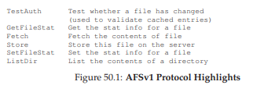
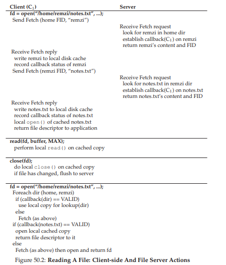
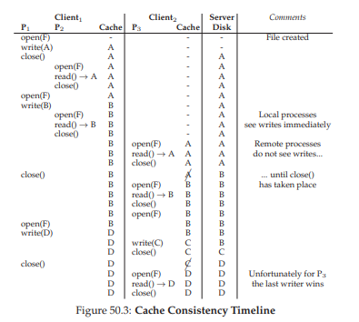
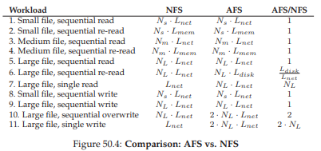

# 50. Andrew File System（AFS）

> 🎯 **この章を学ぶ理由**: NFSとは異なるアプローチでスケーラビリティを追求する設計。コールバック（サーバーからの通知）とファイル全体キャッシュの考え方は、CDNやリアルタイム同期の基盤でもある。
> **前提知識**: 49章（NFS）

AFSは1980年代にカーネギーメロン大学（CMU）でSatyanarayanan教授が率いて開発された。主目標はシンプル——**スケール**だ。サーバー1台でできるだけ多くのクライアントをサポートする分散ファイルシステムをどう設計するか？

NFSとの違いは2点。第一に、スケーラビリティに焦点を当てたプロトコル設計。NFSはクライアントが定期的にサーバーに確認するが、これはサーバーリソースを消費しスケールを制限する。第二に、合理的で理解しやすいキャッシュ一貫性セマンティクス。

## 50.1 AFSバージョン1

AFSの根本思想は**ファイル全体のクライアントディスクへのキャッシュ**だ。

1. `open()` — ファイル全体をサーバーからフェッチし、ローカルディスクに保存
2. `read()`/`write()` — ローカルファイルに対する操作。ネットワーク通信なし
3. `close()` — ファイルが変更されていれば、サーバーにフラッシュ

NFSとの対比：NFSはブロック単位でクライアントメモリにキャッシュする。AFSはファイル全体をクライアントディスクにキャッシュする。

AFSv1では次回アクセス時に**TestAuth**プロトコルメッセージでファイルが変更されたか確認し、変更なければローカルキャッシュを使う。

> **TIP: 計測してから構築せよ（パターソンの法則）**
> 新しいシステムを構築する前に既存システムを計測し、問題を実証せよ。本能ではなく実験的証拠でシステム構築を科学的な営みにできる。

## 50.2 バージョン1の問題

AFSの設計者がプロトタイプを計測して見つけた2つの主要問題：

1. **パストラバーサルのコスト** — クライアントがフルパス名（`/home/remzi/notes.txt`）を送り、サーバーが毎回ディレクトリ階層を辿る。多数のクライアントからのアクセスでCPU時間の大部分がディレクトリ走査に費やされた

2. **TestAuthメッセージの洪水** — ファイルが変更されていないかの確認メッセージが大量に発生。NFS+GETATTRと同じ問題

結果：サーバー1台あたり約20クライアントしかサポートできなかった。

## 50.3 プロトコルの改良

> **CRUX: スケーラブルなファイルプロトコルをどう設計するか？**

## 50.4 AFSバージョン2

2つの重要な改良を導入：

### コールバック

サーバーからクライアントへの**約束**——「あなたがキャッシュしたファイルが変更されたら教えます」。これにより、クライアントは確認のためにサーバーに問い合わせる必要がなくなる。サーバーがファイル変更を通知するまで、キャッシュは有効だと仮定できる。**ポーリングから割り込みへ**の転換だ。

### ファイル識別子（FID）

パス名の代わりにFID（ボリュームID + ファイルID + uniquifier）を使用。クライアントがパスを1要素ずつ解決し、結果をキャッシュする。サーバーの負荷を大幅に削減。

例：`/home/remzi/notes.txt`へのアクセス。

1. `home`のディレクトリをフェッチ、ローカルディスクにキャッシュ、コールバック設定
2. `remzi`のディレクトリをフェッチ、キャッシュ、コールバック設定
3. `notes.txt`をフェッチ、キャッシュ、コールバック設定

2回目以降のアクセスは完全にローカル——サーバーとのやり取りゼロ。ファイルがキャッシュされている一般的なケースでは、AFSはローカルファイルシステムとほぼ同じ性能だ。

## 50.5 キャッシュ一貫性

AFSのキャッシュ一貫性はNFSよりはるかにシンプルだ。

### 異なるマシン間

ファイルが`close()`されるとサーバーにフラッシュされ、そのファイルのキャッシュコピーを持つすべてのクライアントのコールバックが**break（無効化）**される。次にそれらのクライアントがファイルを開くと、サーバーから新しいバージョンをフェッチする。

### 同じマシン上

通常のUNIXセマンティクスに従い、書き込みは即座に他のローカルプロセスに見える。`close()`を待つ必要はない。

### 同時書き込み

複数クライアントが同時に変更した場合、**最後に閉じた者が勝つ**（last closer wins）。結果はどちらかのクライアントが書いた完全なファイルになる。NFSのようにブロック単位の混合は起きない。

## 50.6 クラッシュリカバリ

NFSのシンプルさに比べると、AFSのクラッシュリカバリは複雑だ。

**クライアントクラッシュ**：再起動中にコールバックのbreakメッセージを見逃す可能性がある。再参加時にはすべてのキャッシュ内容を疑わしいものとして扱い、TestAuthで有効性を確認する。

**サーバークラッシュ**：コールバック情報はメモリ上にあるため、再起動で失われる。各クライアントはサーバーがクラッシュしたことを認識し、キャッシュの有効性を再確認する必要がある。ハートビートメッセージなどで検出する。

スケーラブルなキャッシングモデルの代償——NFSではクライアントはサーバークラッシュにほとんど気づかなかった。

## 50.7 AFSv2のスケールと性能

AFSv2でサーバー1台あたり約50クライアントをサポートできるようになった（v1は約20）。クライアント側の性能もローカルFSに非常に近い。

### NFSとの性能比較

- **初回ファイル読み取り** — 両方ともリモートフェッチが支配的。ほぼ同等
- **大きなファイルの再読み込み** — AFSが優位。AFSはローカルディスクキャッシュから読む。NFSはメモリキャッシュのみのため、メモリに収まらない大きなファイルはサーバーから再フェッチが必要
- **順次書き込み（新規ファイル）** — ほぼ同等。どちらもclose時にサーバーへフラッシュ
- **順次上書き** — AFSが不利。古いファイルを先にフェッチし、上書きしてからフラッシュ。NFSはブロックを直接上書き
- **大きなファイルの小さなサブセットアクセス** — NFSが優位。AFSはファイル全体をフェッチするが実際のI/Oは少量

> **ASIDE: ワークロードの重要性**
> 設計判断はワークロードに依存する。AFSの設計者は「ほとんどのファイルは頻繁に共有されず、順次アクセスされる」と仮定した。この仮定が成り立つ場面では完璧な設計だが、ランダム更新やログ追記では不利になる。

## 50.8 AFSのその他の改良

- **真のグローバル名前空間** — すべてのクライアントで同じファイル名。NFSはクライアントごとのマウントに依存
- **セキュリティ** — ユーザー認証メカニズムの統合。NFSの初期は非常に緩い認証
- **柔軟なアクセス制御** — ユーザーがファイルアクセスを細かく制御可能
- **管理ツール** — サーバー管理の簡素化

## 50.9 まとめ

AFSはNFSとは異なるアプローチで分散ファイルシステムを構築した。ファイル全体のキャッシュとコールバックでサーバーとのやり取りを最小化し、スケーラビリティを実現した。一貫性モデルはシンプルで理解しやすく、NFSの時折発生する奇妙な動作は起きない。

残念ながら、NFSがオープンスタンダードとなり市場を支配したため、AFSの普及は限定的だった。しかし、AFSのアイデア——特にコールバックとファイル全体キャッシュ——は、NFSv4がサーバー状態（例：openプロトコルメッセージ）を追加するなど、後のシステム設計に大きな影響を与えた。

## 参考文献

[B+91] "Measurements of a Distributed File System" Mary Baker et al., SOSP '91
[H+11] "A File is Not a File: Understanding the I/O Behavior of Apple Desktop Applications" Tyler Harter et al., SOSP '11
[H+88] "Scale and Performance in a Distributed File System" John H. Howard et al., ACM TOCS 1988
[R+00] "A Comparison of File System Workloads" Drew Roselli et al., USENIX '00
[S+85] "The ITC Distributed File System: Principles and Design" M. Satyanarayanan et al., SOSP '85
[V99] "File system usage in Windows NT 4.0" Werner Vogels, SOSP '99

---

[← 前へ: 49. NFS](./49.md)

